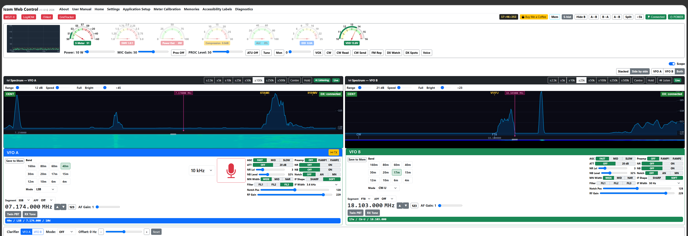
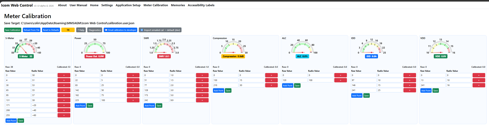

# Yaesu Web Control

> I would appreciate feedback and bug/layout reports. I have only tested on the FTdx101MP and the spectrum display with the SDRplay RSP1B.

Yaesu Web Control (**YWC**) is a continuation of my FTdx101_WebApp with more Yaesu transceivers added and more controls.

**Supported transceivers:**

| Transceiver | Power | Receivers | Notes |
|-------------|-------|-----------|-------|
| FTdx101MP | 200 W | Dual | All features supported |
| FTdx101D | 100 W | Dual | All features supported |
| FTdx10 | 100 W | Single | Two VFOs; no rear-panel IF output for spectrum |
| FT-710 | 100 W | Single | Two VFOs; no rear-panel IF output for spectrum |
| FTDX3000 | 100 W | Single | Two VFOs; no memory tag (MT) command |

## Main Page

## VOX, CW and FM Repeater Panels

## Calibration Page

## ⚠️ Warning

This software interacts with radio hardware. I have used only the official Yaesu CAT commands as per the manual, however, you use entirely at your own risk. Please read the licence. Always verify transmit frequencies, power levels, and settings before use.

---

## 📖 Why This Application Exists
I wrote this application because I can't see the FTdx101MP controls without using a magnifying glass. I've added support for partially sighted users by utilising NVDA and windows narrator. As a ham who uses WSJT-X, JTAlert, and Log4OM, I thought it would be nice to add buttons to start them from the app as it saves openning up the individual programs. I've added memory channel banks and functions to read and save etc. You don't need to save to the transceiver unless you specifically want them on it, taking your transceiver to another location for example. Please read the settings carefully as you can overwrite the transceivers memories.  

Tablet testing has been limited — feedback from tablet users is particularly welcome.

---

---

## 🌱 Why Sponsorship Matters
I’m retired and maintain this project on a limited income, funding all development tools personally. AI‑assisted coding has been invaluable for building features quickly, but it isn’t free. 

If this project has helped you, please consider sponsoring it. Even small contributions make a real difference and help keep the development tools running.

---

## Important - .NET 10 is now built into this app so there is no need to download and install it.

---

## ⚠️ Windows Security Warnings on First Install

Because the installer is not code-signed, Windows and third-party antivirus tools will warn you before it runs. This is expected — the file is not malware. Follow these steps if you hit a block:

**Norton (or other antivirus) flags the file as malware**
This is a false positive caused by the executable being unsigned and newly downloaded. In Norton, go to **Security → History**, find the quarantined file, and choose **Restore & Exclude** (or the equivalent Allow option in your antivirus).

**Right-click → Properties → Unblock**
Windows marks files downloaded from the internet as untrusted. Before running the installer, right-click the file, choose **Properties**, and if you see an **Unblock** checkbox at the bottom of the General tab, tick it and click OK.

**"This app can't run on your PC" — Smart App Control**
If Smart App Control is enabled it will block unsigned apps entirely. Go to **Settings → Privacy & Security → Windows Security → App & Browser Control → Smart App Control** and switch it to **Off**, then restart your PC and try again.

The screenshot below shows the Smart App Control setting:

These are one-time steps — once the app is installed you won't see them again.

---

## 📡 Spectrum Display

The application includes a real-time spectrum display and waterfall, intended for use with a Software Defined Radio (SDR) connected to the transceiver's 9 MHz IF output on the rear panel if it has one. From **v2.3.0** YWC supports **two SDRs** — one per VFO — on dual-receiver radios (FTdx101MP / FTdx101D). See the "Why two SDRs?" notes below for the hardware rationale.

> ## ⚠️ SDR safety — read before connecting
>
> An SDR receiver's front end is **extremely sensitive** and can be **destroyed by even a small amount of TX RF**.
>
> - **FTdx101MP / FTdx101D / FTDX3000** (have IF output): connect the SDR to the rear-panel **IF OUT** RCA socket only. This is an internal low-level signal — safe during TX. Do **not** connect to an antenna port.
> - **FTdx10 / FT-710** (no IF output): if you connect an SDR to an antenna port you **must** disconnect it during TX, or use a dedicated receive-only antenna well away from your TX antenna, or fit a T/R relay or PIN-diode T/R switch in front of the SDR. Transmitting with the SDR coax wired directly to your TX antenna will damage the SDR.
> - In all cases, an antenna physically close to your TX antenna can still couple enough RF into the SDR to damage it. When in doubt, disconnect.
>
> YWC also shows this warning on the Settings page when an SDR is configured, and a more prominent danger banner appears if your selected radio is an FTdx10 or FT-710.

**Supported SDR devices:**

- **SDRplay RSP1 / RSP1A / RSP1B / RSP2 / RSPdx / RSPduo** — supported via the SDRplay API v3. The SDRplay API must be installed separately from [sdrplay.com](https://www.sdrplay.com/downloads/). The author runs YWC with an RSP1B (main IF) and an RSP1 (sub IF) on an FTdx101MP and that is the configuration most thoroughly tested.
- **RTL-SDR, Airspy, and HackRF** — supported via the bundled SoapySDR driver interface. No separate SoapySDR installation is required — the necessary drivers are included in the installer. *These devices have not been tested by the author — feedback from users is very welcome.*

**Features:**
- Variable span: 250 kHz, 500 kHz, 1 MHz, or 2 MHz
- Dual-SDR mode: one SDR per VFO on the FTdx101MP / FTdx101D, with a Mono A / Mono B / Both layout toggle, Stacked / Side-by-side option, and independent span per panel
- Click anywhere on a spectrum panel to tune the corresponding VFO to that frequency (panel A tunes VFO A, panel B tunes VFO B)
- Mouse wheel over a spectrum panel tunes that VFO up/down in 1 kHz steps
- Frequency axis labels automatically track each VFO

### Why two SDRs? (and why two RSP1Bs rather than one RSPduo)

The FTdx101MP and FTdx101D have **two independent receivers**, with separate rear-panel IF output sockets (`IF OUT MAIN` for VFO A, `IF OUT SUB` for VFO B). Watching both bands at once requires **two SDRs** — one wired to each socket.

At first glance an **SDRplay RSPduo** looks like the obvious choice — it has two independent tuners in one box. Why does the author run two separate **RSP1Bs** instead?

- **Bandwidth.** An RSPduo in dual-tuner mode is capped to **roughly 2 MHz total** shared between the two tuners — so each receiver gets ~1 MHz at best. Two separate RSP1Bs each give you the full **10 MHz** the chip can deliver (YWC currently uses 2 MHz spans per side but the headroom is there).
- **Price.** Two RSP1Bs at retail are only marginally more expensive than one RSPduo — and you also get two completely independent radios you can move around your shack rather than one device locked to dual-tuner mode.
- **Failure isolation.** If one RSP locks up, YWC's worker for that VFO restarts independently; the other receiver keeps streaming.

If you already own an RSPduo, it works fine — set it up as your VFO A SDR and the second tuner is available for other software. YWC just won't be able to drive both tuners from one RSPduo (the SDRplay API's dual-tuner mode requires special handling we haven't yet implemented).

### Why an SDRplay RSP, not a £25 RTL-SDR dongle?

RTL-SDR dongles are supported and work — but for a serious HF-watching setup they leave a lot on the table compared to an RSP1B:

- **Bit depth.** RTL-SDR is **8-bit**; RSPplay RSPs are **14-bit**. That's a 36 dB dynamic-range advantage to the RSP, which on a typical 40m evening means weak signals stay visible right next to a S9+30 ragchew instead of disappearing under intermodulation hash.
- **HF coverage.** Most RTL-SDR dongles need a separate **upconverter** to receive HF (they were designed for VHF/UHF TV reception, not HF). RSPs cover **1 kHz to 2 GHz** natively, no upconverter, no extra cable, no insertion loss.
- **Front-end filtering.** RSPs include selectable bandpass filters; RTL-SDR dongles have essentially none. With a kilowatt-class transmitter on the next band a dongle will overload long before an RSP does.
- **Reference clock stability.** RSPs use a TCXO; the cheap dongles drift visibly during a warm-up. For spectrum display centred on the radio's IF, that drift shows up as the whole spectrum sliding sideways over the first ten minutes.

For the author's FTdx101MP-with-9MHz-IF setup, the SDRplay-API path is what was developed against; RTL-SDR users are welcome to try the SoapySDR path but it has not been bench-tested.

### What's that brief pause when I change the span?

When you click a different span button (250k → 2M for example), the spectrum freezes for **about three seconds** before it resumes at the new bandwidth. The header badge shows "Connecting…" during that window.

That delay is **hardware**, not software. Changing the sample rate means YWC asks the SDR's worker process to close the device, reopen it at the new rate, and restart streaming. The SDRplay API takes roughly a second to release a device cleanly and another second or so to reinitialise it. With two SDRs running in dual-SDR mode both go through the cycle at once. The spectrum data you see during the pause is the last frame from before the change — it's intentionally frozen rather than blanked so the screen doesn't go black for three seconds.

This is normal and expected. The first time you see it you'll probably blink; from the second time on it's just how RSPs reconfigure.

---

## Release Notes

## v2.3.0 — Dual-SDR (in development on `develop` branch)

The first big-ticket v2.x feature: **one SDR per VFO** on dual-receiver radios.
On the FTdx101MP and FTdx101D, both receivers have their own IF output socket;
YWC can now drive an independent SDR on each, with two synchronised spectrum
panels on the main page.

### New features

- **Per-VFO SDR assignment.** The Settings page SDR section gained two
  dropdowns — **VFO A SDR** and **VFO B SDR** — so you can tell YWC which
  physical SDR is wired to which VFO's IF output. Either can be left empty
  for a single-SDR setup; the existing single-SDR behaviour is preserved.
- **Two spectrum panels on the main page** when both VFOs are configured,
  each tracking its own VFO's frequency. Click on panel A tunes VFO A;
  click on panel B tunes VFO B.
- **Independent span per VFO.** Each spectrum panel has its own 250k /
  500k / 1M / 2M span buttons — set VFO A to 2 MHz for a wide overview
  of the calling band while VFO B sits at 250 kHz zoomed on the QSO.
  The Settings page still has a single Sample Rate dropdown but it now
  acts as a "reset both VFOs to this default" control; runtime per-VFO
  divergence is set with the buttons above each spectrum.
- **Layout toggles above the spectrum panels** (only visible when both VFOs
  have an SDR):
  - **VFO A / VFO B / Both** — show just one panel or both side by side.
  - **Stacked / Side by side** — stack the two panels vertically (more
    detail per panel) or place them horizontally (both at half-width).
  Both choices are remembered across page reloads.
- **Settings page Scan** now surfaces SDRs that are currently held by a
  running worker, labelled "(in use)", so you can see your active device
  even though the SDRplay API hides it from a fresh enumeration call.

### Architecture (under the hood)

The SDRplay API v3 service enforces **one Selected device per host process** —
we confirmed this against the actual hardware with a four-pattern probe before
committing to the design. So YWC main no longer opens an SDR directly. Each
configured SDR runs in its own `Yaesu_Sdr_Worker.exe` process, with FFT frames
streamed back to YWC over a localhost TCP socket. The worker exe is shipped
alongside `Yaesu_Web_Control.exe` and managed automatically — you'll just see
one or two extra entries in Task Manager when YWC is streaming.

Full architectural reasoning is in `docs/decisions/0001-dual-sdr-architecture.md`
in the repo.

### Settings file migration

The legacy single `SdrDeviceKey` field has been split into `SdrDeviceKeyA` and
`SdrDeviceKeyB`. On the first read of an existing `appsettings.user.json`,
the old value is promoted automatically into `SdrDeviceKeyA` and the legacy
field cleared. No user action needed; the upgrade is silent.

---

## 2026-06-09 - v2.2.2

A small hotfix on top of v2.2.1, primarily addressing one reporter-filed
bug and one regression that v2.2.1 itself introduced.

### Bug fixes

- **Sticky navbar actually works now.** v2.2.1's release notes promised
  this feature but shipped with `sticky-top` applied to the wrong element
  — the `<nav>` inside `<header>`, where `position: sticky` couldn't track
  body scroll. The class is now on `<header>` where it does what was
  intended. The User Manual no longer needs Page-Up to get back to the
  nav links.

- **DX cluster examples in Settings replaced** — closes
  [#27](https://github.com/mm5agm/Yaesu_Web_Control/issues/27) (djrino).
  The in-line examples (`cluster.dl4ny.de:7300`, `dxc.k4ldc.com:7300`) on
  the Settings page were both at hostnames whose DNS no longer resolved.
  Anyone copying them faithfully got a silent failure. v2.2.2 lists five
  verified-alive clusters led by `dxspider.co.uk:7300`. The USER_MANUAL
  §6.6 list was already correct.

### New features

- **Test cluster connection button.** Settings → DX Cluster section gains
  a yellow **Test cluster connection** button. Click it and YWC opens a
  TCP connection to the host/port/callsign typed into the form (without
  saving them), sends the callsign, reads ~10 seconds of output, and
  shows the transcript in a popup. The button turns solid green with a
  "Cluster connection successful" label after a successful test, so it
  is unambiguous what's working and what isn't — exactly the diagnostic
  that would have made the #27 silent-failure obvious in 10 seconds.

### Internal / preparing for v2.3.0

- **SDRplay device key format migrated** to `sdrplay:hw<N>-<serial>` so
  the upcoming dual-SDR work can distinguish two devices that happen to
  share a serial — notably the original RSP1's factory-default
  `0000000001` placeholder. Existing v2.2.x keys (`sdrplay:<serial>`)
  continue to work and are silently rewritten to the new format on the
  next Save Settings. No user action required. New FAQ §15.2 explains
  the background.

- Default `set/qra` example locator updated to `IO85CX` (Colin's actual
  square). Cosmetic only.

## 2026-06-09 - v2.2.1

A quick hotfix on top of v2.2.0 — closes one silently-affecting bug, adds a
hardware-safety warning, and includes two small UX fixes.

### Bug fixes

- **WSJT-X "orange rig" failure** ([#22](https://github.com/mm5agm/Yaesu_Web_Control/issues/22), W1WRH).
  YWC's rigctld bridge was rejecting Hamlib's `PKTUSB` mode name with
  `E_MODE: Unsupported mode for this rig.` whenever WSJT-X tried to set
  the mode at connect time. The result was WSJT-X dropping the rig
  control indicator to orange and re-trying every 20 seconds in an
  infinite loop. Bug affects any radio when the WSJT-X profile is set
  up to push mode explicitly (typical on fresh installs). The
  **read** path was already translating outbound `DATA-USB` → `PKTUSB`
  correctly, but the **write** path didn't accept it coming back —
  inconsistent. Fix accepts `PKTUSB` / `PKTLSB` / `PKTFM` and translates
  them to `DATA-U` / `DATA-L` / `DATA-FM`. Similar translation added
  for `CW` / `CW-R` / `RTTY` / `RTTY-R`.

### New features and improvements

- **⚠️ SDR safety warnings.** Connecting an SDR to a TX antenna —
  or an antenna close to one you're transmitting on — can permanently
  damage the SDR's front end. README and User Manual §6.3 now carry a
  prominent safety section explaining the safe connection options
  (IF output, dedicated RX antenna, or T/R switch). The Settings page
  shows a corresponding warning whenever an SDR is configured, and a
  more prominent red **danger** banner if the selected radio is an
  FTdx10 or FT-710 (no IF tap, SDR must connect to an antenna).
- **Sticky top navigation bar.** The top nav (About / User Manual /
  Home / Settings / Application Setup / Meter Calibration / Memories /
  Accessibility Labels) now stays visible when scrolling. Particularly
  useful in the long User Manual — no more page-ups to get home.
- **About page — bug-report links consolidated.** Two slightly-different
  bug-report links previously caused confusion. The plain "Report a bug"
  link (no diagnostics) has been removed; only the **Report a bug**
  button under the Diagnostics block remains, since the diagnostics
  block is what makes the report actually actionable.

## 2026-06-06 - v2.2.0

A focused bug-fix release on the back of v2.1.0 — closes seven reporter-filed
bugs, smooths several internal rough edges, and substantially refreshes the
Log4OM documentation now that we understand exactly what works (QSO logging)
and what doesn't (Log4OM's own live frequency display).

**Yaesu Web Control passed 100 downloads on 2026-06-06.** Thank you to every
operator who's tried it, and especially to those who took the time to file
bug reports — almost every change in this release came from a real user
report rather than from me hypothesising.

### New features

- **Settings: HTTP port is now configurable, with automatic fallback.** YWC
  was previously hardcoded to port 8080 and would fail to start if anything
  else (Plex, Jenkins, MiniTool ShadowMaker, etc.) had already grabbed it.
  v2.2.0 adds an **HTTP Port** field in Settings (default 8080), and at
  startup tries the configured port plus nine fallbacks, binding the first
  free one. The tray-icon tooltip and the browser auto-open URL both follow
  the actually-chosen port. If all ten are taken, a dialog names the owning
  process for each. (#13, Manuel Cobreros Gómez)

- **Settings: "Restart YWC to apply your changes" banner + one-click
  Restart Now button.** Some settings (radio model, web server address,
  HTTP port) need a full app restart to take effect. v2.2.0 detects when
  these change, shows a prominent banner, and provides a Restart Now
  button that gracefully stops and (for the installed build) auto-relaunches
  YWC. (#9)

- **Click-to-tune now works in the waterfall.** Previously you could click
  the live spectrum to QSY VFO A; now you can also click any signal trail
  in the waterfall and the radio jumps to that column's frequency. Natural
  way to chase a signal you've been watching drift down the screen.

- **Front-panel antenna change now syncs to the UI.** Switching antennas on
  the radio's front panel now updates the YWC antenna dropdown within a
  couple of seconds. (The radio doesn't auto-broadcast antenna changes,
  so YWC polls for them.)

### Bug fixes

- **FTdx10: IF Width dropdown off-by-one above 2900 Hz.** Selecting "3.2 kHz"
  set the radio to 3.0 kHz; selecting "4.0 kHz" was unreachable. Missing
  3 kHz entry restored to the SSB bandwidth table. (#20, Thomas OZ1JTE)

- **YWC was overwriting MIC GAIN and PROC LEVEL on every connect.** Stored
  values were being pushed to the radio at startup, wiping any front-panel
  tweaks the operator had made. Removed all three writes — the radio is
  now the source of truth, and YWC reads back the current values on
  connect. (#16, SP3L-Jacek)

- **Log4OM (and other apps with spaces in their path) refused to launch.**
  The command-line parser was splitting at the first space. Rewritten to
  a strict, predictable contract: wrap the path in double quotes if it
  contains spaces; everything after the closing quote is passed as
  arguments. Existing unquoted paths are auto-migrated on first read.
  New USER_MANUAL §7.1 documents the rule with examples. (#15, SP3L-Jacek)

- **SDR scan: RSPdx and RSP1A were mis-identified.** HwVerToModel had model
  names shifted by one slot at codes 3-5 (so RSPdx showed as "RSP DUO") and
  was missing RSP1A's hwVer 255 entirely. Fixed to match the official
  sdrplay_api.h header. (#10)

- **Settings Save was silently doing nothing when optional fields were
  empty.** A subtle interaction between `<Nullable>enable</Nullable>` and
  jQuery unobtrusive validation caused empty DX-cluster inputs to silently
  abort the form POST — no banner, no log entry, no save. The genuinely-
  optional fields are now nullable in the model so the client-side block
  doesn't trigger.

- **Tray-icon Exit could take 30+ seconds.** Four contributing causes
  identified and fixed; Tray → Exit now completes in about **1.2 seconds**
  end-to-end and the browser cleanly shows a "Yaesu Web Control has
  stopped" overlay.

- **FTdx101 Power needle disappeared after exiting YWC.** During normal
  operation YWC sets the radio's meter to MS13 (Comp + SWR) so it can read
  SWR; without restoring on quit, the Power meter stayed blank. v2.2.0
  sends `MS01` (Power) on shutdown so the needle is back when YWC closes.
  FTdx101MP/D only. (Discussion #6, F1UBW / Régis)

- **CAT dispatcher: front-panel control changes didn't always reach the
  UI.** Coverage now includes PA (IPO/preamp), RA (attenuator), BC (auto
  notch), CO (contour/APF) and AN (antenna), plus the existing handlers.
  (#17, SP3L-Jacek)

- **Power gauge jitter during transmit.** Smoothing window extended from
  7 to 15 samples (≈1.5 s at 10 Hz polling) to handle the steepness of
  the PWR calibration curve above 100 W. SWR smoothing stays at 7 samples
  so high-SWR faults are still seen quickly.

### Documentation

- **Log4OM section (§9.3) overhauled.** New "Known limitation — live
  frequency display" callout makes it clear that Log4OM's main-window
  frequency indicator stays OFFLINE against YWC's rigctld, **but** that's
  purely cosmetic — QSO logging via the WSJT-X → ADIF path captures the
  frequency correctly. Four screenshots prove it end to end.

- **GridTracker section (§9.4) expanded** with screenshots of the General
  and Logging tabs.

- **External Applications section (§7.1)** has a new path-quoting
  subsection with examples — including the JTAlert-with-`/wsjtx` pattern.

- **Calibration help text** corrected (it was still pointing at the
  pre-rename AppData folder).

### Known issues carried forward

- **Log4OM NextGen's live-frequency display still doesn't update from YWC's
  rigctld.** Investigated extensively; this is a feature gap rather than a
  regression (same symptom reproducible on YWC v1.5.4). QSO logging works
  regardless via the WSJT-X → ADIF path documented in §9.3. Tracked as
  issue #18.

- **WSJT-X loses rig control after a frequency change on FTdx10.** Reported
  by W1WRH against v2.1.0; appears to be an FTdx10-specific edge case in
  YWC's rigctld readback path. Awaiting reproduction logs. Tracked as
  issue #22.

## 2026-06-03 - v2.1.0

A "tidy up the seams" release on the back of v2.0.0 — adds the About page, system tray icon, full backup/restore, ADIF import, and a long list of UX polish + bug fixes that came out of testing.

### New features

- **About page.** New **About** link in the top navigation bar. Shows version, build date, copyright, project description, supported radios, and links to the User Manual / GitHub Issues / Discussions / source / sponsor. Includes a **Diagnostics** block (radio model, COM port, baud, browser, OS, .NET runtime, band plan, SDR device, cluster login) with two buttons:
  - **Copy diagnostics** — puts the whole block on your clipboard
  - **Report a bug on GitHub** — opens a pre-filled bug-report form on GitHub in a new tab (template already chosen, diagnostics already inserted; you only need to type the description)
- **System tray icon.** A small YWC icon now appears in the Windows system tray when the app is running. Right-click for menu: *Open Yaesu Web Control · About · Open user data folder · Exit*. Double-click to open the browser. Provides a visible "the app is alive" indicator and a clean way to shut it down — no more Task Manager dance.
- **Unified backup / restore.** The Settings-page backup is now a **single zip** containing settings, memories, memory banks, calibration overrides and label customisations. Replaces the v2.0.0 settings-only version. Atomic — every replaced file is preserved as a `.bak`, and the whole import rolls back if any single file fails.
- **ADIF memory import.** Memories page gains an **Import from ADIF…** button. Reads any standard ADIF file (e.g. a Log4OM export), creates a memory for each unique frequency/mode pair, skips duplicates by label so re-importing is safe.
- **"Show only watched callsigns" toggle.** New checkbox in the DX Watch popup. When ticked, the spectrum overlay and DX Spots list hide every spot that doesn't match a watch-list entry — declutter on busy bands without losing the watched-callsign alerts.
- **Spectrum click sets mode automatically.** Click anywhere on the spectrum and the radio not only QSYs but also flips mode to match the segment (DATA-U around 14.074, USB in the SSB sub-band, CW below the digital sub-band, etc.).
- **Segment dropdown auto-syncs to your current frequency.** Tune via the radio knob / spectrum click / on-screen keyboard — the per-VFO Segment dropdown follows.
- **Red band-edge guard rails on the spectrum.** Dashed red vertical lines at the upper and lower edges of every amateur band in the visible window. Visually obvious when you've tuned outside the allocation.

### Improvements & polish

- **GitHub Issues now have a template picker.** New `.github/ISSUE_TEMPLATE/` files give every new issue a structured skeleton (Describe / Steps / Expected / Actual / Diagnostics / Screenshots).
- **README gains live download / latest-release badges** via shields.io.
- **DX cluster watch list now updates live** — edit the list and the next incoming spot is matched against your new entries without restarting YWC.
- **Mem button is now bold black** instead of pale blue — easier to read against the toolbar.
- **In-app User Manual now renders USER_MANUAL.md directly** (single source of truth via Markdig). Edits to the markdown show up in the app on next page load, no separate Razor file to keep in sync. Heading anchors match GitHub's exactly, so TOC links work.
- **UTC clock info popover** in the top bar — explains where the time comes from and how to verify Windows time-sync.
- **About / Report a bug on GitHub** flow makes future bug reports two clicks (one if you're already signed in).
- **Browser zoom shortcuts documented** (Ctrl + + / − / 0) — useful for partially sighted operators.
- **GNU GPL v3.0** licence explicitly named on the About page (was just "the project licence" before).
- **All remaining "FTdx101 WebApp" references in source / configs / scripts** renamed to "Yaesu Web Control" to match the rebranding from earlier.

### Bug fixes

- **Long-standing latent bug in the outer SignalR handler.** A `ReferenceError` was silently swallowing every FrequencyA event past line `state.lastBackendFreq.A = update.value;` (the `state` variable was defined inside an IIFE further down the file, not in the outer scope). The frequency display was kept up to date by an unrelated polling loop in the IIFE, which is why nobody noticed — but it blocked every later addition to the FrequencyA path, including this release's segment-dropdown auto-sync.
- **FTdx10 SWR meter now uses the documented RM6 read directly**, not the FTdx101-specific MS13+RM0 workaround. (Reported by OE5HMR.)
- **Settings backup endpoint** rewritten to atomic zip-based flow with per-file rollback on any error.

### Reminder
- YWC is **Windows-only**.
- Bug reports and discussion belong on **GitHub** ([Issues](https://github.com/mm5agm/Yaesu_Web_Control/issues) / [Discussions](https://github.com/mm5agm/Yaesu_Web_Control/discussions)), not Groups.io — searchable, threaded, traceable. With v2.1.0, the About page's **Report a bug on GitHub** button makes this near-frictionless.
- The **user manual** is comprehensive: read it from inside the app via the **User Manual** link in the top nav (full screenshots), or on GitHub at [USER_MANUAL.md](USER_MANUAL.md).

---

## 2026-06-01 - v2.0.0

A major-version release covering ~20 user-facing features added since v1.8.0. Worth the version bump because the app has crossed a threshold from "Yaesu control panel" to "comprehensive shack companion."

### New features

**DX cluster integration**
- Direct TCP/telnet connection to your chosen cluster server (user-selectable host, post-login command list).
- Incoming spots overlaid on the spectrum display as clickable yellow callsign labels — click to QSY VFO A.
- New **DX Spots list panel** (toolbar button) — sortable, scrollable table of cluster activity. Works whether or not an SDR is connected. Click a row to QSY.
- **DX Watch** popup — keep a list of callsigns or prefixes (`G4*`, `P29VR`, etc.). When one is spotted, you get a draggable popup alert, an audible beep, and the spot is drawn in bright red on the spectrum.
- DX cluster connection state shown as a coloured badge in the spectrum corner.

**Memory channels**
- **YWC Starter Bank**: ~40 region-aware memory entries shipped with the app (FT8/FT4 watering holes, 60m channels, SSB/CW DX windows, RTTY centres, beacons). Appears as a built-in entry at the top of the Banks dropdown.
- Every memory now optionally stores antenna, IF width, IF shift, roofing filter, NB on/off, NB level, NR level, AGC mode, and power — not just frequency and mode. Click a memory tile and the radio is configured exactly the way you left it.

**Spectrum display**
- Click anywhere on the spectrum to QSY VFO A — and the mode now follows automatically (DATA-U around the FT8 watering holes, USB in the SSB sub-band, etc.).
- Dashed red **band-edge guard rails** at the upper and lower edges of every amateur band in the visible window.
- Cyan tick marks at standard CW / FT8 / FT4 / RTTY / SSB activity centres, with vertical label stacking where close pairs would otherwise overlap.

**VFO controls**
- **B→A copy** and **A→B copy** toolbar buttons — copy the other VFO's frequency and mode without enabling split.
- **Per-VFO status line** inside each VFO panel — band, mode, frequency, power and split state at a glance, banner-coloured to match the receiver.
- **Segment dropdown auto-syncs** to your current frequency. Change frequency on the radio knob, the spectrum, or via the on-screen keyboard — the dropdown follows.

**Accessibility / convenience**
- **Voice announcements** (Web Speech API) — optional spoken cues for band, mode, TX/RX state, manual freq entry, DX alerts and TX timeout. Designed for partially sighted operators.
- **UTC clock** in the top bar with a click-for-details popover.
- **TX timeout warning** banner + repeating beep when TX has been on continuously beyond a configurable threshold (default 120 s).

**External apps**
- **GridTracker launcher** — joins WSJT-X, JTAlert and Log4OM as a one-click launchable app with green/red status.

**Configuration**
- **Settings backup / restore** — export your full configuration as a single JSON file and re-import on another PC.
- New **FAQ section** in the manual — first entry covers the one-time radio menu change (REAR SELECT = USB) needed for WSJT-X DATA-mode TX audio.

### Bug fixes
- A long-standing latent bug in the SignalR `RadioStateUpdate` handler was silently swallowing exceptions, blocking new features from running. Found and fixed via the segment-sync diagnostic in this cycle.
- FTdx10 SWR meter now uses the documented RM6 command directly rather than the FTdx101-specific MS13+RM0 workaround. Reported by OE5HMR.
- DX watch list updates take effect live without restarting the app.

### Removed
- The "Use USB audio for DATA modes" toggle on the Settings page. Testing in this cycle proved the CAT commands it sent were not actually REAR SELECT — the auto-config feature had never worked. Configure REAR SELECT manually on the radio (see FAQ §15.1 in the manual).

### Reminder
- YWC is **Windows-only**.
- Bug reports and discussion belong on **GitHub** ([Issues](https://github.com/mm5agm/Yaesu_Web_Control/issues) / [Discussions](https://github.com/mm5agm/Yaesu_Web_Control/discussions)), not Groups.io — searchable, threaded, traceable.
- The **user manual** is comprehensive: read it from inside the app via the **User Manual** link in the top nav (full screenshots), or on GitHub at [USER_MANUAL.md](USER_MANUAL.md).

---

## 2026-05-30 - v1.8.0

### Fixed / Improved

- **IF Width dropdown is now mode-aware.** The SH command takes the same code regardless of mode but the resulting bandwidth differs per mode — in SSB code 8 = 1650 Hz; in CW the same code 8 = 400 Hz. Until now the dropdown showed SSB labels in every mode, so selecting "1.5 kHz" while in CW actually gave 350 Hz on the radio. The dropdown now rebuilds with the correct labels each time the mode changes, and the Filter Function Display uses the mode-aware width when drawing the passband.

- **IF Width dropdown is automatically hidden in AM and FM modes.** The SH command does not apply in these modes (the radio uses fixed filters or a separate NA narrow toggle), so the row disappears rather than showing misleading SSB labels.

---

## 2026-05-29 - v1.7.1

### Fixed

- **IF Width mapping was wrong on the FTdx101MP/D** (carried over from the original v1.0 implementation). The dropdown showed 9 linear steps from 200 Hz to 3.0 kHz, but the actual FTdx101 SH command uses 22 non-linear steps with code 0 = mode-dependent default (typically 3 kHz). The labels in the dropdown did not match what the radio actually did — selecting "3.0 kHz" gave 1650 Hz, selecting "200 Hz" gave 3000 Hz. The Filter Function Display rendered the wrong passband for the same reason. Replaced with the correct 22-step table per Table 3 of the FTdx101MP/D CAT Operation Reference Manual. Identical structure to the FTdx10 fix in v1.7.0.

  Thanks to Régis F1UBW for the detailed bug report with screenshots that made this reproducible.

---

## 2026-05-29 - v1.7.0

### 🙏 Testers wanted

I personally operate SSB and FT8 on the FTdx101MP only. **I still need testers for:**

- **FT-710, FTdx10, FTDX3000** — basic operation, split, memories, and all controls
- **VOX**, **CW Keyer**, and **FM Repeater** — I don't use these myself; please test the popup panels and report whether the controls match the radio's behaviour

Please report any issues or feedback on the [Groups.io discussion group](https://groups.io/g/Yaesu-Web-Control/topics) or the [GitHub issues page](https://github.com/mm5agm/Yaesu_Web_Control/issues). Even a quick "works fine on FT-710" is genuinely helpful.

### Fixed

- **AF Gain silenced the radio on every startup (FTdx101MP, FTdx101D)** — the app was sending `AG0000;` to the radio on connect when no AF Gain had been previously saved, forcing the volume to zero. Now the AF Gain is read from the radio on connect; the slider shows the radio's actual value
- **AF Gain slider showed 0 on page load** — the slider's initial Razor value was hardcoded to 0 rather than reading from radio state. Fixed
- **IF Width dropdown completely wrong on FTdx10** — the bandwidth lookup table was 16 linear steps (400 Hz–3.4 kHz) when the FTdx10 actually has 23 non-linear steps with code 0 = 3 kHz (the wide default). Replaced with the correct 23-step mapping in both the dropdown and the Filter Function Display
- **IF Width dropdown went blank when the radio sent an unrecognised filter code** — the SignalR handler now silently keeps the dropdown's last valid selection if the incoming code is not in the option list (e.g. CW-mode SH codes that don't appear in the SSB dropdown)
- **TX button flickered momentarily on hardware PTT** — the meter polling loop was counting busy-radio null responses as "TX off", and the TX-off debounce was too short. Null responses are no longer counted, and the debounce was raised from 2 to 5 readings (~2.5 s)
- **Contour Filter Function Display arrow not appearing when toggling Contour on** — the panel was only updating via SignalR echo; now updates immediately on click

### Added

- **RF Gain** — slider 0–255 per VFO in the receiver controls. Useful for taming overload from strong nearby signals when AGC and IPO alone are not enough. Read from the radio on connect
- **Squelch** — slider 0–255 per VFO. Shown automatically only when the VFO is in FM, FM-N, DATA-FM, or DATA-FM-N mode; hidden in other modes. Read from the radio on connect
- **CW Pitch** — sidetone pitch slider in the CW Keyer panel, 300 Hz to 1050 Hz in 10 Hz steps. Read from the radio on connect
- **TX Monitor on/off toggle** — Mon button in the toolbar now toggles the TX monitor on and off (ML0 CAT command), in addition to the existing volume slider. Both the on/off state and level are read from the radio on connect
- **Per-band IF Width / IF Shift / Mode memory** — when you switch away from a band, the app saves the current filter and mode for that band; when you return to it, those settings are automatically restored on the radio. Saved per-VFO and persisted between sessions. Have a 500 Hz CW filter on 40m and a 2.4 kHz SSB filter on 20m; the app will switch between them as you change bands
- **USB audio for DATA modes** — a Settings checkbox that makes the app configure the radio on every connect to route DATA mode audio (FT8, FT4, RTTY, PSK etc.) through the **USB audio codec** rather than the rear DATA/ACC connector. Enable this if you run WSJT-X via USB and don't have the rear connector wired. Supports FTdx101MP/D, FTdx10, FT-710, and FTDX3000

### Improved

- **Read all settings from radio on connect** — the initialisation sequence now queries ~30 settings (IF Width, RF Gain, Squelch, AF Gain, MIC Gain, Speech Processor, Monitor, NR, NB, NB Level, Auto Notch, AGC, IPO, Attenuator, CW Speed, CW Pitch, CW Break-in / delay, VOX state / gain / delay) so the UI reflects the radio's actual current state immediately. The app no longer overwrites the radio's state with software defaults
- **IF Width read on connect (all models)** — the persisted IF Width is no longer written back to the radio at startup; instead the radio's current filter is read and the dropdown updates to match
- **User Manual** — updated to cover RF Gain, Squelch, CW Pitch, Monitor button, per-band memory, and the USB audio for DATA modes setting

---

## 2026-05-27 - v1.6.1

### 🙏 Testers wanted

I personally operate SSB and FT8 on the FTdx101MP only. **I need testers for:**

- **FT-710, FTdx10, FTDX3000** — basic operation, split, memories, and all controls
- **VOX** — I don't use VOX; please test the VOX panel and report whether the controls match the radio's behaviour
- **CW Keyer** — I don't operate CW; please test speed, break-in modes, semi break-in delay, and the M1–M5 memory keyer buttons
- **FM Repeater** — I don't use FM repeaters; please test shift, offset, CTCSS encode/decode, and the Apply button

Please report any issues or feedback on the [Groups.io discussion group](https://groups.io/g/Yaesu-Web-Control/topics) or the [GitHub issues page](https://github.com/mm5agm/Yaesu_Web_Control/issues). Even a quick "works fine on FT-710" is genuinely helpful — it tells me what I can stop worrying about.

### Fixed

- **Radio power-off detection** — the Connect button now automatically switches to red/Disconnected within a few seconds when the radio is powered off or stops responding. Previously it remained green until the app was restarted
- **Contour filter display** — the white arrow on the Filter Function Display was not appearing when Contour was toggled on if the radio was not connected at the time of the click. Fixed; the arrow now appears immediately on toggle

### Added

- **Pop-up panel position memory** — the VOX, CW Keyer, and FM Repeater panels now remember their on-screen positions between sessions. Drag them wherever is convenient — they reappear there next time

### Improved

- **Screen reader / NVDA** — `aria-label` attributes added to all toolbar buttons (Mem, VFO-B, A↔B, Split, +5k, Connect, Power), clarifier controls, memories toolbar, dialog close buttons, and action buttons for consistent NVDA and Windows Narrator announcements

---

## 2026-05-27 - v1.6.0

### Added

- **ATU Tune button** — initiates a tuner cycle (AC CAT command); shows ATU On/Off state
- **NB Level control** — noise blanker depth dropdown (1–20) inline next to NB On/Off, per VFO
- **TX Monitor level** — monitor level slider (0–100) in the TX controls row (ML command)
- **Manual Connect/Disconnect button** — manually connects or disconnects the CAT serial link; useful when the radio is powered on after the app starts
- **Connection health monitoring** — the Connect button automatically switches to red/Disconnected within a few seconds if the radio powers off or stops responding, with no action required from the user
- **VOX pop-up panel** — VOX on/off toggle, gain, hang delay, and anti-VOX sliders (VX/VG/VD CAT commands)
- **FM Repeater pop-up panel** — shift direction, offset (kHz), CTCSS mode, and CTCSS tone selects with an Apply button (RS/RO/CT/CN CAT commands); 50 standard CTCSS tones
- **CW Keyer pop-up panel** — speed (WPM), break-in mode (Off/Semi/Full), and semi break-in delay controls (KS/BI/SD CAT commands)
- **CW Memory Keyer M1–M5** — five memory message buttons in the CW panel; clicking a button sends the message via the radio's KY CAT command
- **CW Message Editor** — M1–M5 messages are editable on the Settings page and persisted to application settings
- **IF Low Cut (TX bandwidth)** — DSP low-cut filter select per VFO, range OFF–1.1 kHz in 100 Hz steps (SL CAT command), inline next to IF Width
- **Read all settings from radio on connect** — app now queries ATU, VOX, FM repeater, CW keyer, and NB level on startup/reconnect so the UI reflects the radio's current state
- **Pop-up panel position memory** — the VOX, CW Keyer, and FM Repeater panels remember their on-screen positions between sessions; drag them wherever is convenient and they reappear there next time

### Improved

- **Screen reader / NVDA** — `aria-label` added to all toolbar buttons, clarifier controls, memories toolbar buttons, and dialog close buttons for consistent NVDA and Windows Narrator announcement

---

## 2026-05-26 - v1.5.6

### Fixed

- **User Manual screenshots missing** — the `pictures/` folder was not included in the installer, so all screenshots in the WSJT-X, JTAlert and Log4OM setup sections showed as broken images. Fixed; all screenshots now appear correctly.
- **Browser launch on first install** — on some machines the browser opened but did not navigate to the app on the very first launch after installation. A short delay is now applied before opening the browser to ensure the web server is fully ready.

---

## 2026-05-26 - v1.5.5

### Fixed

- **Update notification** — the startup check for new versions was silently failing due to a JavaScript error, so the update banner never appeared. Fixed; users will now see a notification in the bottom-right corner when a newer version is available.
- **Update notification dismiss** — clicking Dismiss now remembers the decision in browser storage so the banner does not reappear on every page load. It will reappear automatically when a newer version is released.

---

## 2026-05-26 - v1.5.4

### Added

- **Speech processor control** — PROC on/off button and PROC Level slider (0–100) added to the main panel alongside Mic Gain. The state is persisted and restored to the radio on startup. Available on all supported radios.
- **Memory panel right-click context menu** — right-click any memory tile to Recall, Rename, change Mode, or Delete without opening the full editor.

### Fixed

- **Screen reader / NVDA** — frequency display no longer announces every scroll step. Only the final tuned frequency is announced after scrolling stops, preventing a rapid stream of readings.

### Changed

- **Toolbar button order** corrected to WSJT-X → Log4OM → JTAlert (the correct startup order for these applications).
- **In-app user manual** updated: WSJT-X, JTAlert, and Log4OM setup sections rewritten with screenshots; PROC controls documented.
- **Exe file properties** — version number, product name, company, and description are now visible on the Windows Details tab (right-click the exe → Properties → Details).

---

## 2026-05-25 - v1.5.3

### New

- **Banks dropdown in Mem popup** — switch memory bank directly from the floating Mem panel without opening the full Memories editor. The dropdown appears alongside the Save to Rig buttons and is hidden when no banks have been saved.
- **Startup update check** — on launch the app silently checks GitHub for a newer release. If one is available a dismissible banner appears with a Download link.

### Fixed

- **VFO A↔B Swap button missing on FTdx10 and FT-710** — both radios have full dual-VFO operation and support the SV CAT command. The Swap button is now shown on all supported models.

### Changed

- **User manual** — updated to document the Banks dropdown, startup update check, and corrected VFO swap availability.

---

## 2026-05-24 - v1.5.2

### Fixed

- **Server freeze / ERR_CONNECTION_REFUSED** — the app was shutting itself down whenever the user switched browser tabs or minimised the window for more than 30 seconds. The shutdown timer is now only triggered when the browser tab is actually closed or navigated away from.
- **Memory recall frequency offset (~700 Hz)** — when recalling a memory channel on FTdx10 (and other modes that apply a carrier offset, such as CW), the VFO would land roughly 700 Hz from the correct frequency. The recall sequence now sets the mode first, then the frequency, so the radio applies the correct offset before tuning.
- **VFO-B Show/Hide toggle not responding** — a duplicate click listener in the JavaScript caused the toggle to cancel itself. Fixed; the Show/Hide VFO-B button now works reliably.
- **Swap button entering Memory mode on FTdx10** — the Swap button sent the SV CAT command before the radio mode was set, causing incorrect VFO-B behaviour. Fixed in v1.5.3 — the Swap button is now correctly available on all models.
- **VDD supply voltage meter reading 44.7 V on FTdx10** — the Temperature, IDD (drain current), and VDD (supply voltage) meters are specific to the high-voltage PA board in the FTdx101MP, FTdx101D, and FTDX3000. These meters are now hidden for FTdx10 and FT-710.

### Changed

- **User manual** — updated to document meter availability by model, VFO swap limitation on single-receiver radios, the 30-second shutdown grace period and how to force-quit using Task Manager, Log4OM rigctld setup, and Omni-rig conflict note.

---

## 2026-05-22 - v1.5.1

### Fixed

- **User manual band plans** — the manual only mentioned UK and USA. It now documents all four supported plans: IARU Region 1 (Europe, Africa, Middle East — includes 4m), Region 2 (Americas), Region 3 (Asia-Pacific), and Japan (JARL), including which bands are available in each region and the 60m channel differences.

---

## 2026-05-22 - v1.5.0

### Added

- **FT-710 and FTDX3000 support** — the app now supports the FT-710 and FTDX3000 in addition to the FTdx101MP, FTdx101D, and FTdx10. Select your radio in Settings. The FTDX3000 supports split operation; the memory tag (MT) command is not available on that model.
- **Split frequency and Swap VFO** — a Split button enables split TX/RX operation (transmit on VFO B while receiving on VFO A). A Swap button exchanges the VFO A and VFO B frequencies in one click.
- **Clarifier** — the clarifier (RIT/XIT) offset is now displayed and controllable from the main panel.
- **Radio Memories panel** — a new collapsible Memories panel on the main page shows a summary of your stored memories. Click Edit to open the full Memories editor.
- **Memories page** — a dedicated page for managing radio memory channels: add, edit, and delete entries, import all channels from the radio, and export to a JSON file for backup.
- **Save to Mem buttons** — each VFO panel has a Save to Mem button that saves the current frequency and mode to a memory channel in one click.
- **Memory Banks** — on the Memories page you can save the current set of memories as a named bank (e.g. "Contest", "Daily"), then load or delete banks. Useful for switching between different operating setups without re-entering frequencies.
- **Viewport-too-narrow warning** — a dismissible banner appears when the browser window is narrower than the minimum supported width, with a suggestion to zoom out. It hides automatically when the window is widened.

### Fixed

- **Memory import returning 0 channels** — the import used the recall command (`MR{ch}0;`) instead of the read command (`MR{ch};`). The radio silently ignored the recall form, so all 100 channels imported blank. All channels now import correctly.
- **isFtdx10 ReferenceError** — a JavaScript error fired when toggling VFO-B visibility on non-FTdx10 models if the VFO-B script ran before the model variable was set. Fixed.
- **Memories panel drag handler hijacking Edit link clicks** — clicking the Edit navigation link in the memories panel was sometimes intercepted by the drag handler. Fixed.
- **Memories frequency input** — the memories editor was expecting raw Hz values; it now accepts MHz (e.g. 14.074) matching the rest of the UI.
- **Delete-all memories** — deleting all memories left a stale count in the panel header. Fixed.

### Changed

- **App renamed to Yaesu Web Control** — the application was previously named FTdx101_WebApp. It is now Yaesu Web Control throughout the UI, documentation, and file paths. Settings stored under `%APPDATA%\MM5AGM\Yaesu Web Control\` are migrated automatically on first run.

---

## 2026-05-17 - v1.4.0

### Added

- **Roofing filters per model (Settings)** — the Settings page now shows the correct roofing filter information for each radio. The FTdx101MP comes fully loaded with all five filters as standard (12 kHz, 3 kHz, 1.2 kHz, 600 Hz, 300 Hz) — no configuration needed. The FTdx101D has 12 kHz, 3 kHz, and 600 Hz as standard, with checkboxes to tick the optional 1.2 kHz and 300 Hz filters if installed. The FTdx10 section explains that its roofing filter is selected automatically by the radio based on DSP bandwidth and mode, with informational checkboxes for the optional YF-130CN (1.2 kHz) and YF-130CW (300 Hz) filters.
- **VFO-B show/hide toggle** — the **VFO-B** button in the toolbar now works: click it to collapse or reveal the VFO B panel. The last state is remembered across sessions.
- **IF Width Reset button** — a **Reset** button next to the IF Width dropdown (for both VFO A and VFO B) resets IF Width to the widest bandwidth in one click, matching the Zero button that already exists for IF Shift. *(Subsequently removed — the dropdown already provides direct access to every option including the default.)*
- **FTdx10 IF Width options** — the FTdx10 now shows the correct IF Width options (400 Hz – 3.4 kHz, 16 steps), replacing the FTdx101 values that were shown previously.

### Fixed

- **Mouse wheel tuning without clicking a digit** — wheeling the mouse over the VFO frequency display no longer requires clicking a digit first. Wheeling now automatically selects the 1 kHz digit and begins tuning. Previously, wheeling without a prior click was silently ignored (felt like a lockup).
- **Frequency keyboard locale bug** — on European locales where `.` is a thousands separator, NVDA would read "28.000000 megahertz" as "28 million megahertz". The announcement now strips trailing zeros (e.g. "28 megahertz" or "14.074 megahertz").
- **Segment dropdown double-announcement** — hovering the band segment dropdown caused NVDA to announce the selected option twice (once from the live region, once from NVDA's own select handling). The live region no longer duplicates the selected option text for dropdowns.
- **TX-only meters not announcing a value** — hovering the VDD, IDD, or Compression meter canvases before the radio had transmitted would announce the meter name only, with no reading. A "—" placeholder is now shown until the first real reading arrives.
- **PA Temperature showing stale value on startup** — the temperature meter previously displayed the persisted value from the previous session on startup, which could appear unrealistically high if the radio had been warm. It now shows "—" until the first live reading arrives from the radio.
- **Roofing filter dropdown direction** — the roofing filter now lists options narrow-to-wide (300 Hz → 12 kHz) to match the IF Width dropdown direction.
- **FTdx10 roofing filter removed from VFO panels** — the FTdx10 selects its roofing filter automatically based on mode and DSP bandwidth; there is no CAT command to control it. The dropdown has been removed from the VFO panels for FTdx10 users.
- **Navigation bar inaccessible to screen readers on non-main pages** — the navigation bar was hidden from the accessibility tree on every page (Settings, User Manual, Diagnostics, etc.), making it impossible for NVDA or Narrator users to navigate between pages. It is now only hidden on the main control panel page, where the omission is intentional.

---

## 2026-05-12 - v1.3.2

### Fixed

- **FTdx10 Settings badge** — the Current Configuration panel on the Settings page was showing an incorrect configuration for the FTdx10. It now correctly shows "100W · Single RX". The FTdx10 has two VFOs (used for split operation and easy frequency switching) but only a single receiver — it cannot receive on two frequencies simultaneously.

---

## 2026-05-12 - v1.3.1

### Fixed

- **FTdx10 VFO B panel** — the FTdx10 has VFO A and VFO B (used for split operation and memory), but only a single receiver — it cannot receive on two frequencies simultaneously. The VFO B panel is shown so that split TX/RX and memory operation are accessible.

---

## 2026-05-12 - v1.3.0

### Added

- **Accessibility Labels editor** — a new **Accessibility Labels** page (available from the navigation bar) provides a web-based editor for all screen reader labels. Labels are grouped into sections (Band Buttons, Meters, VFO Controls, Frequency Keyboard, Radio Controls, Spectrum Display, Navigation) and can be edited and saved without touching any files. Changes take effect automatically when you switch back to the main page. A **Reset to Defaults** button restores all labels in one click.
- **Spectrum display labels** — the RF spectrum canvas and the four span buttons (250k, 500k, 1M, 2M) are now included in the Accessibility Labels editor.
- **Navigation bar label** — the application home link in the navigation bar is now included in the Accessibility Labels editor.

### Improved

- **NVDA meter announcements** — meter gauges are now hidden from NVDA's accessibility tree (`aria-hidden`). An ARIA live region takes over all meter announcements. When you hover over a meter, NVDA announces the meter name (from your saved label) followed by the current reading — for example, *"Amplifier supply voltage meter: 50.2 V"*. This fixes a long-standing bug where canvas-gauges was re-injecting its own `title` attribute at 10 Hz, overriding any label the user had saved.
- **No announcements on startup** — the main control panel now uses `role="application"`, which prevents NVDA from reading the page in browse mode on load. The navigation bar is hidden from the accessibility tree, so the list of page links is no longer announced when the app opens.
- **Label changes take effect without F5** — after saving labels on the Accessibility Labels page, switching back to the main page automatically reloads the labels without a manual refresh.
- **Frequency keyboard button** — the keyboard open button now uses a numeric (⑁) icon for clearer visual identification.

### Fixed

- **Attenuator (ATT)** — the CAT command format was wrong. The FTdx101 uses a single-digit code (0–3) but the app was sending and parsing the dB values (00/06/12/18) directly. ATT changes now work correctly in both directions.
- **IF Width** — the `SH` command format was wrong (missing leading zero and incorrect digit count). IF Width changes and restores on startup now work correctly.
- **IF Shift** — the `IS` command format was wrong (the FTdx101 uses a sign character and absolute Hz value, not a 0–9999 linear scale). IF Shift changes and restores on startup now work correctly.
- **Label saves not taking effect** — the browser was caching `labels.json` responses. The fetch now uses `cache: no-cache` to ensure the latest saved labels are always loaded.

---

## 2026-05-11 - v1.2.3

### Added

- **On-screen frequency keyboard** — a keyboard icon button (🖮) now appears next to the MHz label on each VFO panel. Click it to open a floating number pad for typing in a frequency directly. The keyboard pre-fills with the current VFO frequency, supports cursor movement, backspace, and clear, and validates the entry before sending it to the radio. The keyboard is draggable, resizable, and remembers its position and size across sessions. All keys have accessible labels for screen readers.
- **Auto-shutdown when browser is closed** — when the last browser tab is closed, the app waits 30 seconds and then exits automatically. Reopening the page within those 30 seconds cancels the shutdown.
- **Version number in navbar** — the current app version is now shown in the top-left corner of every page.

### Fixed

- **AppVersion display** — the version was showing as "vunknown" due to disabled assembly attribute generation. Now reads from a simple constant that is updated alongside the installer version.

---

## 2026-05-11 - v1.2.2

### Fixed

- **Installer no longer requires .NET 10** — the app is self-contained and bundles its own runtime. The installer was incorrectly blocking installation on machines without a system-wide .NET 10 installation.

---

## 2026-05-10 - v1.2.1

### Fixed

- **Calibration data location** — calibration.user.json was being written to the wrong AppData subfolder (`MM5AGM\FTdx101\WebApp\` instead of `MM5AGM\Yaesu Web Control\`). It now lands in the correct folder alongside appsettings.user.json and radio_state.json.
- **Labels file** — labels.json is now copied to `%APPDATA%\MM5AGM\Yaesu Web Control\` on first run so users can easily locate and edit it.

---

## 2026-05-10 - v1.2.0

### Added

- **FTdx10 support** — the app now works with the Yaesu FTdx10 as well as the FTdx101MP and FTdx101D. Select FTdx10 in Settings to enable it.
  - VFO B panel and its toggle button are hidden automatically (the FTdx10 has one VFO).
  - Power slider limited to 100 W.
  - SDR Settings page shows a notice that the FTdx10 has no rear-panel IF output.
- **Band button keyboard navigation** — Tab moves focus into the band group; Left/Right arrow keys move between bands and switch immediately. Correct `radiogroup` ARIA semantics applied.
- **User manual** — comprehensive built-in user manual covering all features, external application setup, meter calibration, diagnostics, and accessibility.
- **Diagnostics page** — live meter readings table (raw 0–255 values, CAT command, last-updated time) and a scrollable SignalR event log with per-property filtering, pause, clear, and save-to-file controls.

### Fixed

- **SWR calibration** — corrected to use the reflection-coefficient formula so SWR readings now scale accurately from raw CAT values.
- **Band button screen reader support** — NVDA and Windows Narrator now consistently announce the full band name (e.g., "20 metres, radio button") when hovering over or focusing a band button. Previously NVDA would sometimes read the short label ("20m") or nothing.
- **Accessible labels** — removed abbreviations that caused screen readers to mispronounce meter names (e.g., "PA" expanded to "Power Amplifier" by NVDA).

### Changed

- **SDR Settings** — description updated to clarify that the FTdx10 has no IF tap, and that an antenna-connected SDR will show absolute RF frequencies rather than a VFO-centred view.

---

## 2026-04-22 - v1.1.0

### Fixed

- **AF Gain slider** — no longer jumps back to its previous position after release. The slider now sends the CAT command directly to the radio instead of only updating internal state.

### Added

- **IF Shift zero-reset button** — a Zero button next to each VFO's IF Shift slider resets it to centre instantly.

### Changed

- **IF Width and IF Shift** values are now persisted across restarts and restored to the radio on startup.
- **Slider appearance** — Power, MIC Gain, and AF Gain sliders now use the native browser appearance for a cleaner, more consistent look.
- **Auto Notch / Man Notch dropdowns** widened so the full option text is visible without the dropdown arrow overlapping it.

---

## 2026-04-21 - v1.0.0

### Added

- **Band segment dropdown** — each VFO now has a Segment selector (CW / FT8 / SSB / RTTY)
  that tunes directly to the standard frequency for that segment on the current band.
  UK and USA band plans are selectable in Settings. 60m shows named channels.
  Last-used segment per band is remembered across sessions.
- **Noise Blanker (NB)** — ON/OFF control added to both VFO panels alongside NR.
- **Manual Notch frequency slider** — continuously adjustable 10–3200 Hz slider
  added below the Manual Notch on/off control for both VFOs.
- **Spectrum crosshair** — hover over the spectrum to see the exact RF frequency
  at the cursor position.

### Changed

- CAT initialisation sequence trimmed from ~100 commands to 43, reducing startup time.
- Band plan (UK/USA) setting added to the Settings page.

---

## 2026-04-17 - v0.9.0 RC1

This is a release candidate for what may be the final major release. Please test and report any issues via the Groups.io group.

### Added

- **Spectrum display and waterfall** — real-time spectrum and scrolling waterfall via SDRplay RSP1 (or any SoapySDR-compatible device) connected to the FTdx101MP 9 MHz IF output.
  - Variable span: 250 kHz, 500 kHz, 1 MHz, or 2 MHz
  - Click on the spectrum to tune VFO A to that frequency
  - Mouse wheel over the spectrum tunes VFO A up/down in 1 kHz steps
  - Frequency axis labels track VFO A in real time
  - Centre frequency displayed at the top of the spectrum

### Changed

- Layout compacted throughout to fit on a single screen without scrolling
- Mic Gain slider moved alongside Power slider
- AF Gain slider moved alongside Roofing Filter for both VFO A and VFO B
- Copyright notice moved into the navigation bar
- Application buttons row and navigation bar made more compact

---

## 2026-04-10 - v0.7.7

### Changed

- Meter gauges repositioned above the VFO panels

## 2026-04-06 - v0.7.6

### Changed

- Minor fixes and improvements
- Ctrl + F goes to full screen, ESC to get back to normal
- Updated main page screenshot to reflect new VFO controls layout.

## 2026-04-06 - v0.7.5

### Added

- **VFO controls panel** — new two-column controls section alongside the band buttons for both VFO A and VFO B:
  - **AGC** — OFF / FAST / MID / SLOW / AUTO
  - **IPO/AMP** — IPO / AMP1 / AMP2
  - **ATT** (Attenuator) — OFF / 6 dB / 12 dB / 18 dB
  - **NR** (Noise Reduction) — OFF / NR1 / NR2
  - **Auto Notch** — OFF / ON
  - **Man Notch** (Manual Notch) — OFF / ON
- All six controls are **fully two-way**: changes made on the radio front panel are reflected in the app automatically via CAT AI mode.
- Control values are **persisted** and restored on startup.
- **Buy Me a Coffee** donate button added to the toolbar (PayPal).

### Changed

- Frequency display moved below the S-meter/band buttons row to free up horizontal space for the new controls panel.
- VFO controls layout uses a compact two-column grid with bold labels and values.
- Selects return to normal appearance immediately after a value is changed (no lingering highlight).

## 2026-04-06 - v0.7.4

### Changed

- Minor fixes and improvements

## 2026-04-05 - v0.7.3

### Changed

- Add groups.io community link to README

## 2026-04-05 - v0.7.2

### Changed

- Refactor frontend: consolidate SignalR handlers and add orchestrators layer
- Release script works

## 2026-04-01 - Major Rewrite Foundation

This release marks a near-complete rewrite of the application.

### Changed

- Front-end architecture migrated to ES module-based structure.
- Gauge rendering moved to class/factory modules for clearer extension points.
- UI behavior split into focused modules to reduce monolithic script complexity.

### Improved

- Clearer separation between CAT polling, UI rendering, and calibration logic.
- Better maintainability for adding new controls and gauges.
- Lower risk of regressions when updating individual UI features.

## 2026-04-03 - Meter and Calibration Updates

### Added

- New gauges: Compression, IDD, and VDD.
- Full multi-gauge calibration editor page with per-gauge cards.
- Per-gauge Save buttons in addition to global Save Calibration.
- TX control button on the Meter Calibration page.

### Changed

- Lower-row gauge order updated to: SWR, Power, Compression, ALC, Temp, IDD, VDD.
- Calibration schema normalized to use `Radio` point values consistently.
- Calibration storage routing now supports:
	- Development save target: `wwwroot/calibration.default.json`
	- User save target: `%APPDATA%\\MM5AGM\\FTdx101\\WebApp\\calibration.user.json`

### Fixed

- IDD meter polling corrected to dedicated CAT command path.
- Power display rounding now uses integer output (no decimal noise).
- Gauge title/value width stability improved to prevent label width jumping.
- Compression/ALC behavior aligned to TX state to reduce idle-mode jumping.
- AF Gain confirmation tolerance and timeout adjusted to reduce false revert alerts.

