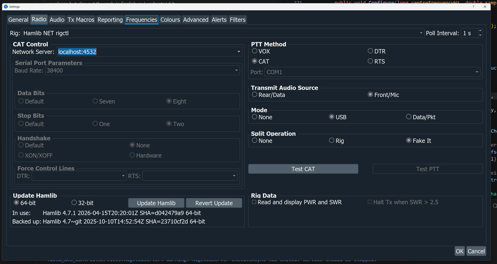
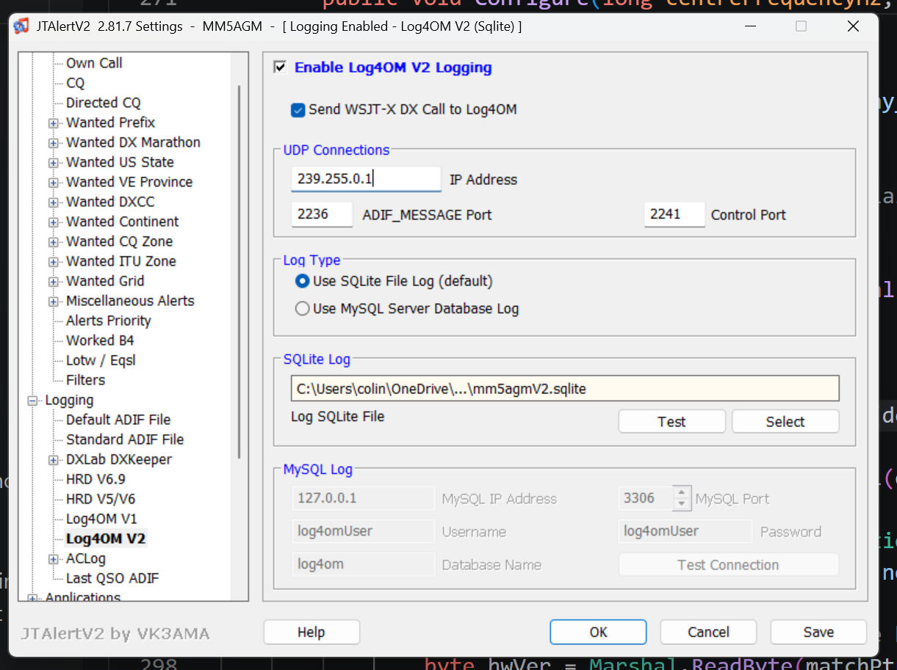
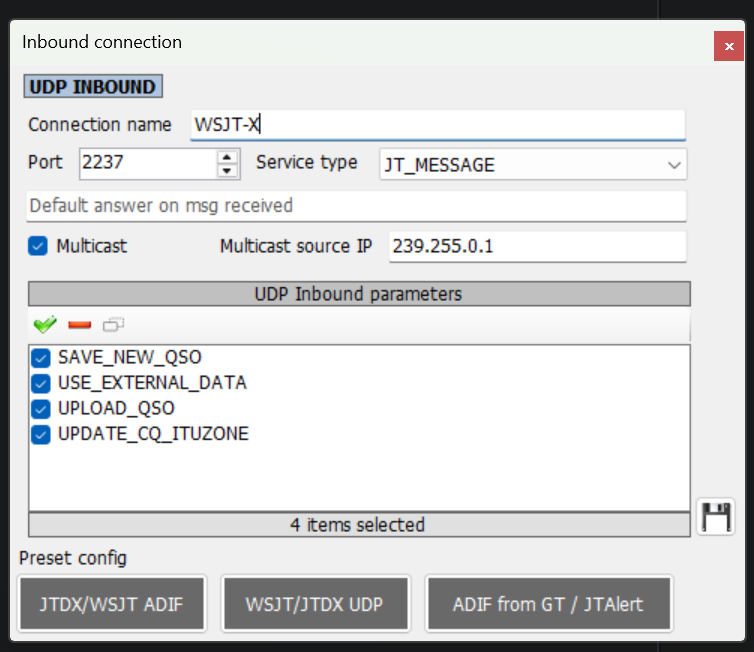
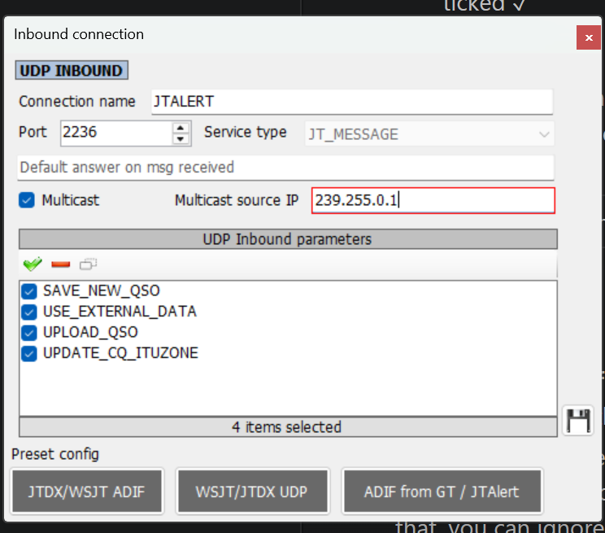
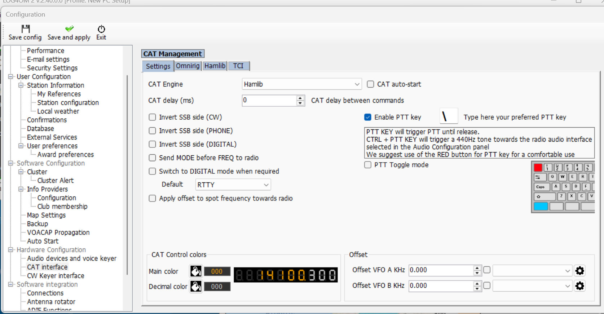

# Yaesu Web Control — User Manual

## Table of Contents

1. [Introduction](#1-introduction)
2. [Installation](#2-installation)
3. [First-Time Setup](#3-first-time-setup)
4. [Starting the Application](#4-starting-the-application)
5. [Main Control Panel](#5-main-control-panel)
   - 5.1 [Top Bar](#51-top-bar)
   - 5.2 [Meters](#52-meters)
   - 5.3 [Power, Mic Gain and Speech Processor](#53-power-mic-gain-and-speech-processor)
   - 5.4 [Spectrum Display](#54-spectrum-display)
   - 5.5 [VFO Panels](#55-vfo-panels)
   - 5.6 [Frequency Display and Tuning](#56-frequency-display-and-tuning)
   - 5.7 [Receiver Controls](#57-receiver-controls)
   - 5.8 [IF Width, IF Low Cut, IF Shift, and AF Gain](#58-if-width-if-low-cut-if-shift-and-af-gain)
   - 5.9 [Band and Segment Selection](#59-band-and-segment-selection)
   - 5.10 [Transmit Controls](#510-transmit-controls)
   - 5.11 [VOX Panel](#511-vox-panel)
   - 5.12 [CW Keyer Panel](#512-cw-keyer-panel)
   - 5.13 [FM Repeater Panel](#513-fm-repeater-panel)
   - 5.14 [Memory Panel](#514-memory-panel)
6. [Settings Page](#6-settings-page)
   - 6.1 [Radio Connection](#61-radio-connection)
   - 6.2 [Web Server Settings](#62-web-server-settings)
   - 6.3 [SDR Spectrum Display](#63-sdr-spectrum-display)
   - 6.4 [Roofing Filters](#64-roofing-filters)
   - 6.5 [CW Memory Messages](#65-cw-memory-messages-m1m5)
7. [Application Setup](#7-application-setup)
   - 7.1 [External App Buttons](#71-external-app-buttons)
   - 7.2 [WSJT-X UDP Settings](#72-wsjt-x-udp-settings)
8. [Radio Memories](#8-radio-memories)
   - 8.1 [Memories Editor](#81-memories-editor)
   - 8.2 [Importing from the Radio](#82-importing-from-the-radio)
   - 8.3 [Exporting to the Radio](#83-exporting-to-the-radio)
   - 8.4 [Memory Banks](#84-memory-banks)
9. [External Applications](#9-external-applications)
   - 9.1 [WSJT-X](#91-wsjt-x)
   - 9.2 [JTAlert](#92-jtalert)
   - 9.3 [Log4OM](#93-log4om)
10. [Meter Calibration](#10-meter-calibration)
11. [Diagnostics](#11-diagnostics)
12. [Using the App on a Tablet or Phone](#12-using-the-app-on-a-tablet-or-phone)
13. [Keyboard Shortcuts](#13-keyboard-shortcuts)
14. [Troubleshooting](#14-troubleshooting)
15. [Accessibility and Screen Readers](#15-accessibility-and-screen-readers)
    - 15.1 [Windows High Contrast Mode](#151-windows-high-contrast-mode)
    - 15.2 [Screen Reader Support](#152-screen-reader-support)
    - 15.3 [NVDA](#153-nvda)
    - 15.4 [Windows Narrator](#154-windows-narrator)
    - 15.5 [Customising Accessible Labels](#155-customising-screen-reader-labels)

---


---

## 1. Introduction

Yaesu Web Control is a web-based control panel for Yaesu HF transceivers. Supported models are:

| Model | Power | Receivers |
|-------|-------|-----------|
| FTdx101MP | 200 W | Dual |
| FTdx101D | 100 W | Dual |
| FTDX3000 | 100 W | Dual |
| FTdx10 | 100 W | Single |
| FT-710 | 100 W | Single |

The app runs as a small application on your shack PC and is accessed through any web browser — on the same PC, a tablet, or any device on your home network.

The application was written for operators who want a large, clean, touchscreen-friendly display alongside their existing logging software, and for those who find the physical controls on the radio difficult to read or reach.

**Key features:**

- Large, readable frequency displays with digit-by-digit mouse-wheel tuning and an on-screen frequency keyboard
- Full dual-receiver control (VFO A and VFO B)
- Live S-meter, power, SWR, ALC, and compression meters (plus PA temperature, IDD, and VDD on FTdx101MP, FTdx101D, and FTDX3000)
- Real-time two-way sync — changes on the radio front panel appear immediately in the app, and vice versa
- Band and segment selectors for fast QSY to CW, FT8, SSB, or RTTY
- Radio memory channels — recall saved frequencies and modes at a click; save and load named memory banks for different operating scenarios (e.g. Daily, Contest)
- Optional real-time spectrum display and waterfall (requires an SDR connected to the 9 MHz IF output)
- Integration with WSJT-X, JTAlert, and Log4OM
- Built-in rigctld server so WSJT-X can control the radio through the app
- Four IARU band plans: Region 1 (Europe, Africa, Middle East), Region 2 (Americas), Region 3 (Asia-Pacific), and Japan (JARL)
- Full screen reader support — compatible with NVDA and Windows Narrator
- Windows High Contrast mode support for all gauge displays
- Customisable accessible labels (band names, meter names, control names) for any language

---

## 2. Installation

1. Download the installer from the [GitHub Releases page](https://github.com/mm5agm/Yaesu_Web_Control/releases).
2. Run the installer. .NET 10 is bundled — you do not need to install it separately.
3. A desktop shortcut and a Start Menu entry are created automatically.
4. The first time you run the app, Windows may show a **Smart App Control** or **Unknown Publisher** warning. Click **More info → Run anyway** to proceed. This warning appears because the installer is not signed with a commercial certificate.

---

## 3. First-Time Setup

Before the app can communicate with your radio you need to tell it which serial port the radio is connected to and what baud rate to use.

1. Open a browser and go to **http://localhost:8080**
2. Click the **Settings** link in the navigation bar.
3. Set **Radio Model** to your transceiver: **FTdx101MP** (200 W, dual receiver), **FTdx101D** (100 W, dual receiver), **FTDX3000** (100 W, dual receiver), **FTdx10** (100 W, single receiver), or **FT-710** (100 W, single receiver).
4. Set **Serial Port** to the COM port your radio is connected to. If you are unsure, go to **Diagnostics → Ports** to see a list of available ports, or check Windows Device Manager.
5. Set **Baud Rate** to match the radio's CAT baud rate. The factory default is **38400** on all supported radios. You can verify or change this on the radio under **Menu → CAT Rate**.
6. Select your **Band Plan**: Region 1 (Europe/Africa/Middle East), Region 2 (Americas), Region 3 (Asia-Pacific), or Japan.
7. Click **Save Settings**, then **Test Connection**. A green tick means the app is talking to the radio.

If you see a red cross, double-check the COM port number and baud rate, then try again.

---

## 4. Starting the Application

Double-click the **Yaesu Web Control** shortcut on your desktop. A small window opens confirming the server has started. The window must remain open while you use the app.

Open your browser and go to:

```
http://localhost:8080
```

The main control panel loads. If the radio is powered on and the serial connection is correct, a brief "Initialising…" overlay appears while the app reads the current radio state. After a few seconds the overlay disappears and all controls reflect the current state of the radio.

**Closing the app:** When you close the browser tab or window, the app detects that no browser is connected and begins a 30-second countdown. If you reopen the page within those 30 seconds (for example after a page refresh or accidentally closing the tab) the countdown cancels and the app continues normally. If no browser reconnects within 30 seconds the application exits automatically and disappears from Task Manager. If you need to force-quit immediately, open Windows Task Manager (**Ctrl+Shift+Esc**, or **Ctrl+Alt+Del** then select Task Manager), find **Yaesu_Web_Control.exe** in the list, and click **End Task**.

**Accessing the app from another device:** If you set **Network Interface** to `0.0.0.0 (all interfaces)` in Settings (the default), the app is also accessible from any device on your local network. The Settings page shows the full URL for each network interface — bookmark one of these on your tablet or phone.

---

## 5. Main Control Panel

### 5.1 Top Bar

The top bar contains navigation links, external application buttons, and the radio power button. The app name and current version number (e.g., **Yaesu Web Control v1.5.3**) are shown in the top-left corner.

**Update notification** — on startup the app silently checks the GitHub releases page for a newer version. If one is available, a small banner appears in the bottom-right corner with a **Download** link that opens the releases page in your browser, and a **Dismiss** button. No banner appears if you are already on the latest version or if the internet is not available.

**External app buttons** (WSJT-X, JTAlert, Log4OM) appear if they are enabled in Application Setup. The colour of each button indicates status:

| Colour | Meaning |
|--------|---------|
| Green | Application is running and connected |
| Yellow | Application is running but waiting for UDP data (WSJT-X only) |
| Red | Application is not running |

Click a button to launch the application. If it is already running, it is brought to the front.

The **WSJT-X** button also shows a red **TX** badge when WSJT-X is currently transmitting.

**POWER button** (top right) turns the radio on or off. The button is green when the radio is on and red when it is off.

---

### 5.2 Meters

A scrollable row of meters is displayed above the VFO panels. The meters shown depend on your radio model:

**FTdx101MP, FTdx101D, FTDX3000** — seven meters:

| Meter | What it shows |
|-------|--------------|
| SWR | Standing wave ratio on the antenna — only active during transmit |
| Power | Output power in watts — only active during transmit |
| Compression | Speech compression in dB — only active during transmit |
| ALC | Automatic Level Control voltage — only active during transmit |
| Temp | PA temperature in °C |
| IDD | PA drain current in amps |
| VDD | PA supply voltage in volts |

**FTdx10, FT-710** — four meters (SWR, Power, Compression, ALC). The Temp, IDD, and VDD meters are not shown because those radios have a different power amplifier design that runs on 13.8 V; the high-voltage PA meters do not apply.

All meters update in real time at approximately 10 times per second. Meters that only apply to transmit automatically read zero when the radio is receiving.

The meter scales are calibrated to show meaningful units rather than raw ADC values. See Section 10 (Meter Calibration) if you want to adjust the calibration for your specific radio.

---

### 5.3 Power, Mic Gain and Speech Processor

**Power slider** — Sets the transmit power from 5 W to 200 W (FTdx101MP) or 5 W to 100 W (FTdx101D, FTDX3000, FTdx10, and FT-710). Drag the slider to set the desired power level. The current value is shown to the right of the slider.

**MIC Gain / Data Out Gain slider** — Sets the microphone gain (0–100). When the radio is in a data mode (DATA-U, DATA-L, PSK, RTTY, or DATA-FM), the label changes to **Data Out Gain** automatically.

**PROC button** — Toggles the speech processor on and off. The button is amber when the processor is active and grey when off. The speech processor increases the average power of your transmitted audio, which can improve readability at the other end — particularly useful for SSB DX and pile-ups.

**PROC Level slider** — Sets the speech processor compression level (0–100). A typical starting point is around 50. Higher values increase average power further but can make the audio sound over-processed and harder to copy. Monitor the compression meter while speaking and aim for 6–10 dB of compression. Both the PROC on/off state and the level are saved and restored when the app restarts.

---

### 5.4 Spectrum Display

The spectrum display is only visible if an SDR device has been configured in Settings. It shows a real-time spectrum and scrolling waterfall of the band around the current VFO A frequency.

**Span buttons** — Click **250k**, **500k**, **1M**, or **2M** to change the visible bandwidth. The display recentres on VFO A.

**Click to tune** — Click anywhere on the spectrum to tune VFO A to that frequency.

**Mouse wheel to tune** — Scroll the mouse wheel over the spectrum to tune VFO A up or down in 1 kHz steps.

**Frequency crosshair** — Move the mouse over the spectrum to see the exact RF frequency at the cursor position displayed above the waterfall.

A status badge in the spectrum panel shows the current SDR state: **No SDR**, **Connecting…**, **Live**, or **Disconnected**.

---

### 5.5 VFO Panels

There are two VFO panels side by side:

- **VFO A** (blue border) — the main receiver, present on all supported radios
- **VFO B** (green border) — the sub-receiver, present on all supported radios.

Both panels have identical controls. All settings are independent — changing a control in VFO A does not affect VFO B.

**VFO-B toggle** — the **VFO-B** button in the toolbar shows or hides the VFO B panel. The last state is remembered across sessions.

**A↔B Swap** — the **A↔B** button in the toolbar swaps the frequencies and modes between VFO A and VFO B in one click. Available on all supported radios.

---

### 5.6 Frequency Display and Tuning

The frequency display shows the current VFO frequency in MHz to 1 Hz resolution (e.g., **14.074.000**).

**Digit tuning with the mouse wheel:**

1. Click on any digit in the frequency display. The selected digit is highlighted.
2. Roll the mouse wheel up to increase that digit, or down to decrease it.
3. Carry-over is automatic — for example, scrolling 9 → 0 on the kHz digit also increments the 10 kHz digit.
4. The new frequency is sent to the radio approximately 200 ms after you stop scrolling.
5. Click anywhere outside the frequency display to deselect.

**On a tablet or phone**, tap a digit to select it, then use the **▲** and **▼** buttons that appear below the display to adjust it.

---

**On-screen frequency keyboard:**

A numeric entry button (**⑁**) appears to the right of the **MHz** label on each VFO panel. Click or tap it to open a floating on-screen number pad for typing in a frequency directly.

The keyboard pre-fills with the current VFO frequency when it opens. The display shows the frequency as **XX.YYYYYY MHz** with the current digit position highlighted in blue.

You can enter digits by clicking the on-screen buttons **or by typing on your physical keyboard** — whichever is more convenient.

| Key | Action |
|-----|--------|
| **0–9** | Enter a digit at the cursor position and advance the cursor one place to the right |
| **◀ / ▶** | Move the cursor left or right without changing any digit |
| **⌫** | Zero the digit at the cursor and move the cursor left |
| **CLR** | Reset all digits to zero |
| **↵ Enter** | Validate and send the frequency to the radio, then close the keyboard |
| **✕** (title bar) | Close the keyboard without changing the frequency |
| **Esc** | Close the keyboard without changing the frequency |

The same actions are available from the physical keyboard: digit keys type digits; **← →** move the cursor; **Backspace** zeros the current digit; **Delete** clears all digits; **Enter** sends the frequency; **Esc** closes the keyboard.

If you enter a frequency outside the radio's range (0.030–75.000 MHz) an error message appears and the frequency is not sent.

**Moving and resizing the keyboard:** Drag the title bar to move the keyboard anywhere on screen (touch drag is also supported on tablets). Drag the bottom-right corner to resize it. The position and size are saved automatically and restored the next time you open the keyboard.

All keys have accessible labels for screen readers.

---

### 5.7 Receiver Controls

Each VFO panel has a row of dropdowns for the main receiver settings. All are two-way — if you change a setting on the radio's front panel, the dropdown updates automatically.

**Mode** — Select the operating mode:
LSB, USB, CW-U, CW-L, FM, FM-N, AM, AM-N, RTTY-L, RTTY-U, DATA-L, DATA-U, DATA-FM, DATA-FM-N, PSK

**Antenna** — Select the antenna connector: ANT 1, ANT 2, ANT 3

**Roofing Filter** — Select the roofing filter bandwidth: 12 kHz, 3 kHz, 1.2 kHz, 600 Hz, 300 Hz

**Control column** (the two-column grid of dropdowns to the right):

| Control | Options |
|---------|---------|
| AGC | OFF, FAST, MID, SLOW, AUTO |
| IPO/AMP | IPO, AMP1, AMP2 |
| ATT | OFF, 6 dB, 12 dB, 18 dB |
| NR | OFF, NR1, NR2 |
| NB | OFF, ON |
| NB Level | 1–20 (noise blanker depth; only relevant when NB is ON) |
| Auto Notch | OFF, ON |
| Man Notch | OFF, ON |
| Notch Hz | Slider 10–3200 Hz (only relevant when Man Notch is ON) |

All of these settings are restored to the radio when the app starts.

**Filter Function Display** — A compact real-time display positioned alongside the band buttons, between the band button column and the receiver controls column. It shows the shape of the active DSP filter passband, matching the style of the filter scope on the FTdx101MP front panel.

- The **red-bordered trapezoid** represents the active passband. The sloped sides reflect the filter roll-off characteristic at the passband edges.
- **Green animated bars** inside the trapezoid represent signals passing through the filter. No signals are shown outside the passband, making it immediately clear which audio frequencies are being received.
- **Passband width** reflects the current IF Width setting, automatically constrained by the selected Roofing Filter if it is narrower than the DSP setting.
- **Passband position** shifts left or right as the IF Shift slider is adjusted — the display updates live while dragging the slider.
- A **white downward arrow** appears on the top edge of the passband when the Contour filter is active, indicating the contour centre frequency. It moves as the contour frequency slider is adjusted.
- The display updates automatically whenever any filter parameter changes, whether adjusted from the browser or from the radio's front panel.

---

### 5.8 IF Width, IF Low Cut, IF Shift, and AF Gain

**IF Width** — Sets the DSP filter bandwidth. Options: 200 Hz, 400 Hz, 600 Hz, 850 Hz, 1.2 kHz, 1.4 kHz, 1.8 kHz, 2.4 kHz, 3.0 kHz. This setting is persisted and restored on startup.

**IF Low Cut** — Sets the lower edge of the DSP passband (SL command). Options: OFF, 100 Hz, 200 Hz, 300 Hz, 400 Hz, 500 Hz, 600 Hz, 700 Hz, 800 Hz, 900 Hz, 1.0 kHz, 1.1 kHz. Use this to cut low-frequency audio or interference — for example, 300 Hz in SSB to reduce hum and LF splatter. This setting is independent per VFO.

**IF Shift** — Shifts the passband centre ±1000 Hz in 20 Hz steps. Drag the slider or use the keyboard arrow keys. The current offset is shown next to the slider.

**Zero button** — Resets IF Shift to 0 Hz instantly.

IF Shift is persisted and restored on startup.

**AF Gain** — Sets the audio output level (0–255). Drag the slider and release to send the new value to the radio.

---

### 5.9 Band and Segment Selection

**Band buttons** — Click a band button (160m, 80m, 40m, etc.) to switch the VFO to that band. The radio tunes to the last-used frequency on that band. You can also navigate between band buttons with the keyboard: **Tab** moves focus into the band group, then the **left/right arrow keys** move between bands and activate the selected one immediately.

Available bands depend on your band plan setting:

| Band Plan | Bands |
|-----------|-------|
| IARU Region 1 (Europe, Africa, Middle East) | 160m, 80m, 60m, 40m, 30m, 20m, 17m, 15m, 12m, 10m, 6m, **4m** |
| IARU Region 2 (Americas) | 160m, 80m, 60m, 40m, 30m, 20m, 17m, 15m, 12m, 10m, 6m |
| IARU Region 3 (Asia-Pacific) | 160m, 80m, 60m, 40m, 30m, 20m, 17m, 15m, 12m, 10m, 6m |
| Japan (JARL) | 160m, 80m, 40m, 30m, 20m, 17m, 15m, 12m, 10m, 6m |

Region 1 is the only plan that includes the 4m (70 MHz) band. Japan has no 60m secondary allocation.

**Segment dropdown** — After selecting a band, a dropdown appears above the frequency display showing common operating segments for that band. Select a segment to jump directly to its standard frequency and set the appropriate mode:

| Segment | Example (20m) | Mode set |
|---------|--------------|---------|
| CW | 14.025 MHz | CW-U |
| FT8 | 14.074 MHz | DATA-U |
| SSB | 14.150 MHz | USB |
| RTTY | 14.080 MHz | RTTY-U |

The last segment you used on each band is remembered, so when you return to a band the dropdown re-selects your previous segment.

**60m — Region 1 and Region 3:** Shows FT8 (5.357 MHz) and USB (5.362 MHz) segments, covering the WRC-15 secondary allocation (5351.5–5366.5 kHz). Access to 60m varies by country within these regions.

**60m — Region 2 (Americas):** Shows the five FCC-designated channels (5.331, 5.347, 5.357, 5.372, 5.404 MHz).

**60m — Japan:** No 60m secondary allocation; the 60m band does not appear for the Japan plan.

---

### 5.10 Transmit Controls

**TX button** — Appears on whichever VFO is currently the transmit VFO. Click to start transmitting; click again to return to receive. The button turns red and the label changes to **TX** while transmitting.

**Radio POWER button** — Turns the radio on or off. The button shows green (on) or red (off).

**Connect button** — Manually connects or disconnects the CAT serial link to the radio. Shown as **Connect** (grey) when disconnected and **Disconnect** (green) when connected. Useful if the radio was powered on after the app started, or after a USB cable was unplugged and re-plugged.

**ATU button** — Initiates an ATU (Automatic Tuner Unit) tune cycle. Labelled **ATU: On** (green) when the ATU is active or **ATU: Off** (grey) when bypassed. Clicking the button when active triggers a fresh tune cycle; clicking when inactive activates the ATU. Only applies to radios fitted with an internal or external ATU.

**Mon level** — TX monitor level slider (0–100). Controls how much of the transmitted audio you hear in the headphones during TX. Drag and release to apply.

**VOX button** — Opens the **VOX Settings** panel. The button shows **VOX: On** (green) or **VOX: Off** (grey) based on the current VOX state.

**CW button** — Opens the **CW Keyer** panel. See Section 5.12.

**FM Rep button** — Opens the **FM Repeater** panel. See Section 5.13.

**MIC Gain** — Drag the slider to set the microphone gain (0–100). The value is sent to the radio as you release.

**PROC** — Speech processor toggle. Shows **Proc On** (green) or **Proc Off** (grey).

**PROC Level** — Speech processor level slider (0–100).

---

### 5.11 VOX Panel

Click the **VOX** button to open the VOX pop-up panel.

| Control | Description |
|---------|-------------|
| VOX toggle | Enables or disables VOX. Shows **VOX: On** (green) or **VOX: Off** (grey) |
| Gain | VOX sensitivity (0–100). Higher values trigger TX more easily |
| Delay | VOX hang time (0–2500 ms). Time TX stays active after audio stops |
| Anti-VOX | Anti-VOX level (0–100). Suppresses the receiver audio from triggering VOX |

Close the panel by clicking the **×** button or clicking outside it.

---

### 5.12 CW Keyer Panel

Click the **CW** button to open the CW Keyer pop-up panel.

| Control | Description |
|---------|-------------|
| Speed | Keyer speed in WPM (4–60) |
| Break-in | **Off** (keyer only), **Semi** (semi break-in), or **Full** (QSK full break-in) |
| Delay | Semi break-in delay (0–2500 ms) — only relevant in Semi mode |
| M1–M5 buttons | Sends the corresponding memory message via the radio's KY CAT command |

**CW memory messages** are configured on the **Settings** page (see Section 6.5). Each message can be up to 24 characters. Use `{CALL}` as a placeholder — it is sent literally (the radio does not expand it; configure your callsign in the message text directly for CW use).

---

### 5.13 FM Repeater Panel

Click the **FM Rep** button to open the FM Repeater pop-up panel. These settings apply when using FM mode.

| Control | Description |
|---------|-------------|
| Shift | **None**, **Positive** (+), **Negative** (−), or **Split** |
| Offset | Repeater offset in kHz. Common values: 600 kHz (2m), 1600 kHz (70cm) |
| CTCSS Mode | **Off**, **Encoder**, **Decoder**, or **Encoder + Decoder** |
| CTCSS Tone | Select the required CTCSS sub-tone from the standard set (67.0 Hz – 254.1 Hz) |
| Apply button | Sends all FM repeater settings to the radio in one operation |

---

### 5.14 Memory Panel

The **Mem** button in the toolbar opens a floating memory panel showing all your saved memory channels as clickable tiles. Each tile shows the label, frequency, and mode. Click a tile to instantly tune VFO A to that frequency and mode.

The panel is non-modal — it stays open while you use the rest of the app. Drag the title bar to reposition it anywhere on screen. Its position is remembered between sessions.

**Save to Mem button** — A **Save to Mem** button appears below the S-meter on both the VFO A and VFO B panels. Click it to save the current VFO frequency and mode as a new memory. A label input box appears — type a name (up to 12 characters) and press Enter or click Save. The new memory appears immediately in the floating panel.

**Banks dropdown** — if you have saved memory banks (see Section 8.4), a **Banks** dropdown appears in the toolbar alongside the Save to Rig buttons. Select a bank name to switch to it instantly — the memory list is replaced with that bank's contents and the tiles refresh automatically. The dropdown resets to its placeholder after loading, and is hidden when no banks have been saved.

For full memory management — editing labels and frequencies, reordering, importing from and exporting to the radio, and memory banks — see Section 8.

---

## 6. Settings Page

Access Settings from the navigation bar or by clicking the settings icon. Changes take effect only after clicking **Save Settings**.

### 6.1 Radio Connection

| Setting | Description |
|---------|-------------|
| Radio Model | **FTdx101MP** (200 W, dual RX), **FTdx101D** (100 W, dual RX), **FTDX3000** (100 W, dual RX), **FTdx10** (100 W, single RX), or **FT-710** (100 W, single RX) |
| Serial Port | COM port the radio's USB/serial cable is connected to (e.g., COM3) |
| Baud Rate | Must match the radio's CAT Rate setting. Default: 38400 |
| Band Plan | **IARU Region 1** (Europe, Africa, Middle East — includes 4m), **IARU Region 2** (Americas), **IARU Region 3** (Asia-Pacific), or **Japan** (JARL). Affects which bands and segment frequencies are shown. UK is Region 1; USA, Canada, and South America are Region 2; Australia, New Zealand, and most of Asia (except Japan) are Region 3. |

After changing the serial port or baud rate, click **Test Connection** to verify the radio responds. A green tick confirms success.

---

### 6.2 Web Server Settings

| Setting | Description |
|---------|-------------|
| Network Interface | `localhost` (this PC only) or `0.0.0.0` (all interfaces, including LAN). Choose `0.0.0.0` to access the app from a tablet or phone |

> **Note:** After changing the network interface, save settings and restart the application.

The Settings page also shows the full URL for each detected network interface so you can bookmark the correct address on your tablet.

---

### 6.3 SDR Spectrum Display

The spectrum display requires an SDR receiver. On the FTdx101MP, FTdx101D, and FTDX3000 the SDR is connected to the radio's 9 MHz IF output (rear panel RCA socket labelled **IF OUT**), giving a VFO-centred panoramic view of the band. The FTdx10 and FT-710 do not have an IF output — see the note below.

> **FTdx10 and FT-710 users:** These radios have no rear-panel IF output. You can still use an SDR for spectrum display by connecting it to an antenna port, but the spectrum will show absolute RF frequencies rather than a view centred on your VFO frequency. The IF Frequency setting has no effect when used this way. The Settings page shows a reminder of this when FTdx10 or FT-710 is selected as the radio model.

**Supported hardware:**
- **SDRplay RSP1 and RSP series** — requires the [SDRplay API v3](https://www.sdrplay.com/downloads/) to be installed separately
- **RTL-SDR, Airspy, HackRF** — drivers are included in the app installer; no separate installation needed

**Setting up the SDR (FTdx101MP / FTdx101D / FTDX3000):**

1. Connect the SDR to the 9 MHz IF output using an RCA-to-SMA adapter and a short coax cable.
2. Go to Settings and click **Scan** in the SDR section.
3. Detected devices appear in the dropdown. Select your device.
4. Set **IF Frequency** to `9000000` (9 MHz) for the FTdx101 IF output.
5. **Sample Rate**: 2M (2,048,000 Hz) is recommended and gives a 2 MHz span.
6. **FFT Size**: 1024 is recommended.
7. Click **Save Settings**.

The spectrum panel appears on the main page when a device is saved. If you want to remove the spectrum display, click **Disable/Clear** in the SDR settings section.

| SDR Setting | Recommended Value |
|-------------|------------------|
| IF Frequency | 9,000,000 Hz (FTdx101MP, FTdx101D, FTDX3000) — no effect on FTdx10 or FT-710 |
| Sample Rate | 2,048,000 (2M) |
| FFT Size | 1024 |

---

### 6.4 Roofing Filters

Select which optional roofing filters are fitted to your radio. The app uses this list to show only the installed filters in the Roofing Filter dropdown on the main page. FTdx101MP comes fully loaded; FTdx101D, FTdx10, and FTDX3000 allow optional filter selection.

---

### 6.5 CW Memory Messages (M1–M5)

Enter up to five CW message memories. These are available from the CW Keyer panel (see Section 5.12) via the M1–M5 buttons.

- Maximum 24 characters per message
- Messages are saved in application settings and persist between sessions
- Use the M1–M5 buttons in the CW panel to send a message

**Example messages:**

| Slot | Default message |
|------|----------------|
| M1 | CQ CQ DE {CALL} |
| M2 | TU 73 |
| M3 | QRZ? |
| M4 | UR 5NN |
| M5 | DE {CALL} |

Note: `{CALL}` is a reminder placeholder — the radio's KY command does not perform variable substitution. Replace `{CALL}` with your actual callsign.

---

## 7. Application Setup

Access Application Setup from the navigation bar. This page configures the external application buttons and the WSJT-X UDP connection.

### 7.1 External App Buttons

Three buttons can appear in the top bar to launch external applications. For each button you can set:

- **Show / Hide** — whether the button appears on the main page
- **Button Name** — the label shown on the button (e.g., "WSJT-X")
- **Command Line** — the full path to the executable, including any arguments

Default command lines:

| App | Default |
|-----|---------|
| WSJT-X | `C:\WSJT\wsjtx\bin\wsjtx.exe --rig-name=WebApp` |
| JTAlert | `C:\HamApps\JTAlert\JTAlert.exe` |
| Log4OM | `C:\Program Files (x86)\Log4OM 2\Log4OM.exe` |

Adjust these to match where you have installed each program.

---

### 7.2 WSJT-X UDP Settings

| Setting | Default | Description |
|---------|---------|-------------|
| UDP Address | 239.255.0.1 | Multicast address WSJT-X sends status packets to |
| UDP Port | 2237 | UDP port number |

These must match WSJT-X's **Settings → Reporting → UDP Server** settings. See Section 9.1 for full WSJT-X setup instructions.

---

## 8. Radio Memories

The app maintains its own list of memory channels, independent of the radio's built-in memories. You can store as many channels as you like, organised with labels, and recall any of them at a click from the floating Mem panel (see Section 5.11).

### 8.1 Memories Editor

Access the full memories editor from **Memories** in the navigation bar.

The editor shows all your saved memories in a table. For each memory you can edit:

| Field | Description |
|-------|-------------|
| Label | Name shown on the memory tile (up to 12 characters) |
| Frequency (MHz) | Frequency in MHz, e.g. 14.074 |
| Mode | Operating mode (LSB, USB, CW-U, DATA-U, FM, etc.) |
| Clarifier (Hz) | Clarifier offset in Hz |
| RX Clar | Whether the RX clarifier is enabled |
| TX Clar | Whether the TX clarifier is enabled |

Click **Save** to save all changes. Click **Add Memory** to append a blank row. Click the **trash** icon on any row to delete that memory.

The **Pop Out** button opens the Memories page in a new browser tab — useful if you want to edit memories on a second monitor while the main control panel is open in the first.

---

### 8.2 Importing from the Radio

The radio's built-in memory channels can be read into the app using the **Import** buttons at the top of the Memories page.

| Button | What it does |
|--------|-------------|
| **Import (Replace)** | Reads channels 001–099 from the radio and replaces ALL app memories with what is found. Your existing app memories are lost. |
| **Import (Add)** | Reads channels 001–099 from the radio and adds them to your existing app memories without deleting anything. |

Import reads up to 99 channels and takes up to 30 seconds. A progress indicator is shown while it runs. Channels that are empty on the radio are skipped automatically.

> **Note:** Importing does not affect the radio — it only reads from it.

---

### 8.3 Exporting to the Radio

| Button | What it does |
|--------|-------------|
| **Export to Radio** | Writes your app memories to the radio starting at channel 001, overwriting ALL existing radio channels. |
| **Export to Radio (Add)** | Scans the radio for empty channels and writes your app memories into those slots only. Existing radio channels are not touched. |

> **Warning:** Export to Radio (Replace) overwrites all 99 radio memory channels. Make sure you have imported or backed up anything you want to keep first.

---

### 8.4 Memory Banks

Memory banks let you save the current memory list under a name and reload it later. This is useful if you use different sets of memories for different operating scenarios — for example a "Daily" bank for regular operating and a "Contest" bank with contest-specific frequencies.

The **Memory Banks** bar appears at the top of the Memories page.

**Saving a bank:**

1. Set up your memories as you want them (add, edit, import from radio, etc.) and click **Save** on the editor form.
2. Click **Save As…** in the Memory Banks bar.
3. Type a name for the bank (e.g. "Contest") and click OK.
4. If a bank with that name already exists, you are asked to confirm overwrite.

The bank is saved immediately. Your current working memories are unchanged.

**Loading a bank:**

1. Select a bank from the dropdown.
2. Click **Load**.
3. Confirm the prompt — the current memory list is replaced with the bank contents and the page reloads.

**Deleting a bank:**

1. Select the bank from the dropdown.
2. Click **Delete** and confirm.

Deleting a bank does not affect your current working memories.

Banks are stored in `%APPDATA%\MM5AGM\Yaesu Web Control\memory-banks.json` and are not affected by importing from or exporting to the radio.

---

## 9. External Applications

### 9.1 WSJT-X

The app integrates with WSJT-X in two ways:

1. **CAT control via rigctld** — the app runs a rigctld-compatible server on TCP port 4532. WSJT-X connects to this to control the radio (frequency, mode, PTT).
2. **UDP status sync** — WSJT-X sends status packets (frequency, mode, TX state) to the app via UDP. The app uses these to keep VFO A in sync.

**Configuring WSJT-X for use with this app:**

The default command line (`--rig-name=WebApp`) causes WSJT-X to use a separate configuration profile called "WebApp". You must configure this profile once:

1. Launch WSJT-X from the app's button (so it starts in the WebApp profile).
2. In WSJT-X, go to **File → Settings**.

**Radio tab:**
- Rig: **Hamlib NET rigctl**
- Network Server: `localhost:4532`
- PTT Method: **CAT**
- Split Operation: **Fake It**
- Click **Test CAT** — it should show green.
- Click OK.



**Reporting tab:**
- UDP Server: `239.255.0.1`
- UDP Server port: `2237`
- Outgoing Interfaces: `loopback_0` (or leave blank for all interfaces)
- Multicast TTL: `1`
- Tick: **Accept UDP requests**, **Notify on accepted UDP request**
- Click OK.


These settings are saved in the WebApp profile and used every time WSJT-X is launched from the app button.

> **Important:** If you already use WSJT-X with a direct serial connection to the radio, the `--rig-name=WebApp` keeps those settings separate. Your normal WSJT-X profile is not affected.

**If you do not want a separate profile**, remove `--rig-name=WebApp` from the WSJT-X command line in Application Setup. WSJT-X will then use its default configuration — make sure that configuration points to rigctld on port 4532.

---

### 9.2 JTAlert

JTAlert monitors WSJT-X activity and displays alerts for callsigns of interest. It can also send QSO data to Log4OM via UDP multicast.

The JTAlert button in the top bar launches JTAlert and shows green when it is running.

**Configuring JTAlert to log to Log4OM:**

In JTAlert, go to **Settings → Logging → Log4OM V2** and set:

- **Enable Log4OM V2 Logging:** ticked
- **Send WSJT-X DX Call to Log4OM:** ticked
- **IP Address:** `239.255.0.1`
- **ADif_MESSAGE Port:** `2236`
- **Control Port:** `2241`



---

### 9.3 Log4OM

Log4OM can receive QSO data from WSJT-X and JTAlert via UDP multicast, and display the current frequency via rigctld.

**Do not use Omni-rig.** Yaesu Web Control owns the serial port. If Omni-rig is also configured for the same radio it will conflict with the app and one will fail.

#### Step 1 — UDP inbound connections

Go to **Software Integration → Connections** and select the **UDP** tab. Add two UDP INBOUND connections.

**For WSJT-X** (receives QSO data directly from WSJT-X):
- Connection name: `WSJT-X`
- Port: `2237`
- Service type: **JT_MESSAGE**
- Multicast: **ticked**
- Multicast source IP: `239.255.0.1`
- Parameters: SAVE_NEW_QSO, USE_EXTERNAL_DATA, UPLOAD_QSO, UPDATE_CQ_ITUZONE



**For JTAlert** (receives QSO data from JTAlert):
- Connection name: `JTALERT`
- Port: `2236`
- Service type: **JT_MESSAGE**
- Multicast: **ticked**
- Multicast source IP: `239.255.0.1`
- Parameters: SAVE_NEW_QSO, USE_EXTERNAL_DATA, UPLOAD_QSO, UPDATE_CQ_ITUZONE



#### Step 2 — Remote control

Still in the Connections screen, select the **Remote Control** tab and set:

- **Remote control port:** `2241`
- **Enable remote control:** ticked
- **Send to specific IP address/port:** `127.0.0.1`

This allows JTAlert to exchange control messages with Log4OM bidirectionally.


#### Step 3 — Frequency display (optional)

If you want Log4OM to display the current frequency independently of WSJT-X, configure the CAT interface. Go to **Hardware Configuration → CAT interface**:

- CAT Engine: **Hamlib**
- Address: `localhost`
- Port: `4532`



#### Startup order

Always start applications in this order:

1. **Yaesu Web Control** (must be running before anything connects to rigctld)
2. **WSJT-X**
3. **JTAlert**
4. **Log4OM**

---

## 10. Meter Calibration

The calibration page lets you adjust the scale of each meter gauge to match your radio's actual output. This is useful if the meter readings seem inaccurate.

Access calibration from **Calibrate Meters** in the navigation bar.

**How calibration works:**

Each meter has a table of calibration points. Each point maps a **raw value** (the number the radio sends) to a **display value** (what is shown on the gauge).

For example, the S-meter might have points like:
- Raw 0 → S0
- Raw 120 → S9
- Raw 200 → S9+20dB

The gauge interpolates between points to produce smooth readings.

**Editing calibration:**

1. To add a point: click **Add Point**, then enter the raw and display values.
2. To delete a point: click the **×** button next to it.
3. To test: click the **TX** button on the calibration page to transmit a test signal and watch the meters respond in real time.
4. Click **Save Calibration** when finished.
5. Click **Reload From File** to discard unsaved changes.

Calibration is saved to `%APPDATA%\MM5AGM\Yaesu Web Control\calibration.user.json`.

---

## 11. Diagnostics

Access the Diagnostics page from the navigation bar. It is primarily used when something is not working as expected.

**COM Ports button** — Opens a list of all serial ports currently detected on your PC. Use this if you are unsure which port the radio is connected to.

**CAT Status JSON button** — Opens a live JSON view of every radio parameter the app knows about. Useful when reporting a bug.

**Live Meter Readings table** — Shows the most recent raw value (0–255) received from the radio for each meter, alongside the CAT command used to request it and the time it was last updated. Rows flash yellow when a new value arrives. High SWR raw values are highlighted in orange.

**SignalR Event Log** — A scrolling log of every radio state update received over the websocket connection, with millisecond timestamps. Use the filter dropdown to narrow the log to a single property (e.g., SWR, Power, S-Meter). The **Pause** button freezes the log so you can read it; **Clear** empties it; **Save…** downloads the current log as a text file.

---

## 12. Using the App on a Tablet or Phone

The app is designed to work well on tablets and phones.

1. Make sure the **Network Interface** in Settings is set to `0.0.0.0 (all interfaces)`.
2. Note the network URL shown on the Settings page (e.g., `http://192.168.1.42:8080`).
3. Open that URL in the browser on your tablet or phone.
4. For the best experience on a tablet, use the browser's **Add to Home Screen** option to create a shortcut.

**Touch-friendly frequency tuning:**

On touch devices, tap a digit in the frequency display to select it (it highlights). Two buttons appear — **▲** (increase) and **▼** (decrease) — which you can tap to adjust that digit.

---

## 13. Keyboard Shortcuts

| Key / Action | Result |
|---|---|
| **F** | Enter full-screen mode |
| **Esc** | Exit full-screen mode |
| Click a frequency digit | Select that digit for editing |
| Mouse wheel (on selected digit) | Increment or decrement the digit |
| Mouse wheel (on spectrum) | Tune VFO A up or down in 1 kHz steps |
| Click on spectrum | Tune VFO A to the clicked frequency |
| **Tab** (in band buttons) | Move focus into the band button group |
| **← / →** (in band buttons) | Move to the previous/next band and switch immediately |
| Numeric entry button (**⑁**) next to MHz | Open the on-screen frequency keyboard for that VFO |
| **0–9** (frequency keyboard open) | Type the digit at the cursor position |
| **← →** (frequency keyboard open) | Move the cursor left or right |
| **Backspace** (frequency keyboard open) | Clear the current digit and move cursor back |
| **Delete** (frequency keyboard open) | Clear all digits |
| **↵ Enter** (frequency keyboard open) | Send the entered frequency to the radio |
| **Esc** (frequency keyboard open) | Close the keyboard without changing frequency |

---

## 14. Troubleshooting

**App shows "Initialising…" and never clears**

- Check that the radio is powered on.
- Check the COM port in Settings. Go to **Diagnostics → Ports** to see which ports are available.
- Check the baud rate in Settings matches the radio's **Menu → CAT Rate** setting (default 38400).
- Click **Test Connection** in Settings.

**Frequency display shows 0 or does not update**

- The radio may not be responding to CAT commands. Test the connection from the Settings page.
- Check that no other software (e.g., another instance of the app, Ham Radio Deluxe, WSJT-X in direct CAT mode, Omni-rig) is using the same COM port. If you use Log4OM with Omni-rig, see Section 9.3 — Omni-rig is not needed and will conflict with this app.

**WSJT-X does not show as connected**

- Make sure you have configured WSJT-X's **WebApp** profile (see Section 8.1). This must be done once after a fresh install.
- Check that the UDP address in Application Setup (default 239.255.0.1) matches WSJT-X's **Settings → Reporting → UDP Server** address.
- Check that the UDP port (default 2237) also matches.
- If WSJT-X was already running when you started the app, restart WSJT-X from the app button.

**WSJT-X cannot control the radio (CAT fails)**

- Make sure WSJT-X's Radio settings are:
  - Rig: Hamlib NET rigctl
  - Network Server: localhost, port 4532
- The rigctld server starts automatically when this app starts. Check the app is running.

**Spectrum display shows "No SDR" or "Disconnected"**

- For SDRplay devices: confirm the **SDRplay API** is installed and the **SDRplay API Service** is running (check services.msc).
- For RTL-SDR: check the device is plugged in and not in use by another application (e.g., SDR#).
- Try clicking **Scan** again in Settings and re-selecting the device.
- Verify the IF Frequency is set to `9000000`.

**Meters appear to show incorrect values**

- The meters use a default calibration that may not exactly match every individual radio. See Section 9 to adjust the calibration.

**App will not start — "Another instance is already running"**

- Only one instance of the app can run at a time. Check the Windows taskbar or system tray for an existing instance. If the previous instance crashed and left a stale lock, restart Windows.

**App shuts down unexpectedly after closing the browser**

- This is normal behaviour. When the last browser tab is closed, the app waits 30 seconds for a reconnection before exiting. If you want to keep the app running (for example while WSJT-X is using it via rigctld), leave a browser tab open on the main page. If you need to force-quit immediately without waiting, open Windows Task Manager (**Ctrl+Shift+Esc**), find **Yaesu_Web_Control.exe**, and click **End Task**.

**Cannot access the app from a tablet**

- Check that **Network Interface** in Settings is set to `0.0.0.0 (all interfaces)`, not `localhost`.
- Check that Windows Firewall allows inbound connections on port 8080. You may see a firewall prompt the first time you use the app.
- Make sure the tablet is on the same Wi-Fi network as the shack PC.

---

## 15. Accessibility and Screen Readers

### 15.1 Windows High Contrast Mode

When a Windows High Contrast theme is active, the gauge displays automatically adjust:

- Gauge needles are shown in bright **yellow** so they remain clearly visible against dark backgrounds.
- Gauge plate backgrounds become transparent, preserving the half-circle appearance.

To enable a High Contrast theme: **Windows Settings → Accessibility → Contrast themes**, choose a theme, and click **Apply**. No changes to the app are needed — it detects the theme automatically.

---

### 15.2 Screen Reader Support

All interactive controls in the app have accessible labels that screen readers announce when you hover over or focus on them:

| Element | What is announced |
|---------|------------------|
| Band buttons | Full band name — e.g., "20 metres, radio button" |
| Band button group | Announced as a radio group; arrow keys move between bands |
| Meter gauges | Meter name and current reading — e.g., "S meter, VFO A: S5", "Amplifier supply voltage meter: 50.2 V" |
| Frequency display | "VFO A frequency" with current value in MHz |
| Sliders, dropdowns, buttons | Their purpose — e.g., "Transmit power", "VFO A mode" |

---

### 15.3 NVDA

NVDA (NonVisual Desktop Access) is a free, open-source screen reader for Windows.

**Download:** [https://www.nvaccess.org/download/](https://www.nvaccess.org/download/)

NVDA works with Edge, Chrome, and Firefox. Install it, then open the app in Edge as normal.

**Essential NVDA keys:**

| Key | Action |
|-----|--------|
| `Insert + N` | Open the NVDA menu |
| `Insert + Q` | Quit NVDA |
| `Insert + M` | Toggle mouse tracking on/off |

**How meter announcements work:**

The app does **not** rely on NVDA's built-in mouse tracking for meter gauges. Instead, the meter canvases are intentionally hidden from NVDA's accessibility tree (`aria-hidden`). An ARIA live region — a standard web accessibility technique — handles all meter announcements directly.

When you move the mouse over a meter gauge, the app reads:

1. The meter's accessible label from your saved labels (see Section 14.5)
2. The current reading at that moment (e.g., "S5", "50.2 V", "1.5:1")

It then writes *both* into the live region, and NVDA announces them as a single phrase — for example: **"Amplifier supply voltage meter: 50.2 V"**.

Because the live region is always active, meter values are announced whether or not NVDA's mouse tracking is enabled. The label used is always your custom label, not a title generated by the gauge library.

**Behaviour on startup:**

When the app loads, NVDA does not automatically read through the page. Two design decisions achieve this:

- The main control panel uses `role="application"`, which tells NVDA to stay in forms/interaction mode rather than reading the page from top to bottom in browse mode.
- The navigation bar at the top of the page is hidden from the accessibility tree so it is not announced when the page loads or when you return to the tab.

**Band navigation:** When Tab moves focus into a band button group, NVDA announces *"Band — use arrow keys to change band, group"*. Press the **left/right arrow keys** to move between bands. Each band change is announced immediately (e.g., "20 metres, radio button, checked").

> **Note:** NVDA reads abbreviations aloud. "SWR" is read as three separate letters ("S W R"). "PA" may be expanded to "Power Amplifier". The default labels in this app are written to avoid ambiguous abbreviations.

---

### 15.4 Windows Narrator

Narrator is the screen reader built into Windows 11 — no download required.

**Toggle Narrator on/off:** `Win + Ctrl + Enter`

Once running, Narrator reads aloud the element that has keyboard focus. To navigate the app with Narrator:

- Use `Tab` to move between interactive controls (buttons, sliders, dropdowns).
- Narrator announces the control's label and current value as focus moves to it.
- In **Scan mode** (`Caps Lock + Space`): use the arrow keys to move through all elements on the page, including non-interactive text and meter labels.

---

### 15.5 Customising Screen Reader Labels

Every control in the app — band buttons, meters, VFO controls, the on-screen frequency keyboard, spectrum span buttons, and the navigation bar home link — has a text label that screen readers announce. You can change any of these labels through the built-in **Accessibility Labels** editor.

**Editing labels:**

1. Click **Accessibility Labels** in the navigation bar.
2. The page shows all labels grouped by section. Edit the text in any **Label** field.
3. Click **Save Labels**.
4. Switch back to the main page — the new labels take effect automatically without needing to reload.

To restore all labels to their factory defaults, click **Reset to Defaults** at the bottom of the page.

---

**What can be customised:**

| Section | Controls covered |
|---------|-----------------|
| Band Buttons | Band buttons — 160m through 4m |
| Meters | All meter gauges (S-meter, SWR, Power, etc.) |
| VFO Controls | Frequency displays, up/down buttons, mode selector |
| Radio Controls | AGC, IPO/AMP, ATT, NR, NB, Notch, Roofing filter, AF gain, IF width, IF shift, TX power, Mic gain |
| Frequency Keyboard | On-screen frequency keyboard — all buttons including digits 0–9 |
| Spectrum Display | Spectrum canvas and span buttons (250k, 500k, 1M, 2M) |
| Navigation | Application name / home link |

---

**Complete French translation:**

On the Accessibility Labels page, replace each label value with the French equivalent below. The section names (Band Buttons, Meters, etc.) and internal keys are not editable — only the label values shown in the input boxes.

| Section | Key | French label |
|---------|-----|-------------|
| Band Buttons | 160m | 160 mètres |
| Band Buttons | 80m | 80 mètres |
| Band Buttons | 60m | 60 mètres |
| Band Buttons | 40m | 40 mètres |
| Band Buttons | 30m | 30 mètres |
| Band Buttons | 20m | 20 mètres |
| Band Buttons | 17m | 17 mètres |
| Band Buttons | 15m | 15 mètres |
| Band Buttons | 12m | 12 mètres |
| Band Buttons | 10m | 10 mètres |
| Band Buttons | 6m | 6 mètres |
| Band Buttons | 4m | 4 mètres |
| Meters | S meter — VFO A | Indicateur S, VFO A |
| Meters | S meter — VFO B | Indicateur S, VFO B |
| Meters | Power output meter | Indicateur de puissance |
| Meters | SWR meter | Indicateur ROS |
| Meters | ALC meter | Indicateur ALC |
| Meters | Compression meter | Indicateur de compression |
| Meters | Amplifier temperature meter | Indicateur de température ampli |
| Meters | Drain current meter | Indicateur de courant de drain |
| Meters | Amplifier supply voltage meter | Indicateur de tension d'alimentation |
| VFO Controls | VFO A — frequency display | Fréquence VFO A en mégahertz |
| VFO Controls | VFO B — frequency display | Fréquence VFO B en mégahertz |
| VFO Controls | VFO A — frequency up button | VFO A fréquence plus haute |
| VFO Controls | VFO A — frequency down button | VFO A fréquence plus basse |
| VFO Controls | VFO B — frequency up button | VFO B fréquence plus haute |
| VFO Controls | VFO B — frequency down button | VFO B fréquence plus basse |
| VFO Controls | VFO A — mode selector | Mode VFO A |
| VFO Controls | VFO B — mode selector | Mode VFO B |
| Frequency Keyboard | Open keyboard — VFO A | Ouvrir le clavier de fréquence pour VFO A |
| Frequency Keyboard | Open keyboard — VFO B | Ouvrir le clavier de fréquence pour VFO B |
| Frequency Keyboard | Close keyboard | Fermer le clavier de fréquence |
| Frequency Keyboard | Digit key: 0 | Zéro |
| Frequency Keyboard | Digit key: 1 | Un |
| Frequency Keyboard | Digit key: 2 | Deux |
| Frequency Keyboard | Digit key: 3 | Trois |
| Frequency Keyboard | Digit key: 4 | Quatre |
| Frequency Keyboard | Digit key: 5 | Cinq |
| Frequency Keyboard | Digit key: 6 | Six |
| Frequency Keyboard | Digit key: 7 | Sept |
| Frequency Keyboard | Digit key: 8 | Huit |
| Frequency Keyboard | Digit key: 9 | Neuf |
| Frequency Keyboard | Move cursor left | Déplacer le curseur à gauche |
| Frequency Keyboard | Move cursor right | Déplacer le curseur à droite |
| Frequency Keyboard | Backspace — clear digit and move left | Retour arrière — effacer le chiffre et reculer |
| Frequency Keyboard | Clear all digits | Effacer tous les chiffres |
| Frequency Keyboard | Confirm frequency entry | Saisir la fréquence |
| Spectrum Display | Spectrum canvas | Affichage du spectre RF |
| Spectrum Display | Span 250 kHz button | Largeur de bande 250 kHz |
| Spectrum Display | Span 500 kHz button | Largeur de bande 500 kHz |
| Spectrum Display | Span 1 MHz button | Largeur de bande 1 MHz |
| Spectrum Display | Span 2 MHz button | Largeur de bande 2 MHz |
| Navigation | Application name / home link | Accueil FTdx101 WebApp |

---

**Complete Danish translation:**

| Section | Key | Danish label |
|---------|-----|-------------|
| Band Buttons | 160m | 160 meter |
| Band Buttons | 80m | 80 meter |
| Band Buttons | 60m | 60 meter |
| Band Buttons | 40m | 40 meter |
| Band Buttons | 30m | 30 meter |
| Band Buttons | 20m | 20 meter |
| Band Buttons | 17m | 17 meter |
| Band Buttons | 15m | 15 meter |
| Band Buttons | 12m | 12 meter |
| Band Buttons | 10m | 10 meter |
| Band Buttons | 6m | 6 meter |
| Band Buttons | 4m | 4 meter |
| Meters | S meter — VFO A | S-måler, VFO A |
| Meters | S meter — VFO B | S-måler, VFO B |
| Meters | Power output meter | Udgangseffektmåler |
| Meters | SWR meter | SWR-måler |
| Meters | ALC meter | ALC-måler |
| Meters | Compression meter | Kompressionsmåler |
| Meters | Amplifier temperature meter | Forstærkertemperaturmåler |
| Meters | Drain current meter | Drænstrømmåler |
| Meters | Amplifier supply voltage meter | Forsyningsspændingsmåler |
| VFO Controls | VFO A — frequency display | VFO A frekvens i megahertz |
| VFO Controls | VFO B — frequency display | VFO B frekvens i megahertz |
| VFO Controls | VFO A — frequency up button | VFO A frekvens op |
| VFO Controls | VFO A — frequency down button | VFO A frekvens ned |
| VFO Controls | VFO B — frequency up button | VFO B frekvens op |
| VFO Controls | VFO B — frequency down button | VFO B frekvens ned |
| VFO Controls | VFO A — mode selector | VFO A tilstand |
| VFO Controls | VFO B — mode selector | VFO B tilstand |
| Frequency Keyboard | Open keyboard — VFO A | Åbn frekvenstastaturt for VFO A |
| Frequency Keyboard | Open keyboard — VFO B | Åbn frekvenstastaturt for VFO B |
| Frequency Keyboard | Close keyboard | Luk frekvenstastaturt |
| Frequency Keyboard | Digit key: 0 | Nul |
| Frequency Keyboard | Digit key: 1 | En |
| Frequency Keyboard | Digit key: 2 | To |
| Frequency Keyboard | Digit key: 3 | Tre |
| Frequency Keyboard | Digit key: 4 | Fire |
| Frequency Keyboard | Digit key: 5 | Fem |
| Frequency Keyboard | Digit key: 6 | Seks |
| Frequency Keyboard | Digit key: 7 | Syv |
| Frequency Keyboard | Digit key: 8 | Otte |
| Frequency Keyboard | Digit key: 9 | Ni |
| Frequency Keyboard | Move cursor left | Flyt markør til venstre |
| Frequency Keyboard | Move cursor right | Flyt markør til højre |
| Frequency Keyboard | Backspace — clear digit and move left | Tilbage — slet ciffer og flyt til venstre |
| Frequency Keyboard | Clear all digits | Ryd alle cifre |
| Frequency Keyboard | Confirm frequency entry | Indtast frekvens |
| Spectrum Display | Spectrum canvas | RF-spektrum visning |
| Spectrum Display | Span 250 kHz button | Spændvidde 250 kHz |
| Spectrum Display | Span 500 kHz button | Spændvidde 500 kHz |
| Spectrum Display | Span 1 MHz button | Spændvidde 1 MHz |
| Spectrum Display | Span 2 MHz button | Spændvidde 2 MHz |
| Navigation | Application name / home link | FTdx101 WebApp startside |

---

*Yaesu Web Control is written and maintained by mm5agm@outlook.com. For bug reports and feedback, please use the [Groups.io discussion group](https://groups.io/g/Yaesu-Web-Control/topics) or the [GitHub issues page](https://github.com/mm5agm/Yaesu_Web_Control/issues).*
