# Icom Web Control — User Manual

> 🔍 **Searching this manual:** press **Ctrl + F** (Windows / Linux) or **⌘ + F** (Mac) to open your browser's find-in-page box. Type any term — a band name like "60m", a control like "Speech Processor", an error message you've hit — to jump straight to the relevant section.

## Table of Contents

1. [Introduction](#1-introduction)
2. [Installation](#2-installation)
3. [First-Time Setup](#3-first-time-setup)
4. [Starting the Application](#4-starting-the-application)
5. [Main Control Panel](#5-main-control-panel)
   - 5.1 [Top Bar](#51-top-bar)
   - 5.2 [Meters](#52-meters)
   - 5.3 [Power, Mic Gain and Speech Processor](#53-power-mic-gain-and-speech-processor)
   - 5.4 [Spectrum Display](#54-spectrum-display)
   - 5.5 [VFO Panels](#55-vfo-panels)
   - 5.6 [Frequency Display and Tuning](#56-frequency-display-and-tuning)
   - 5.7 [Receiver Controls](#57-receiver-controls)
   - 5.8 [IF Width, IF Shape, Filter Slot, and AF Gain](#58-if-width-if-shape-filter-slot-and-af-gain)
   - 5.9 [Band and Segment Selection](#59-band-and-segment-selection)
   - 5.10 [Transmit Controls](#510-transmit-controls)
   - 5.11 [VOX Panel](#511-vox-panel)
   - 5.12 [CW Keyer Panel](#512-cw-keyer-panel)
   - 5.13 [FM Repeater Panel](#513-fm-repeater-panel)
   - 5.14 [DX Watch Panel](#514-dx-watch-panel)
   - 5.15 [Memory Panel](#515-memory-panel)
   - 5.16 [Voice Announcements](#516-voice-announcements)
   - 5.17 [DX Spots List](#517-dx-spots-list)
6. [Settings Page](#6-settings-page)
   - 6.1 [Radio Connection](#61-radio-connection)
   - 6.2 [Web Server Settings](#62-web-server-settings)
   - 6.3 [Spectrum Scope](#63-spectrum-scope)
   - 6.4 [CW Memory Messages](#64-cw-memory-messages-m1m5)
   - 6.5 [DX Cluster](#65-dx-cluster)
   - 6.6 [Backup &amp; Restore](#66-backup--restore)
7. [Application Setup](#7-application-setup)
   - 7.1 [External App Buttons](#71-external-app-buttons)
   - 7.2 [WSJT-X UDP Settings](#72-wsjt-x-udp-settings)
8. [Radio Memories](#8-radio-memories)
   - 8.1 [Memories Editor](#81-memories-editor)
   - 8.2 [Importing from the Radio](#82-importing-from-the-radio)
   - 8.3 [Importing from ADIF](#83-importing-from-adif)
   - 8.4 [Exporting to the Radio](#84-exporting-to-the-radio)
   - 8.5 [Memory Banks](#85-memory-banks)
   - 8.6 [IWC Starter Bank](#86-iwc-starter-bank)
   - 8.7 [A one-click "FT8 setup" (or any mode) workflow](#87-a-one-click-ft8-setup-or-any-mode-workflow)
9. [External Applications](#9-external-applications)
   - 9.1 [WSJT-X](#91-wsjt-x)
   - 9.2 [JTAlert](#92-jtalert)
   - 9.3 [Log4OM](#93-log4om)
   - 9.4 [GridTracker](#94-gridtracker)
10. [Meter Calibration](#10-meter-calibration)
    - 10.1 [Calibrating the S-Meter (receive)](#101-calibrating-the-s-meter-receive)
    - 10.2 [Calibrating the Power meter (transmit)](#102-calibrating-the-power-meter-transmit)
    - 10.3 [Other meters](#103-other-meters)
11. [Diagnostics](#11-diagnostics)
12. [Using the App on a Tablet or Phone](#12-using-the-app-on-a-tablet-or-phone)
13. [Keyboard Shortcuts](#13-keyboard-shortcuts)
14. [Troubleshooting](#14-troubleshooting)
    - 14.1 [Reporting a bug](#141-reporting-a-bug)
    - 14.2 [Common problems](#142-common-problems)
15. [Frequently Asked Questions](#15-frequently-asked-questions)
    - 15.1 [WSJT-X has no TX audio in DATA modes](#151-wsjt-x-transmits-but-the-radio-shows-no-tx-audio-or-zero-power-output-in-data-u--data-l-mode)
    - 15.2 [Can I use VSPE / OmniRig / com0com?](#152-can-i-use-vspe-omnirig-com0com-or-a-similar-virtual-com-port-sharer)
    - 15.3 [Why was Alexa voice control dropped in favour of the built-in microphone?](#153-why-was-alexa-voice-control-dropped-in-favour-of-the-built-in-microphone-method)
    - 15.4 [What is the TX button for?](#154-what-is-the-tx-button-for-when-i-press-it-the-radio-goes-into-tx-mode-but-theres-no-audio-from-my-microphone)
    - 15.5 [WSJT-X is very slow to key the radio (long PTT / Tune delay)](#155-wsjt-x-is-very-slow-to-key-the-radio-1020-second-delay-on-ptt--tune)
    - 15.6 [Can I hear the radio from another room?](#156-can-i-hear-the-radio-from-another-room-i-have-iwc-working-downstairs-but-theres-no-sound)
16. [Accessibility and Screen Readers](#16-accessibility-and-screen-readers)
    - 16.1 [Making Everything Bigger](#161-making-everything-bigger)
    - 16.2 [Windows High Contrast Mode](#162-windows-high-contrast-mode)
    - 16.3 [Screen Reader Support](#163-screen-reader-support)
    - 16.4 [NVDA](#164-nvda)
    - 16.5 [Windows Narrator](#165-windows-narrator)
    - 16.6 [Customising Accessible Labels](#166-customising-screen-reader-labels)
    - 16.7 [Frequency tuning by keyboard or buttons](#167-frequency-tuning-by-keyboard-or-buttons)
17. [Voice Control](#17-voice-control)
    - 17.1 [What you can say](#171-what-you-can-say)
    - 17.2 [Enabling voice control](#172-enabling-voice-control)
    - 17.3 [Using the mic button](#173-using-the-mic-button)
    - 17.4 [Troubleshooting](#174-troubleshooting)
    - 17.5 [Privacy](#175-privacy)
    - 17.6 [Adding your own commands](#176-adding-your-own-commands)
    - 17.7 [More languages](#177-more-languages)

---


---

## 1. Introduction

Icom Web Control — **IWC** for short — is a web-based control panel for the Icom IC-7300 MkII HF/50 MHz transceiver.

> **Windows only.** IWC runs on Windows 10 or 11 (64-bit). There is no Linux or macOS build, and none is planned. The app is hosted by a small WinForms process and uses a Windows serial-port driver to reach the radio. You can still access the browser interface itself from any device on your home network (tablet, phone, Linux laptop) — but the IWC server must be running on a Windows PC.

> **No internet connection needed.** IWC reaches the radio over a serial cable and serves its own web page from your own PC, so the whole of it works on a shack computer that has never been online. Only two things reach out to the internet, and neither is required: the **DX cluster** spot feed (Section 6.5), which is off until you switch it on, and the **update check** that tells you when a new version is available. With no connection the cluster badge simply reads *Disconnected* and the update banner never appears. Everything else — meters, spectrum, tuning, voice control, WSJT-X and the rest — is entirely local.
>
> **This was not quite true up to and including v1.0.3.** The page fetched three files — the meter-gauge library, the icon font and the library that carries live updates from the radio to the browser — from public servers on the internet instead of from your PC. Almost nobody noticed, because a browser that had loaded them once kept its own copy for a year afterwards. On a PC that had never been online they never arrived at all, and the page opened with no meters and no value that ever changed. All three now ship inside IWC. **If your shack PC has no internet, use v1.0.4 or later — the v1.0.4 pre-releases carry the fix too.**

Supported radio:

| Model | Power | Receiver | Interface |
|-------|-------|----------|-----------|
| IC-7300 MkII | 100 W | Single (VFO A / VFO B) | CI-V over USB Type-C |

IWC connects to the IC-7300 MkII over its CI-V computer-control interface, carried on the radio's single USB Type-C cable. No extra hardware is required — the spectrum scope, meters, and all controls come over that one connection.

The app runs as a small application on your shack PC and is accessed through any web browser — on the same PC, a tablet, or any device on your home network.

The application was written for operators who want a large, clean, touchscreen-friendly display alongside their existing logging software, and for those who find the physical controls on the radio difficult to read or reach. **Voice control and spoken announcements are first-class features** for partially sighted operators.

**Key features:**

- Large, readable frequency display with digit-by-digit mouse-wheel tuning and an on-screen frequency keyboard
- VFO A / VFO B control (the IC-7300 is a single-receiver radio; the app presents and switches both VFOs)
- Live S-meter, power, SWR, ALC, and compression meters
- Real-time two-way sync — changes on the radio front panel appear immediately in the app, and vice versa
- Band and segment selectors for fast QSY to CW, FT8, SSB, or RTTY
- **IF passband width** control with a FIL1 / FIL2 / FIL3 filter-slot selector — pick any width the radio supports for the current mode, straight from the app
- Full receive controls: AGC, Preamp, Attenuator, NR, NB, Auto Notch, Manual Notch, **RF Gain**, **Squelch** (FM mode)
- CW keyer with speed, break-in, delay, **sidetone pitch**, and five programmable memory messages
- TX monitor on/off toggle and level control
- Radio memory channels — recall saved frequencies and modes at a click; save and load named memory banks for different operating scenarios (e.g. Daily, Contest)
- Real-time spectrum display and waterfall using the **IC-7300's built-in band scope**, delivered over CI-V — no external SDR or IF tap needed
- **DX cluster spots** overlaid on the spectrum — click a callsign to QSY straight to that frequency; user-selectable cluster server with live connection-status badge
- **DX watch list** — get a popup alert and a beep when watched callsigns or prefixes appear in the cluster feed (e.g. `P29*` for a DXpedition); persisted across app restarts
- **TX timeout warning** — visible red banner + audible tone if TX has been on too long (configurable threshold), as a safety net against open mics, stuck PTTs and VOX false-triggers
- **Per-VFO status line** inside each VFO panel — at-a-glance summary of band, mode, frequency, power and split state, banner-coloured to match the receiver
- **Voice announcements** — optional spoken cues for band/mode/TX changes, DX alerts and TX timeout, using your browser's built-in text-to-speech (handy for partially sighted operators)
- Integration with WSJT-X, JTAlert, and Log4OM
- Built-in rigctld server so WSJT-X can control the radio through the app
- Four IARU band plans: Region 1 (Europe, Africa, Middle East), Region 2 (Americas), Region 3 (Asia-Pacific), and Japan (JARL)
- Full screen reader support — compatible with NVDA and Windows Narrator
- Windows High Contrast mode support for all gauge displays
- Customisable accessible labels (band names, meter names, control names) for any language

---

## 2. Installation

1. Download the installer from the [GitHub Releases page](https://github.com/mm5agm/Icom_Web_Control/releases).
2. Run the installer. .NET 10 is bundled — you do not need to install it separately.
3. A desktop shortcut and a Start Menu entry are created automatically. Both are called **Icom Web Control**, so typing "icom" into Start finds the app.
   > **Upgrading from v1.0.4 or earlier?** Those versions filed the Start Menu entry inside a folder named **MM5AGM**, which sorts it under **M** rather than **I** and makes it invisible to anyone searching for "Icom". Installing v1.0.5 moves it out to the top level and removes the old one, so you end up with a single entry where you would expect it. If Windows Search does not find a brand-new shortcut immediately, give it a minute to index.
4. The first time you run the app, Windows may show a **Smart App Control** or **Unknown Publisher** warning. Click **More info → Run anyway** to proceed. This warning appears because the installer is not signed with a commercial certificate.

---

## 3. First-Time Setup

Before the app can communicate with your radio you need to tell it which serial port the radio is connected to and what baud rate to use.

**Required — radio connection:**

1. Open a browser and go to **http://localhost:8080**. If port 8080 was already in use on your PC (e.g. Plex, Jenkins, MiniTool ShadowMaker), IWC will have automatically picked the next free port from 8081–8089. **Hover over the IWC tray icon** down by the Windows clock to see the actual URL — or simply double-click the tray icon to have IWC open the right URL in your default browser.
2. Click the **Settings** link in the navigation bar.
3. Set **Radio Model** to your transceiver: **IC-7300 MkII** (HF + 6m + 4m EU) or **IC-7300** (HF + 6m). Both are 100 W, single-receiver.
4. Set **Serial Port** to the COM port your radio is connected to. This is the USB serial port the IC-7300 presents when you plug in its USB Type-C cable. If you are unsure, go to **Diagnostics → Ports** to see a list of available ports, or check Windows Device Manager.
5. Set **Baud Rate**. Leave it at **19200** on the **IC-7300 MkII** — there is nothing on the radio to match it against. The MkII has no **CI-V USB Baud Rate** menu; the **CI-V Baud Rate** item you will find under **Menu → Set → Connectors → CI-V** governs the round **[REMOTE]** socket only, so it has no bearing on a USB connection and its "Auto" default is not a problem. This box alone decides the rate on a MkII.
   **If you have the original IC-7300 — not the MkII — use 115200.** The original model will not send band scope data at any lower rate, so at 19200 everything works except the spectrum display, which stays permanently empty. On the radio set **CI-V USB Port** to **Unlink from [REMOTE]** and **CI-V USB Baud Rate** to **115200**, then set 115200 here as well. Settings shows a warning if you pick a combination that will not work.
6. Select your **Band Plan**: Region 1 (Europe/Africa/Middle East, includes 4m), Region 2 (Americas), Region 3 (Asia-Pacific), or Japan.
7. If you run digital modes (FT8, FT4, RTTY, PSK) via USB audio, see the FAQ (§15) for a one-time radio menu change needed on the radio itself — it's not configurable from IWC.
8. Click **Save Settings**, then **Test Connection**. A green tick means the app is talking to the radio.

If you see a red cross, double-check the COM port number and baud rate, then try again.

**Optional — extras you can set up later in Settings:**

- **DX cluster** (Section 6.5) — connect to a DX cluster server to overlay live DX spots on the spectrum.
- **CW memory messages** (Section 6.4) — pre-fill the M1–M5 CW keyer memories.

None of these are required for basic operation. Get the radio connection working first; come back for the extras when you want them.

---

## 4. Starting the Application

Double-click the **Icom Web Control** shortcut on your desktop. The app starts in the background and your default browser opens automatically to whichever port IWC managed to bind (usually `http://localhost:8080`, but IWC will fall back to 8081–8089 if 8080 was already in use on your PC).

A small **IWC tray icon** appears in the Windows system tray (down by the clock, possibly under the **Show hidden icons ︿** arrow). The tray icon is your "the app is running" indicator and gives you a clean way to manage it without juggling Task Manager:

- **Hover** over the icon — a tooltip confirms the version and the actual URL (e.g. `http://localhost:8080` or `http://localhost:8081`). If you ever wonder which port IWC ended up on, this is the fastest way to check.
- **Double-click** the icon — opens IWC in your default browser (handy if you've closed all browser tabs and need to get back to the app).
- **Right-click** the icon — opens a menu:

| Menu item | What it does |
|---|---|
| Open Icom Web Control | Opens IWC in your default browser. |
| About — version vX.Y.Z | Shows version, release date, and licence. The browser About page (top nav bar) has full details and a Copy diagnostics button. |
| Open user data folder | Opens `%APPDATA%\MM5AGM\Icom Web Control\` in File Explorer — handy for grabbing the backup zip after export, or inspecting/editing JSON files. |
| Exit Icom Web Control | Confirms then shuts the app down cleanly. WSJT-X / Log4OM / JTAlert / GridTracker / Fldigi lose their CAT connection until you restart IWC. |


If the radio is powered on and the serial connection is correct, a full-screen **start-up panel** with a spinner covers the page while the app gets going. It reports what it is waiting for:

- **"Initializing radio, please wait…"** — IWC is opening the serial port and reading the radio's current state.
- **"Starting spectrum scope, please wait…"** — the radio is talking; IWC is now waiting for the first spectrum sweep.

The panel clears when the spectrum appears, so the page you are handed is finished rather than still rearranging itself. On a healthy start with the radio already on this takes about a second and you may barely see it.

If the scope cannot produce a sweep — switched off at the radio, or a fault on the CI-V bus — the panel gives up after about 12 seconds and hands you the rest of the app anyway. There is also a **Continue anyway** button: you should never need it, but the panel covers the whole page, so it is there to make sure nothing can lock you out.

Once it clears, all controls reflect the current state of the radio. This includes frequencies, mode, AGC, NB level, ATU state, VOX settings, FM repeater settings, CW keyer speed and break-in mode, IF width, and more — no software defaults are applied.

If the radio is switched **off**, the panel clears straight away and leaves you on the main page so you can turn the radio on with the power button. If the serial port is wrong or missing, the panel says so and offers a link to Settings rather than spinning indefinitely.

**Closing the app:** Three ways:
1. **Right-click the tray icon → Exit Icom Web Control.** Cleanest — confirms first, then shuts the server down properly.
2. **Close the browser tab and walk away.** The app detects no browser is connected and begins a 30-second countdown; if no browser reconnects within 30 seconds it exits automatically.
3. **Force-quit** via Task Manager (Ctrl+Shift+Esc → find `Icom_Web_Control.exe` → End Task). Use this only if something has hung.

**Accessing the app from another device:** If you set **Network Interface** to `0.0.0.0 (all interfaces)` in Settings (the default), the app is also accessible from any device on your local network. The Settings page shows the full URL for each network interface — bookmark one of these on your tablet or phone.

---

## 5. Main Control Panel

### 5.1 Top Bar

The top bar contains navigation links, external application buttons, and the radio power button. The app name and current version number (e.g., **Icom Web Control v1.0.6**) are shown in the top-left corner.

**Update notification** — on startup the app silently checks GitHub for a newer version. If one is available, a small banner appears with a **Download** link that opens the releases page in your browser, and a **Dismiss** button. No banner appears if you are already on the latest version or if the internet is not available.

The banner only ever tells you about **full releases**. Pre-releases are deliberately left out of it — if you want to try one you go and fetch it yourself from the [releases page](https://github.com/mm5agm/Icom_Web_Control/releases), rather than being nudged towards a less-tested build while you're operating.

**External app buttons** (WSJT-X, JTAlert, Log4OM, GridTracker, Fldigi) appear if they are enabled in Application Setup. The colour of each button indicates status:

| Colour | Meaning |
|--------|---------|
| Green | Application is running and connected |
| Yellow | Application is running but waiting for UDP data (WSJT-X only) |
| Red | Application is not running |

Click a button to launch the application. If it is already running, it is brought to the front.

The **WSJT-X** button also shows a red **TX** badge when WSJT-X is currently transmitting.

**POWER button** (top right) turns the radio on or off. The button is green when the radio is on and red when it is off.

**UTC clock** — a yellow `HH:MM:SS Z` clock sits just left of the Buy Me a Coffee button. Amateur radio operates on UTC for logging, contests and beacon schedules, so the time is always visible regardless of your PC's local time zone.

> **Where the time comes from.** The clock reads your **PC's system clock**, converted to UTC. There is no separate network time source — IWC trusts whatever Windows says the time is. Hovering the clock gives a one-line reminder; **clicking it** opens a popover with a full explanation and step-by-step instructions for verifying Windows time-sync.
>
> **Why this matters beyond just the clock display.** The same PC time is also used for:
>
> - The **Age** and **Time UTC** columns in the DX Spots list (§5.17)
> - The **15-minute spot age-out** (§5.4)
> - The **TX timeout warning** countdown (§5.10)
> - QSO timestamps in any external logger you're using (Log4OM, JTAlert)
>
> If the PC clock is wrong, all of those misbehave.
>
> **For users with constant internet**, Windows syncs against `time.windows.com` typically once a week or whenever the connection comes back. Your clock stays within a second of UTC without effort.
>
> **For users who operate offline a lot**, a typical PC clock drifts seconds-to-minutes per week. Fine for SSB casual logging, problematic for FT8 and contests. Re-sync whenever you reconnect to the internet (Windows Settings → Time & Language → Date & time → Sync now).

**Status line** — each VFO panel has its own compact one-line summary directly below the IF Width row, banner-coloured to match the panel (blue for VFO A, green for VFO B):

```
VFO A:  40m / USB / 7.100.000 / 100W
VFO B:  17m / USB / 18.110.000
```

The line shows the current band, mode and frequency, with transmit power appended on the VFO A line. When split mode is active the VFO A line ends with **SPLIT  RX** and the VFO B line ends with **TX**, making the transmit-vs-receive role obvious at a glance. The line updates live whenever any of these values change.

---

### 5.2 Meters

A scrollable row of meters is displayed above the VFO panels. Leftmost is the 30-second S-meter history strip (see below — it can be hidden), then the S-meter itself. To the right of the S-meter come the transmit-related meters. The IC-7300 is a single-receiver radio, so there is one S-meter (VFO A):

| Meter | What it shows |
|-------|--------------|
| S-meter | Receive signal strength — always live |
| Power | Output power (Po) — only active during transmit |
| SWR | Standing wave ratio on the antenna — only active during transmit |
| ALC | Automatic Level Control — only active during transmit |
| Compression | Speech compression — only active during transmit |
| Id | PA drain current in amps — only active during transmit |
| Vd | PA supply voltage in volts — read slowly in both RX and TX |

The IC-7300 has **no PA temperature meter over CI-V**, so there is no Temp gauge. Each meter is read with its own CI-V `15`-family query (S-meter `15 02`, Po `15 11`, SWR `15 12`, ALC `15 13`, COMP `15 14`, Vd `15 15`, Id `15 16`).

All meters update in real time at approximately 10 times per second. The TX meters automatically read zero when the radio is receiving; the S-meter is always live and is zeroed while transmitting (it has no meaning on transmit).

**The transmit meters dim when you are not transmitting.** Power, SWR, ALC, Compression and Id fade back to about half strength on receive and come up to full the moment you key the radio, so the meter row is not competing for your attention with five needles that are reading nothing. They stay exactly where they are — dimmed, not hidden — so nothing on the page moves when you transmit, and the gauges remain in the same place for a screen reader and for voice control. The S-meter is unaffected, and so is **Vd**: the radio reports the PA supply voltage on receive as well as transmit, so that gauge stays at full strength throughout.

The meter scales are calibrated to show meaningful units rather than raw CI-V values. See Section 10 (Meter Calibration) if you want to adjust the calibration for your radio.

**S-meter history strip.** A small 30-second strip-chart sits to the left of the S-meter gauge in the top meter row. It is shown by default; click the **S-hist** button in the top toolbar to hide it, and again to bring it back. The choice is remembered between sessions, so if you have previously turned the strip off it stays off. The strip shows three things at once:

- **Green line** — the actual S-meter trace over the last 30 seconds. Lets you see QSB fading patterns and brief interference spikes that the analog needle barely registered.
- **Yellow dashed line** — the peak hold for the window, useful for noting a station's actual peak signal during an over without staring at the needle.
- **Red dashed line** — the noise-floor reference (the 10th-percentile reading in the window). When the line jumps up suddenly, a noise source has switched on — often a useful diagnostic when QRM appears.

The vertical axis is calibrated in S-units (S1, S5, S9, S9+30, S9+60) using the same calibration table as the analog gauge. The horizontal axis runs from **-30s** on the left to **now** on the right. The strip is purely a visual aid — none of the information is sent to the radio.

---

### 5.3 Power, Mic Gain and Speech Processor

**Power slider** — Sets the IC-7300's transmit power. The IC-7300 puts out up to 100 W (up to 25 W in AM). The slider drives the radio's RF Power setting; the current value is shown to the right of the slider.

The radio is the source of truth for RF Power, and **IWC follows it continuously**. The Power setting is read from the radio (CI-V `14 0A`) about once a second, so turning the radio's own **RF POWER** knob moves the slider and the label in IWC within a second or so — you do not have to touch anything in the app, and a page you left open does not go stale. Opening IWC on a second computer or another browser tab shows the radio's real setting straight away rather than the last value that computer happened to send.

The slider will not move under your hand: while you are actually dragging it, updates from the radio are held back until you let go.

> **Before v1.0.5 this was not true.** IWC only read the Power setting back immediately after *it* had set it, so a change made on the radio's front panel never reached the app — the slider stayed where the app had last put it, and could disagree with the radio indefinitely. If you are on an earlier version, the value shown is what IWC last sent, not necessarily what the radio is set to.

The slider snaps to 5 W steps for ease of dragging, but the numerical label shows the radio's **exact** value. If the radio is set to an odd value like 73 W or 91 W via the front-panel knob, the label reads `73 W` or `91 W` even though the slider visually sits at the nearest 5 W mark. Moving the slider yourself sends the chosen 5 W step to the radio, overwriting the odd value.

**MIC Gain / Data Out Gain slider** — Sets the microphone gain (0–100). When the radio is in a data mode (DATA-U, DATA-L, PSK, RTTY, or DATA-FM), the label changes to **Data Out Gain** automatically.

**PROC button** — Toggles the speech processor on and off. The button is amber when the processor is active and grey when off. The speech processor increases the average power of your transmitted audio, which can improve readability at the other end — particularly useful for SSB DX and pile-ups.

**PROC Level slider** — Sets the speech processor compression level (0–100). A typical starting point is around 50. Higher values increase average power further but can make the audio sound over-processed and harder to copy. Monitor the compression meter while speaking and aim for 6–10 dB of compression. Both the PROC on/off state and the level are saved and restored when the app restarts.

---

### 5.4 Spectrum Display

The spectrum comes from the **IC-7300's own built-in band scope**, streamed to the app over CI-V — there is no external SDR and nothing extra to plug in. It shows a real-time spectrum and scrolling waterfall of the band around the current VFO A frequency, and appears automatically once the radio is connected.

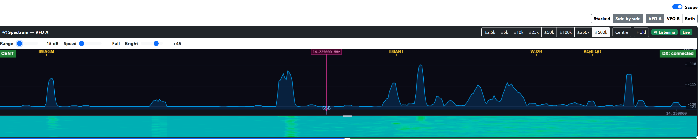

**Scope switch** — a small **Scope** switch sits above the panel. Turning it off tells the radio to stop producing scope data altogether (CI-V `27 11`) and the trace goes quiet; turning it back on resumes it. It is there for three reasons: to give the screen space back to the rest of the control panel, to stop the display when you don't want it, and as the quick A/B test if you ever suspect the scope stream itself is adding noise to your receive audio — switch it off, listen, switch it back on.

**Switching the scope off collapses the panel**, so the spectrum, waterfall, span buttons and the Range / Speed / Bright bar all fold away and everything below them moves up. The switch itself stays put on its own row, with the reminder *"Spectrum hidden — switch Scope on to show it"* beside it, so the way back is always on screen. Your choice is remembered between sessions.

If the scope stops streaming for any other reason — it is off at the radio, or no sweep has arrived yet — the panel stays on screen and says what is happening instead ("Band scope is off — switch it on above the panel", or "Waiting for the radio's band scope…"). Only the switch collapses the panel; nothing the radio does can take the way of switching it back on off the screen.

**Span buttons** — eight buttons in the panel header set the visible bandwidth, from **±2.5k** (narrowest — a single QSO fills the screen) through **±5k**, **±10k**, **±25k**, **±50k**, **±100k**, **±250k** to **±500k** (widest — a 1 MHz-wide view). The figure is the *half*-width either side of centre, matching the way the IC-7300 labels its own scope, so **±500k** shows a megahertz across the screen. Clicking one sets the radio's scope span, so the radio's front panel changes too; equally, changing the span on the radio lights the matching button in IWC, because the active button is re-synced from every incoming sweep.

**Click to tune** — Click anywhere on the spectrum **or the waterfall** to tune VFO A to that frequency. A click on a signal trail in the waterfall QSYs to the frequency of that column, which is the natural way to chase an interesting signal you can see slowly drifting down the screen. **The mode also changes automatically** to match the segment of the band you clicked into — CW below the digital sub-band, DATA-U around the FT8/FT4/RTTY watering holes, USB/LSB in the phone segment, FM at the top of 10m and on 2m/4m. If you click somewhere outside the recognised amateur bands the mode is left as-is.

**Mouse wheel to tune** — Scroll the mouse wheel over the spectrum to tune VFO A up or down in 1 kHz steps.

**Frequency crosshair** — Move the mouse over the spectrum to see the exact RF frequency at the cursor position displayed above the waterfall.

**Resize spectrum vs waterfall** — Hover the horizontal boundary between the spectrum trace (top) and the waterfall (bottom); the cursor becomes a vertical-resize arrow. Drag up to give the spectrum more vertical room — useful when you're hunting weak signals close to the noise floor. Drag down to give the waterfall more history. The ratio is remembered per VFO across browser reloads, so the next time you open IWC the panel is back the way you left it. Two short grey grip-bars at the centre of the boundary mark the handle; they turn cyan while you're dragging.

**Centre / Fixed** — The button beside **Hold** shows which scope mode the radio is in and switches it. In **Centre** mode the frequency you are tuned to stays in the middle of the screen and the band slides past underneath as you tune; in **Fixed** mode the band stays where it is and your marker moves across it, which is the better view for watching a whole segment. The button carries the mode the radio actually reports — change it on the radio's own screen and the button follows — and it stays greyed out reading *Cent/Fix* until the first sweep arrives, because until then IWC does not know which mode you are in.

**Fixed mode turns the button amber.** That is simply how the two modes are told apart at a glance — it is not a warning. IWC draws the display from the window the radio reports in the sweep itself, so in Fixed mode the trace, the frequency scale, the band-plan markers and any DX spots all line up on the band segment the radio is showing, and your VFO marker moves across it as you tune.

**The VFO marker** — a magenta vertical line marks where VFO A is sitting in the window, with the frequency in a boxed label at the top of the trace. In Centre mode it sits in the middle, because that is where the radio puts it; in Fixed mode it travels across the segment as you tune. Magenta is used because everything else on the panel is already spoken for — the trace and the persistent cursor are blue and cyan, the band-plan markers cyan, the DX spots and the Fixed badge amber, the band-edge guard rails red — so the marker stays findable on a busy sweep. If you tune outside the window the radio is showing (easy to do in Fixed mode), the label parks against the nearer edge of the panel with an arrow pointing the way, so you can always see how far off the display you have gone and in which direction.

**IWC asserts a scope mode when it connects**, which is why the radio may go back to Centre when you start the app or reconnect. Whichever mode you last chose *in IWC* — from this button or from the badge on the canvas — is the one it asserts, and that choice is now remembered between sessions. Choosing a mode on the radio's own screen is not remembered, so if you want Fixed to stick, set it from IWC.

**Hold** — Freezes the spectrum and waterfall on the frame that was on screen when you clicked, so you can study a fleeting signal without it scrolling away — or grab a screenshot of a particular moment. Three things show it is frozen: the button turns amber, the status badge changes to a yellow **Hold**, and a small `HOLD` banner appears in the top-left of the canvas. Click **Hold** again to resume live streaming. Hold affects only what is drawn — the radio keeps sweeping, and frequency, mode and meters carry on updating as normal. The state is per panel, so you can freeze one and leave the other running.

**Persistent cursor — bookmark a frequency** — **Shift-click** anywhere on the panel to drop a persistent cyan cursor at that frequency, with the frequency in a small boxed label beside it. It stays put as you tune around with ordinary clicks, so you can mark a station to come back to. To remove it, **Shift-click on or near it** (within about 10 pixels).

#### The Range / Speed / Bright bar

The three sliders under the panel header shape the display. All three are per-VFO and are saved **on the server**, not just in your browser, so they follow you to a phone or tablet as well as surviving a reload.

**Range** — the height of the vertical scale, in dB (5–140). This is a gain control for the trace: a *smaller* Range makes peaks taller, a *larger* one flattens everything out. It does **not** move the noise floor. IWC measures the noise floor on every sweep and pins it just above the bottom edge of the panel automatically, so the noise stays where you put it no matter how you set Range, and no matter how far you zoom the span in or out. Wind Range down until weak signals stand clear of the grass, and up again if strong signals are running off the top.

**Speed** — how fast the waterfall scrolls, from **Full** down to **1/128**. Drag it left if signal trails are scrolling past faster than you can read them. The spectrum trace above the waterfall keeps updating live regardless of this setting.

**Bright** — lifts the waterfall's colour mapping by up to 60 dB, bringing weak signals further up the colour scale so they show as blue-green rather than near-black. **Off** (0) is the unmodified mapping. Like Speed, it affects only the waterfall; the spectrum trace above it is untouched. The change applies to new rows as they scroll in — the history already on screen keeps the colours it was drawn with.

#### The three badges

**Scope mode** (top-left of the canvas) — shows the scope mode the radio is actually in, read from the sweep data itself: **CENT**, **FIX**, **SCROLL-C** or **SCROLL-F**. **CENT** is green and the other three are amber, so you can see at a glance whether the display is following your VFO or holding a fixed segment; the frequency axis is correct either way. **Clicking the badge switches the radio between Centre and Fixed** — it does exactly what the **Centre / Fixed** button in the panel header does, so use whichever is nearer. The button is the one to reach for with a keyboard or a screen reader.

**Scope status** (right-hand end of the panel header) — **Scope off** (no sweeps; the scope is switched off, or the radio isn't up yet), **Connecting…**, **Live** (green — sweeps are arriving), **Hold** (yellow — frozen, see above), **Disconnected**, **Off-screen** (amber — the watch panel described below is pointed at a frequency the single scope cannot currently show), or **Scope blocked** (red — the radio understood the request for scope data and refused it; the panel prints the reason and what to change, see §14.2).

**DX cluster** (top-right of the canvas) — the cluster connection state: green for *connected*, amber for *connecting*, red for *disconnected*, grey for *off*. See Section 6.5 for cluster setup and troubleshooting.

#### Overlays

**DX cluster spots** — If you have configured a DX cluster server in Settings (see §6.5), incoming spots are overlaid as small yellow callsign labels along the top of the spectrum at each spot's frequency. Clicking on a spot (within a few pixels of its marker) tunes VFO A exactly to that frequency. Spots outside the current span are not drawn; spots older than the configured age (default 15 minutes) are removed automatically.

**How spots are filtered for display** — the spectrum panel shows any spot whose frequency falls inside the currently visible window (VFO A ± half the span). When you change band, VFO A moves and the spectrum recentres, so the visible spots change automatically to match the new band. There is no explicit band filter — just a "is this spot inside the visible window?" check. In practice this means you see only the current band, because amateur bands have large gaps between them. At the widest span (±500 kHz) you'd technically see a wider chunk, but adjacent bands rarely overlap that window.

The cluster feed itself is not band-filtered by IWC — spots arrive for every band the cluster carries. They are all kept client-side; only the ones inside the visible window get drawn. To reduce traffic at the source (for example, to receive only 20 m and 40 m spots), add a line like `set/filter band 20 or band 40` to **Settings → DX Cluster → Post-login commands**. That filter runs on the cluster server and cuts down on spots before they reach IWC.

On crowded bands (the lower end of 20m on a contest weekend, for example) labels are stacked across up to five rows to avoid overlap. If even five rows can't fit everything in a tight cluster of nearby frequencies, **the app drops the spots that don't fit rather than letting labels overlap and become illegible**. The dropped spots are still in the underlying spot list — they just aren't drawn. Zooming the spectrum to a narrower span (e.g. ±100k or ±50k) spreads spots out and reveals the ones that were hidden.

**Decluttering with the watch list** — if cluster traffic is making the spectrum unreadable, open the DX Watch popup (§5.14) and tick **Show only watched callsigns**. Every yellow (non-watched) spot disappears from the spectrum and the DX Spots list, leaving only the red watched-list matches. Toast / beep / voice alerts still fire as normal on watched spots; the toggle only changes what's drawn. Untick to bring all spots back. Setting is remembered per browser.

**Band-plan markers** — small cyan tick marks at the bottom of the spectrum show the standard activity frequencies for the currently visible band: CW, FT8, RTTY, SSB DX window etc. The exact frequencies come from your selected IARU region (§6.1 Band Plan). The markers update automatically as you change band or zoom the spectrum; only segments whose frequency falls inside the visible window are drawn. Where two markers would overlap (e.g. FT8 at 14.074 and RTTY at 14.080 — only 6 kHz apart), the labels stack vertically so both remain readable. They're a quick orientation aid — especially helpful when visiting an unfamiliar band — and they don't interact with anything; nothing happens if you click them.

**Band-edge guard rails** — dashed red vertical lines drawn at the lower and upper edges of every amateur band that falls inside the visible window. They make it immediately obvious when you've tuned outside the amateur allocation (e.g. clicking 14.396 MHz on the spectrum lands you above the 20m upper edge at 14.350 — the red line is right there, telling you why no DX cluster spots are appearing and why the mode hasn't auto-changed). The edges use the worldwide amateur envelopes (the broadest limits across all regions), so a Region 1 operator may see a guard rail slightly beyond their own legal limit on a few bands — never the other way round.

#### Two panels — the pseudo-dual receiver

By default IWC shows **one** spectrum panel, for VFO A. The IC-7300 has a single receiver and a single scope, so that is the honest picture.

Switching on **Enable pseudo-dual receiver** in **Settings → Spectrum Display** adds a second panel for VFO B — a *watch* panel — by time-sharing the one scope between them. On the **same band** both panels update live and your audio is never interrupted, because the single sweep covers both frequencies. Watching a **different** band is only possible by briefly borrowing the receiver, so it is off unless you also tick **Allow cross-band watch**; with that on, IWC retunes for a moment every few seconds (interval configurable, default 15 s) and your listening audio dips for about 0.4 s per peek. With cross-band watch off, a watch panel pointed at another band simply shows **Off-screen**.

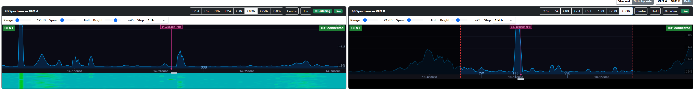

**Listen / Listening** — with two panels up, the one you are hearing carries a green **Listening** badge and the other carries a **Listen** button. Click **Listen** to move the radio's audio to that VFO; the badge and button swap over. The badge follows the radio, so switching VFOs on the front panel moves it too.

**Layout toggles** — two small button groups appear above the panels (only when both are showing):

- **Stacked** / **Side by side** — panels one above the other, or splitting the width between them.
- **VFO A** / **VFO B** / **Both** — show just one panel, or both.

Both choices are remembered in your browser.

**The watch panel's span buttons** — because there is only one scope with one span, VFO B can never show a *wider* view than VFO A. **Settings → Spectrum Display → Watch panel (VFO B) span buttons** decides what B's buttons do:

- **Zoom in independently** (default) — B's buttons crop its own view tighter in software, leaving VFO A and the radio alone.
- **Share one span** — B's buttons drive the one physical span exactly as A's do, and both panels' buttons light up together.
- **Hide** — B has no span buttons at all; only VFO A controls the shared span. (This is the setting in the screenshot above.)

---

### 5.5 VFO Panels

There are two VFO panels side by side:

- **VFO A** (blue border) — the operating VFO.
- **VFO B** (green border) — the second VFO. The IC-7300 has **one physical receiver**, so VFO B is a frequency / mode slot through which that single receiver is steered; it is not a second, independently-listening receiver.

**Greying behaviour.** Because there is only one receiver, only the VFO the radio is currently operating on can be edited:

- **Normal mode** (split off): the **active** VFO panel is fully usable; the **inactive** VFO's card body is greyed. Mode, IF Width, Notch, and the rest still display their stored values for reference, but cannot be edited — those values only take effect when you make that VFO active via the **A↔B** button. The card header stays normal colour.
- **Split mode**: the **receive** VFO is fully usable; the **transmit** VFO's card body is greyed — opposite of normal mode for which panel is inactive. The TX panel's **frequency field is still editable** so you can set the TX frequency from IWC without un-splitting first — click a digit and scroll the mouse wheel, or use the keyboard icon next to MHz to type one in. Everything else in that card body stays read-only. The card header stays normal, so the TX button and SPLIT badge on the transmit panel remain full-colour and clearly active.

**S-meter location — not in the VFO panels.** The S-meter and its 30-second history strip live in the **top meter row** (just below the toolbar), not inside the VFO A / VFO B panels. There is a single S-meter, since the IC-7300 has one physical receiver.

**Antenna selector.** The IC-7300 has a single antenna connector, so no antenna selector is shown.

Both panels have identical controls — changing a control on the active (fully usable) panel writes to the radio immediately; changing a control on the inactive panel's greyed body does nothing (apart from the TX frequency in split, as noted).

**VFO-B toggle** — the **VFO-B** button in the toolbar shows or hides the VFO B panel. The last state is remembered across sessions.

**A↔B Swap** — the **A↔B** button in the toolbar swaps the frequencies and modes between VFO A and VFO B in one click.

**B→A Copy** — the **B→A** button copies VFO B's frequency and mode into VFO A. **VFO B is left unchanged.** This is the right control to use when you want to transmit on VFO B's settings without enabling split — after the copy, VFO A holds the same frequency and mode as VFO B and the radio transmits normally on VFO A. Different from swap (which exchanges both VFOs), and different from split (which leaves the VFOs alone but uses VFO B as the TX frequency only while in RX/TX mode).

**A→B Copy** — the **A→B** button is the mirror operation: copies VFO A's frequency and mode into VFO B with VFO A left unchanged. Useful for seeding VFO B from your current operating frequency before nudging one of the two (e.g. to set up split manually).

**Split** — enables split operation: VFO A is the receive frequency, VFO B is the transmit frequency. The button turns red and shows **Split ON** when active. Pressing it again turns split off. **No frequencies are changed** — whatever VFO B is currently set to becomes the TX frequency. Use this button whenever you want to transmit on a different frequency from your receive frequency, including cross-band split (e.g. listening on 20m, transmitting on 6m) or any arbitrary TX offset.

**+5k (Quick Split)** — a DX pile-up convenience button. It always sets VFO B to **VFO A + 5 kHz** and enables split in one click. Use this when a DX station says "listening 5 up". It is not a general-purpose split button — it will overwrite whatever VFO B was set to. For any split scenario other than +5 kHz, set VFO B to the desired TX frequency first and then press **Split**.

> **Example — cross-band split (6m TX, 20m RX):**
> 1. Tune VFO A to your 20m listening frequency
> 2. Tune VFO B to your 6m transmit frequency
> 3. Press **Split** — you are now receiving on 20m and transmitting on 6m
> 4. Do **not** press +5k, as that would move VFO B back to 20m + 5 kHz

---

### 5.6 Frequency Display and Tuning

The frequency display shows the current VFO frequency in MHz to 1 Hz resolution (e.g., **14.074.000**).

**Digit tuning with the mouse wheel:**

1. Click on any digit in the frequency display. The selected digit is highlighted.
2. Roll the mouse wheel up to increase that digit, or down to decrease it.
3. Carry-over is automatic — for example, scrolling 9 → 0 on the kHz digit also increments the 10 kHz digit.
4. The new frequency is sent to the radio approximately 200 ms after you stop scrolling.
5. Click anywhere outside the frequency display to deselect.

**On a tablet or phone**, tap a digit to select it, then use the **▲** and **▼** buttons that appear below the display to adjust it.

---

**On-screen frequency keyboard:**

A numeric entry button (**⑁**) appears to the right of the **MHz** label on each VFO panel. Click or tap it to open a floating on-screen number pad for typing in a frequency directly.

The keyboard pre-fills with the current VFO frequency when it opens. The display shows the frequency as **XX.YYYYYY MHz** with the current digit position highlighted in blue.

You can enter digits by clicking the on-screen buttons **or by typing on your physical keyboard** — whichever is more convenient.

| Key | Action |
|-----|--------|
| **0–9** | Enter a digit at the cursor position and advance the cursor one place to the right |
| **◀ / ▶** | Move the cursor left or right without changing any digit |
| **⌫** | Zero the digit at the cursor and move the cursor left |
| **CLR** | Reset all digits to zero |
| **↵ Enter** | Validate and send the frequency to the radio, then close the keyboard |
| **✕** (title bar) | Close the keyboard without changing the frequency |
| **Esc** | Close the keyboard without changing the frequency |

The same actions are available from the physical keyboard: digit keys type digits; **← →** move the cursor; **Backspace** zeros the current digit; **Delete** clears all digits; **Enter** sends the frequency; **Esc** closes the keyboard.

If you enter a frequency outside the radio's range (0.030–75.000 MHz) an error message appears and the frequency is not sent.

**Moving and resizing the keyboard:** Drag the title bar to move the keyboard anywhere on screen (touch drag is also supported on tablets). Drag the bottom-right corner to resize it. The position and size are saved automatically and restored the next time you open the keyboard.

All keys have accessible labels for screen readers.

---

### 5.7 Receiver Controls

Each VFO panel has a row of dropdowns for the main receiver settings. All are two-way — if you change a setting on the radio's front panel, the dropdown updates automatically.

**Mode** — Select the operating mode. The IC-7300 modes are:
LSB, USB, CW-U, CW-L, FM, AM, RTTY-L, RTTY-U, DATA-L, DATA-U, DATA-FM

(DATA-L / DATA-U are the radio's data-mode variants of LSB / USB, used for FT8, FT4, PSK and similar via USB audio.)

**Antenna** — The IC-7300 has a single antenna connector, so there is no antenna selector to show. On radios with more than one antenna jack the selector would appear here.

**Control column** (the grid of controls to the right). Each is a set of segmented buttons or a slider, and all are two-way — they update when you change the corresponding setting on the radio:

| Control | Options |
|---------|---------|
| AGC | FAST, MID, SLOW |
| Preamp | OFF, P.AMP1, P.AMP2 |
| ATT | OFF, 20 dB |
| NR | OFF, ON |
| NR Lvl | Slider 0–15 (noise-reduction depth; matches the radio's own scale) |
| NB | OFF, ON |
| NB Level | Slider 0–100% (noise-blanker depth) |
| Notch | OFF, AN (auto notch), MN (manual notch) |
| MN Width | WIDE, MID, NAR — width of the manual notch (relevant when Notch is set to MN) |
| Notch Pos | Slider 0–255 — manual-notch position (0 = low, 128 = centre, 255 = high; relevant when Notch is set to MN) |
| RF Gain | Slider 0–255. At 255 (maximum) sensitivity is highest; reducing RF Gain helps when a strong nearby signal is overloading the front end. |
| Squelch | Slider 0–255. Only shown when the VFO is in FM mode. 0 = squelch fully open (hear everything); higher values cut off weaker signals. |

All of these settings are read from the radio when the app connects.

The IF filter controls (**IF Shape**, the **FIL1 / FIL2 / FIL3** slot selector, and **IF Width**) also sit in this control grid — they are described in [§5.8](#58-if-width-if-shape-filter-slot-and-af-gain).

**Twin PBT** — The first of the two buttons at the end of the VFO panel's button row opens the **Twin PBT** (Digital Passband Tuning) dialog. This is the radio's `TWIN PBT CLR` pair of knobs, brought out as two sliders.

PBT works on the **IF** passband, not the audio, and it is the strongest interference tool the radio has. Each slider shifts one edge of the passband — **PBT1** the inner, **PBT2** the outer — and the label beside it reads **Centre** at no shift, or a signed offset either side.

Two ways to use it, both worth knowing:

- **Shift the two sliders in *opposite* directions** and the passbands overlap less, so the filter narrows. This is how you squeeze an interfering signal out of one side without retuning.
- **Set both sliders to the *same* value** and the passband keeps its width but moves bodily. That is an **IF Shift**, and it is how you slide a whole crowded passband off an adjacent carrier.

**Clear PBT** returns both to centre — the same as holding the radio's `TWIN PBT CLR` knob for a second.

Things the radio does that the dialog cannot show you:

- **PBT applies to SSB, CW, RTTY and AM only.** FM has no adjustable IF passband, so the sliders will do nothing there.
- **The radio memorises PBT per band**, so a setting you leave on 40 m is still there when you come back to it.
- **Changing IF Width resets both PBT shifts to centre.** That is the radio's behaviour, not the app's. If the dialog happens to be open when you change the width, close and reopen it to see the reset — it reads the radio when it opens.
- On the radio's own display, a dot **·** appears on the passband indicator whenever PBT is shifting the width.

The sliders are read from the radio each time you open the dialog, not polled continuously, so a change made at the radio's knobs shows up the next time you open it.

**RX Tone** — The second button opens the **RX Tone Control** dialog. This is the radio's own *SET > Tone Control > RX* menu group, brought out where you can reach it: the audio filter edges plus the bass and treble shelves. It shapes the **receive audio only** — it does not touch the IF filter, and it has no effect on what you transmit.

Everything in the dialog belongs to the VFO's **current mode**. The radio stores these settings per mode, not per VFO, so the values you see are whatever that mode is set to, and changing them changes them for that mode everywhere. Switch mode with the dialog open and it re-reads for the new mode.

| Control | Range | Notes |
|---------|-------|-------|
| HPF | Through, 100 Hz – 2000 Hz | High-pass: cuts the **low** edge of the receive audio. "Through" = no cut. |
| LPF | 500 Hz – 2400 Hz, Through | Low-pass: cuts the **high** edge. "Through" = no cut. |
| Bass | −5 to +5 | Low-frequency shelf, 0 = flat. |
| Treble | −5 to +5 | High-frequency shelf, 0 = flat. |

**Widest** sets both filter edges to Through. **Flat** returns Bass and Treble to 0.

> **Changing HPF or LPF resets Bass and Treble to 0.** That is the radio's own behaviour, not the app's — it treats the filter edges and the shelves as alternative ways of shaping the same audio. The dialog re-reads and shows the new zeros, so set the filter edges first and the shelves afterwards.

Not every mode has every control, and the dialog greys out what does not apply, with a line of text saying so:

- **SSB, AM, FM** — all four controls.
- **CW and RTTY** — HPF and LPF only. The radio has no Bass or Treble for these modes.
- **DATA modes (DATA-U / DATA-L)** — none of them. The radio disables RX Tone Control entirely in the data modes, so that the audio reaching WSJT-X and friends is unshaped.

A common use: on a crowded SSB band, set HPF to 300 Hz and LPF to 2400 Hz to tighten the audio around speech, then lift Treble a little for intelligibility. On AM, open both edges to Through and the audio widens out again.

---

### 5.8 IF Width, IF Shape, Filter Slot, and AF Gain

The IC-7300 gives each mode three selectable IF filter presets — **FIL1**, **FIL2**, **FIL3** — and for each one you choose a **passband width** and a filter **shape**. IWC exposes all three of these directly on the VFO panel, so you can set the filter you want without stepping through the radio's own FIL popup. Every control here is two-way: change it on the radio and the app updates, and vice versa.

**IF Width** — Sets the IF passband width for the currently selected filter slot.

The dropdown is **mode-aware** — it is rebuilt whenever you change mode and shows the actual widths (in Hz / kHz) the IC-7300 supports for that mode:

- **SSB and CW** (LSB, USB, CW-U/-L, and the DATA variants) — 50 Hz to 500 Hz in 50 Hz steps, then 600 Hz up to **3.6 kHz** in 100 Hz steps.
- **RTTY** — 50 Hz to 500 Hz in 50 Hz steps, then 600 Hz up to **2.7 kHz** in 100 Hz steps.
- **AM** — 200 Hz up to **10 kHz** in 200 Hz steps.
- **FM** — the IF Width row is hidden. FM has no adjustable IF width on the IC-7300.

The current width is read back from the radio, so the dropdown always reflects the width the radio is actually on. Pick a value and it is sent immediately. If you pick a width the radio can't land on exactly it snaps to the nearest supported step, and the dropdown updates to show what the radio settled on.

> Changing the width **resets Twin PBT to centre** — the radio does this itself. Set the width first, then the PBT shifts, or you will lose them. See Twin PBT in [§5.7](#57-receiver-controls).

**Filter slot (FIL1 / FIL2 / FIL3)** — Selects which of the mode's three filter presets is active. Each slot remembers its own width and shape, so you can set, for example, FIL1 wide for rag-chewing, FIL2 medium, and FIL3 narrow for digging a weak signal out of QRM — then switch between them with a single click. Selecting a slot switches the radio to it, and the IF Width dropdown above updates to show that slot's stored width.

**IF Shape (SHARP / SOFT)** — Sets the filter shape for the current slot. **SHARP** gives steeper skirts for maximum adjacent-signal rejection; **SOFT** gives gentler skirts that many operators find easier on the ear for SSB and AM listening.

**AF Gain** — Sets the audio output level (0–255). Drag the slider and release to send the new value to the radio. It sits on the frequency row of each VFO panel.

---

### 5.9 Band and Segment Selection

**Band buttons** — Click a band button (160m, 80m, 40m, etc.) to switch the VFO to that band. The radio tunes to the last-used frequency on that band. You can also navigate between band buttons with the keyboard: **Tab** moves focus into the band group, then the **left/right arrow keys** move between bands and activate the selected one immediately.

Available bands depend on your band plan setting:

| Band Plan | Bands |
|-----------|-------|
| IARU Region 1 (Europe, Africa, Middle East) | 160m, 80m, 60m, 40m, 30m, 20m, 17m, 15m, 12m, 10m, 6m, **4m** |
| IARU Region 2 (Americas) | 160m, 80m, 60m, 40m, 30m, 20m, 17m, 15m, 12m, 10m, 6m |
| IARU Region 3 (Asia-Pacific) | 160m, 80m, 60m, 40m, 30m, 20m, 17m, 15m, 12m, 10m, 6m |
| Japan (JARL) | 160m, 80m, 40m, 30m, 20m, 17m, 15m, 12m, 10m, 6m |

Region 1 is the only plan that includes the 4m (70 MHz) band. Japan has no 60m secondary allocation.

**Out of band — the red band button.** The band buttons use the band plan you selected, not a generic worldwide table. If you tune outside every allocation in your own region, no band button lights up normally; instead the button for the band you were **nearest to** turns **red** with bold black text. If voice announcements are on, the band is spoken as **"out of band"**.

This matters most in Region 1, where several allocations are narrower than the worldwide envelope: 80m ends at 3.800 (not 4.000), 40m ends at 7.200 (not 7.300), and 160m starts at 1.810 (not 1.800). Tuning to 3.900 MHz as a Region 1 operator is out of band, and IWC now says so.

The red marker answers "which band were you aiming at" — it is **not** a licence check and it is not permission to transmit. Your own licence conditions are narrower than the IARU allocation in many countries. Check your licence, not this button.

If your national allocation differs from the IARU default, you can edit the band edges yourself without waiting for an IWC release — see [Updating the band plan without an IWC release](#updating-the-band-plan-without-an-iwc-release) in section 6.3.

**Segment dropdown** — After selecting a band, a dropdown appears above the frequency display showing common operating segments for that band. Select a segment to jump directly to its standard frequency and set the appropriate mode:

| Segment | Example (20m) | Mode set |
|---------|--------------|---------|
| CW | 14.025 MHz | CW-U |
| FT8 | 14.074 MHz | DATA-U |
| SSB | 14.150 MHz | USB |
| RTTY | 14.080 MHz | RTTY-U |

The last segment you used on each band is remembered, so when you return to a band the dropdown re-selects your previous segment.

**Auto-sync to current frequency** — the Segment dropdown also follows your actual tuning. When you change frequency by any means (clicking the spectrum, turning the radio's front-panel knob, typing on the on-screen frequency keyboard), the dropdown updates to show the segment that contains your new frequency. If you tune into a gap between segments (e.g. 14.150 — between FT8 at 14.074 and SSB at 14.225 on 20m), the dropdown shows the closest segment at or below your frequency. This keeps the dropdown's display honest — it always tells you where you actually are, not where you last clicked.

**Out of band — OOB.** Segments describe activity centres and have no upper edge of their own, so they stop at the band edge. Tune outside your region's allocation and the dropdown goes **red and reads OOB**, matching the red band button. It is disabled while it says OOB — there is no segment to select, and choosing one cannot retune the radio. Tune back into the band and it returns to the correct segment for wherever you now are.

This is different from **`--`**, which means the band you are on has no segments defined in the band plan (4m outside Region 1, for example). `--` says "no plan for this band"; **OOB** says "you are outside the band".

**Per-band frequency and mode memory** — When you switch away from a band the app saves the frequency and mode you were last using on that band. When you return to the band it takes you back to that spot instead of a fixed default. Settings are saved per-VFO (VFO A and VFO B are independent) and persist between sessions.

**60m — Region 1 and Region 3:** Shows FT8 (5.357 MHz) and USB (5.362 MHz) segments, covering the WRC-15 secondary allocation (5351.5–5366.5 kHz). Access to 60m varies by country within these regions.

**60m — Region 2 (Americas):** Shows the five FCC-designated channels (5.331, 5.347, 5.357, 5.372, 5.404 MHz).

**60m — Japan:** No 60m secondary allocation; the 60m band does not appear for the Japan plan.

---

### 5.10 Transmit Controls

**TX button** — Appears on whichever VFO is currently the transmit VFO. Click to start transmitting; click again to return to receive. The button turns red and the label changes to **TX** while transmitting.

**Radio POWER button** — Turns the radio on or off. The button shows green (on) or red (off).

**Connect button** — Manually connects or disconnects the CAT serial link to the radio. The button reflects the actual serial port state when the page loads:

- **Connected** (green) — the serial port is open and the radio is communicating
- **Disconnected** (red) — the serial port is closed or the radio is not responding

The button updates automatically — if the radio is powered off or stops responding, it switches to red/Disconnected within a few seconds without any action needed.

Click the button to toggle the connection. While connecting, it briefly shows "Connecting…". On reconnect the app re-reads all radio settings so the controls reflect the current radio state. Useful if the radio was powered on after the app started, or after a USB cable was unplugged and re-plugged.

**ATU and Tune buttons** — Control the IC-7300's internal automatic antenna tuner (CI-V `1C 01`).

- **ATU** toggles the tuner between **ATU On** (green) and **ATU Off** (grey). On = the tuner network is engaged in the signal path; Off = bypassed.
- **Tune** starts the radio's auto-tune cycle. The ATU button turns red and shows **Tuning…** while the radio searches for a low-SWR match — typically 2-7 seconds — and the Tune button becomes **Stop**. Press **Stop** (or the red ATU button) to end the cycle early; the app then re-reads the tuner from the radio, so whatever state the interrupted cycle left behind is what you see. When the cycle finishes on its own the buttons go back to **ATU On** and **Tune**.
- **Long press the ATU button (≥500 ms)** does the same as the Tune button. This is how the radio's own front-panel TUNER key works, so it is kept for anyone used to it — but it is no longer the only way in. A long press cannot be announced by a screen reader or performed by voice, and for a while the Tune function was advertised in a tooltip alone.

Both are also on voice control: "tuner on", "tuner off", and "tune antenna" to start or stop a cycle — see [§17](#17-voice-control).

The IC-7300 has a single tuner state (there is no separate per-VFO ATU setting), so the buttons reflect the same state whichever VFO is active.

**Mon button** — Toggles the TX monitor (sidetone) on and off. The button is amber when the monitor is active and grey when off. Click to toggle.

**Mon level slider** — Sets the TX monitor volume (0–100). Controls how much of the transmitted audio you hear in the headphones during TX. Drag and release to apply. Both the on/off state and the level are read from the radio when the app connects.

**TX timeout warning** — If the radio has been transmitting continuously for longer than a configurable threshold (default **120 seconds**), a red banner appears across the top of the page reading *"TX has been ON for more than N seconds — check your microphone, keyer or VOX!"* and a tone beeps every three seconds until the warning is cleared. The warning triggers regardless of how TX was started (app button, hardware PTT, VOX, CAT) and automatically clears the moment the radio returns to receive.

Click **Dismiss** on the banner to silence it without stopping TX (useful for a long deliberate transmission). Click **Change timeout…** to set a different threshold (5–3600 seconds); the new value is remembered between sessions for that browser. The warning exists as a safety net against open mics, stuck PTTs and VOX false-triggers — it doesn't stop the transmission itself.

**VOX button** — Opens the **VOX Settings** panel. The button shows **VOX: On** (green) or **VOX: Off** (grey) based on the current VOX state.

**CW button** — Opens the **CW Keyer** panel. See Section 5.12.

**FM Rep button** — Opens the **FM Repeater** panel. See Section 5.13.

All three panels can be open at the same time and can be dragged anywhere on screen by their title bar.


**MIC Gain** — Drag the slider to set the microphone gain (0–100). The value is sent to the radio as you release.

**PROC** — Speech processor toggle. Shows **Proc On** (green) or **Proc Off** (grey).

**PROC Level** — Speech processor level slider (0–100).

---

### 5.11 VOX Panel

Click the **VOX** button to open the VOX pop-up panel.

| Control | Description |
|---------|-------------|
| VOX toggle | Enables or disables VOX. Shows **VOX: On** (green) or **VOX: Off** (grey) |
| Gain | VOX sensitivity (0–100). Higher values trigger TX more easily |
| Delay | VOX hang time (0–2500 ms). Time TX stays active after audio stops |
| Anti-VOX | Anti-VOX level (0–100). Suppresses the receiver audio from triggering VOX |

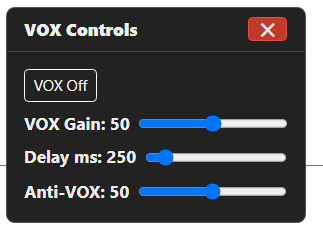

Close the panel by clicking the **×** button in its title bar. Drag the title bar to reposition the panel anywhere on screen. Its position is remembered between sessions.

---

### 5.12 CW Keyer Panel

Click the **CW** button to open the CW Keyer pop-up panel.

> **Note:** the CW Keyer panel is wired to the IC-7300's CI-V keyer — memory send, speed, pitch, break-in and break-in delay all map to real CI-V commands. It is, however, **untested on air**: I don't operate CW, so this is the one panel in IWC that has never been exercised by someone who would notice it misbehaving. Feedback from CW operators is especially welcome.

| Control | Description |
|---------|-------------|
| Speed | Keyer speed in WPM (4–60) |
| ZIN | CW Auto Zero In. One click asks the radio to nudge the VFO so the received CW signal sits exactly at your configured CW pitch (set via the Pitch control). Much faster than chasing the signal with the VFO knob. **Also available as a per-VFO ZIN button in each VFO panel's header** — handy for Search-and-Pounce operating when you don't want to open the popout for every signal. |
| Break-in | **Off** (keyer only), **Semi** (semi break-in), or **Full** (QSK full break-in) |
| Delay | Semi break-in delay (0–2500 ms) — only relevant in Semi mode |
| Pitch | CW sidetone pitch frequency (300–1050 Hz in 10 Hz steps). Also sets the CW receive offset so the radio zero-beats at this tone. Read from the radio on connect. |
| M1–M5 buttons | Sends the corresponding stored CW memory message |

**CW memory messages** are configured on the **Settings** page (see Section 6.4). Each message can be up to 24 characters. Use `{CALL}` as a placeholder — it is sent literally (the radio does not expand it; configure your callsign in the message text directly for CW use).

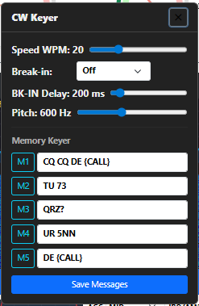

Close the panel by clicking the **×** button in its title bar. Drag the title bar to reposition the panel anywhere on screen. Its position is remembered between sessions.

---

### 5.13 FM Repeater Panel

Click the **FM Rep** button to open the FM Repeater pop-up panel. These settings apply when using FM mode.

| Control | Description |
|---------|-------------|
| Shift | **None**, **Positive** (+), **Negative** (−), or **Split** |
| Offset | Repeater offset in kHz. Common values: 600 kHz (2m), 1600 kHz (70cm) |
| CTCSS Mode | **Off**, **Encoder**, **Decoder**, or **Encoder + Decoder** |
| CTCSS Tone | Select the required CTCSS sub-tone from the standard set (67.0 Hz – 254.1 Hz) |
| Apply button | Sends all FM repeater settings to the radio in one operation |


Close the panel by clicking the **×** button in its title bar. Drag the title bar to reposition the panel anywhere on screen. Its position is remembered between sessions.

---

### 5.14 DX Watch Panel

Click the **DX Watch** button on the toolbar to open the watched-callsign panel. This is where you tell the app which callsigns or callsign prefixes you want to be alerted on when they show up in the DX cluster feed.

Use it for chasing a particular DXpedition (`P29VR`), staying on top of a contest call (`G4ABC/P`), or watching a whole prefix run (`VK*` for any Australian station).

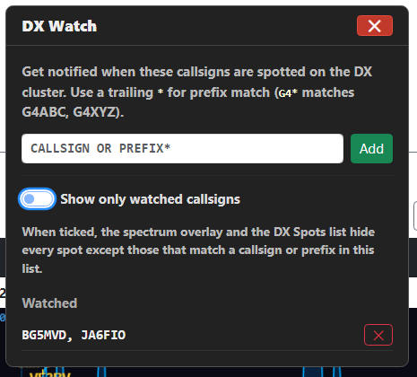

**Adding a watched call:**

1. Type the callsign or prefix in the input field (e.g. `G4ABC` or `VK*`).
2. Click **Add** or press Enter.
3. The entry appears in the list below.

**Removing a watched call:**

Click the red **×** to the right of any entry. The entry is removed immediately and the change is persisted.

**Wildcard matching:**

- Plain callsign — exact match, case-insensitive (`G4ABC` matches only `G4ABC`)
- Trailing `*` — prefix match (`G4*` matches `G4ABC`, `G4XYZ`, `G4ABC/P`, etc.)

**Show only watched callsigns.** Below the input field is a toggle labelled **Show only watched callsigns**. When ticked, the spectrum overlay and the DX Spots list (§5.17) hide every spot that doesn't match an entry in your watch list — useful on a busy band where dozens of yellow labels make the spectrum hard to read. The watched spots remain visible (still drawn in red on the spectrum), and toast/beep alerts still fire as normal. Untick to bring all spots back. The setting is remembered per browser.

**What happens when a watched call is spotted:**

- A small red **alert toast** appears with the callsign, frequency, spotter and any comment from the spot. The toast fades after about 8 seconds. **Click the toast to QSY VFO A directly to that frequency.**
- A short two-tone **beep** plays (only after you've interacted with the page — browsers block audio until the user has clicked something on the page first).
- On the spectrum panel, the watched callsign is drawn in **bright red** instead of the usual yellow, so you can see it at a glance.

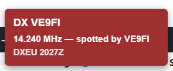

**Moving the alert toast.** The toast appears in the bottom-right of the page by default, but you can **drag it anywhere on screen** by pressing and holding on it and moving the mouse. The new position is remembered between sessions, so the next alert appears in the same place. (Click without dragging still QSYs as normal — the app distinguishes the two by checking whether the pointer actually moved by more than a few pixels.)

The list of watched calls is saved across app restarts in your user settings file. You don't need to re-enter it after a reboot. Close the watch panel with the **×** button in its title bar; drag the title bar to reposition the panel anywhere on screen — the position is remembered between sessions.

---

### 5.15 Memory Panel

The **Mem** button in the toolbar (bold black text) opens a floating memory panel showing all your saved memory channels as clickable tiles. Each tile shows the label, frequency, and mode. **Click a tile to QSY VFO A to that frequency** — and any of the memory's saved advanced settings (mode, AGC, NB, NR, power, IF Width) are sent to the radio at the same time. Fields that aren't set in the memory are left as-is on the radio.

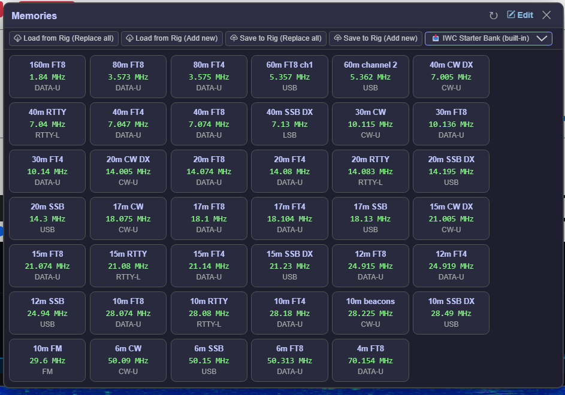

The panel is non-modal — it stays open while you use the rest of the app. Drag the title bar to reposition it anywhere on screen. Its position is remembered between sessions. Press **Esc** to close it.

**The toolbar at the top of the floating panel** carries the four rig-transfer actions and the Banks dropdown:

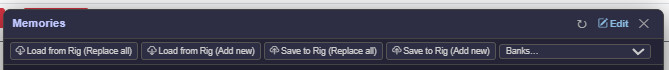

**Right-click any tile** to get a context menu with **Recall**, **Rename**, **Change Mode** and **Delete** — quick edits without having to open the full editor:

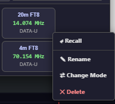

**Save to Mem button** — A **Save to Mem** button appears below the S-meter on both the VFO A and VFO B panels. Click it to save the current VFO frequency, mode and all advanced settings as a new memory. A label input box appears — type a name (up to 12 characters) and press Enter or click Save. The new memory appears immediately in the floating panel.


**Banks dropdown** — a **Banks** dropdown sits in the floating panel's toolbar alongside the Save to Rig buttons. The first entry is always **📥 IWC Starter Bank (built-in)** — the bundled set of common watering-hole memories shipped with the app (§8.5). Below that, any banks you've saved yourself appear (§8.4). Select any entry to switch — the memory list is replaced with that bank's contents and the tiles refresh automatically. The dropdown resets to its placeholder after loading.

For full memory management — editing labels and frequencies, reordering, importing from and exporting to the radio, and memory banks — see Section 8.

---

### 5.16 Voice Announcements

> **Where's the on/off toggle?** It is **not** on the Settings page. The master switch for voice announcements lives in the **Voice** dialog — click the **Voice** button in the main-page toolbar (in the same row as **DX Watch** and **DX Spots**) and untick **Enable voice announcements** to turn them off (or tick to turn them on). The dialog also has the voice picker, rate, volume, per-category toggles and a Test button.
>
> Not the same as **Voice Control** (§17): voice *announcements* are the app **speaking to you** (band changes, mode changes, DX alerts), while voice *control* is **you speaking to the app** (press-and-hold mic button to issue commands). They are independent features with separate on/off switches.

Voice announcements make the app speak when key things change — useful for partially sighted operators, or for anyone who wants to be told what the radio is doing without having to look at the screen.

The feature uses your browser's built-in text-to-speech engine (Web Speech API), so any SAPI 5 voices already installed on Windows are available in the Voice picker.

> **If you use a screen reader (NVDA, JAWS, etc.) leave this OFF.** The app already announces important events via standard `aria-live` regions which your screen reader picks up — turning on the Voice panel as well would give you double announcements.

**Controls in the panel:**

| Control | Description |
|---------|-------------|
| Enable voice announcements | Master on/off. When off, nothing is spoken |
| Voice | Pick which TTS voice to use — populated from your OS |
| Rate | Speech rate, 0.5×–2.0× normal speed |
| Volume | Speech volume, 0–100% |
| Test voice | Speak a sample phrase — use this to confirm your voice and rate are right |
| Stop talking | Cancel any in-progress speech immediately |

**What's announced (each can be toggled separately):**

- **Band changes** — "forty metres" when you change band on VFO A. Tune outside every allocation in your region and it says **"out of band"** instead of a band name (see §5.9).
- **Mode changes** — "upper sideband", "C W upper", "data lower", etc.
- **TX / RX state** — "transmit" when you key up, "receive" when you stop
- **Manual frequency entry** — confirmation after typing a frequency on the on-screen keyboard
- **DX watched-callsign alerts** — spelled-out callsign and frequency when a watched call appears in the DX cluster feed (in addition to the existing toast + beep)
- **TX timeout warning** — "Warning. Transmit timeout. Check microphone."

**Initial load is silent.** When you open the app the current band, mode and frequency are loaded from the radio's state but **not** spoken — the first announcement for each category fires on the next *change*. So opening the app doesn't read out the whole state.

**Multiple announcements are queued in order.** A single band-button press often triggers several changes back-to-back — the band changes, then the per-band saved mode and IF settings are restored. The app speaks each enabled announcement in full before moving on to the next, so you'll hear (for example) "forty metres" followed shortly by "upper sideband" rather than one cutting the other off. Use **Stop talking** to clear the queue immediately if you've heard enough.

**Persistence.** All settings (master enable, voice name, rate, volume, category checkboxes) are saved to localStorage per browser. Different devices remember their own preferences.

**Position.** The panel is draggable like the other popups (VOX, CW, FM Repeater, DX Watch) and its on-screen position is remembered between sessions.

---

### 5.17 DX Spots List

Click the **DX Spots** button on the toolbar to open a list of DX cluster spots filtered to the current band. This complements the spectrum overlay — and unlike the overlay, it works **whether or not you have an SDR connected**.

| Column | What it shows |
|---|---|
| Callsign | The spotted station. Watched callsigns (from §5.14) appear in **bright red**. |
| Freq kHz | Spot frequency in kHz |
| Mode | Mode parsed from the comment (FT8, CW, SSB, RTTY, etc.) or inferred from the frequency segment if not in the comment |
| Time UTC | Absolute time the spot was received, in `HH:MM` UTC |
| Age | Relative age — "<1m", "3m", "12m" |
| Spotter | The station that reported the spot |
| Comment | Free-text comment from the spotter |

**Click any row** to QSY VFO A to that spot's frequency **and switch mode** to match the band-plan segment the frequency falls into (FT8 → DATA-U, CW → CW-U, phone segments → USB or LSB as appropriate, etc.). This matches the click-to-tune behaviour on the spectrum panel — so clicking an FT8 spot from a phone segment flips the radio to DATA-U in one step rather than leaving you on the wrong mode.

**Click any column header** to sort by that column; click again to reverse the sort direction. The current sort is shown by a ▲ or ▼ next to the column name.

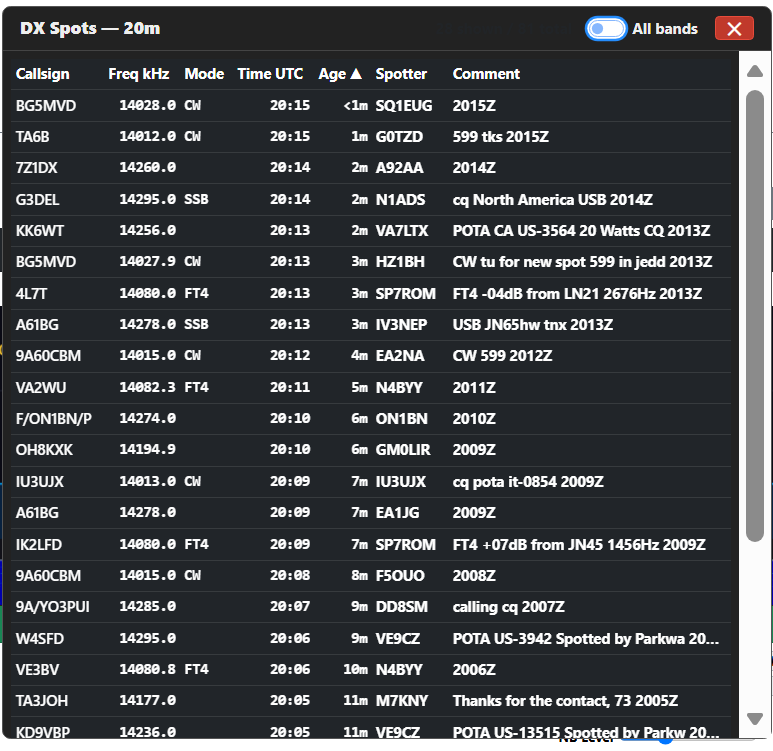

**All bands toggle** — by default the list filters to spots on your current band (so changing band changes what you see). Tick **All bands** in the title bar to see every spot in the buffer regardless of frequency — useful when chasing a rare DXpedition wherever it pops up.

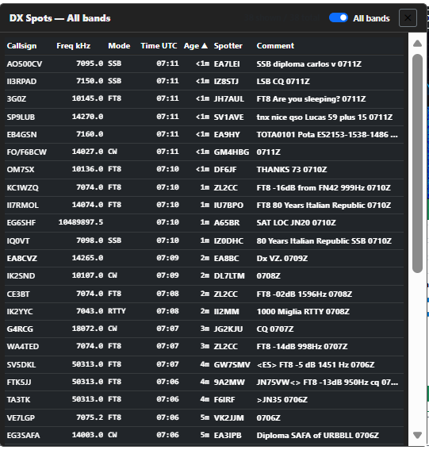

**Watch-list filter** — the DX Spots list also honours the **Show only watched callsigns** toggle in the DX Watch popup (§5.14). When that toggle is ticked, the list hides every spot whose callsign doesn't match the watch list. The count at the top of the panel reflects the filtered view ("3 shown / 78 total"), so it's obvious how aggressively the list is being filtered. The two toggles — All bands and Show only watched — combine orthogonally: e.g. with both on, you'd see only your watched callsigns across every band in the cluster.

**Why this is useful alongside the spectrum overlay:**

- The spectrum overlay drops callsign labels on crowded bands (§5.4). The list shows them all.
- The list shows comments, spotter info and exact time — the overlay only has room for the callsign.
- The list is fully accessible to screen readers; canvas-rendered text in the overlay is not.
- On phones and tablets, tapping a list row is easier than tapping a tiny spectrum label.

**Age-out** — spots older than the configured age (default 15 min, set in Settings → DX Cluster) are dropped automatically. The list re-renders every 30 seconds to remove stale rows even when no new spots arrive.

**Position and persistence** — drag the title bar to move the panel anywhere on screen. Panel position, size, sort column, sort direction, and the All bands setting are all saved per browser so the panel returns to where you left it next session.

**Empty state** — if you see "No spots on this band", either no spots are in the buffer yet (cluster just connected, give it a few seconds), or the DX cluster feature isn't configured at all (see §6.5).

---

## 6. Settings Page

Access Settings from the navigation bar or by clicking the settings icon. Changes take effect only after clicking **Save Settings**.

At the top of the page, the **Network Access URLs** card lists the addresses you can use to reach IWC from this PC and from other devices on the LAN; the **Current Configuration** card on the right shows a one-line summary of what IWC is using right now (radio model, serial port, baud rate, network interface, web port, SDR device). The web port shown here is whichever port IWC actually managed to bind — usually 8080 but possibly 8081–8089 if 8080 was already in use on your PC.

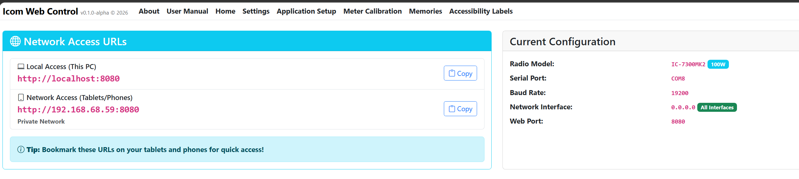

#### Changes that need a full app restart

Most settings take effect the moment you click **Save Settings**. A few — radio model, network interface, and HTTP port — need a full IWC restart to apply cleanly because they affect how the app is bound to the operating system, or because they change what the server renders into the HTML of every open browser tab. When you change one of these, the Settings page shows a yellow **"Restart Icom Web Control to apply your changes"** banner above the rest of the page with a one-click **Restart Now** button:

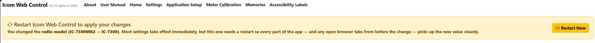

Clicking **Restart Now** stops IWC and (when running as the installed exe) automatically relaunches it. The browser briefly shows a "Icom Web Control has stopped" overlay during the restart; just reload the tab once IWC is back. When running from source via `dotnet run`, the auto-relaunch is skipped — you'll need to start `dotnet run` again manually.

### 6.1 Radio Connection

| Setting | Description |
|---------|-------------|
| Radio Model | **IC-7300 MkII** (100 W, HF + 6m + 4m EU) or **IC-7300** (100 W, HF + 6m). Both are single-receiver with a built-in CI-V band scope. |
| Serial Port | COM port the IC-7300 presents over its USB Type-C cable (e.g., COM3). Find it in Windows Device Manager or on the **Diagnostics → Ports** page. |
| Baud Rate | The rate IWC opens the serial port at. Default: **19200**. **IC-7300 MkII:** leave it at 19200 — the MkII has no **CI-V USB Baud Rate** menu, and its **CI-V Baud Rate** item applies to the **[REMOTE]** socket only, so there is nothing to match and raising this will not speed the band scope up (measured: the same ~4 sweeps per second at 19200 and at 115200). **Original IC-7300 (not MkII): use 115200** — the original will not send band scope data at any lower rate. Settings warns you if you choose a combination that disables the scope. |
| Band Plan | **IARU Region 1** (Europe, Africa, Middle East — includes 4m), **IARU Region 2** (Americas), **IARU Region 3** (Asia-Pacific), or **Japan** (JARL). Affects which bands and segment frequencies are shown. UK is Region 1; USA, Canada, and South America are Region 2; Australia, New Zealand, and most of Asia (except Japan) are Region 3. |

IWC talks to the radio using the CI-V protocol over that single USB serial connection (controller address `E0`, radio address `B6`). After changing the serial port or baud rate, click **Test Connection** to verify the radio responds. A green tick confirms success.

> **Running WSJT-X / FT8 via USB audio?** The IC-7300 needs its **USB SEND / audio** menu items set up before it will transmit digital audio from a PC. This is a one-time radio setup — see FAQ §15.

> **CI-V transceive:** leave the radio's **CI-V Transceive** setting **ON** (the default) so that changes made on the radio's front panel are reported back to IWC and the display stays in sync.

> **CI-V USB Echo Back:** IWC works with this **on or off**, so you can leave it alone. If you are on **v1.0.4-pre1 or earlier**, switch it **OFF** — on those versions echo back stops IWC connecting at all. It is under **MENU → SET → Connectors → CI-V**; the IC-7300 MkII has two entries, **CI-V USB (A) Echo Back** and **(B)**, and the original IC-7300 has one. All of them default to **OFF**. See §14.2 if you are seeing *"port opened, but the radio isn't responding"*.

---

### 6.2 Web Server Settings

| Setting | Description |
|---------|-------------|
| Network Interface | `localhost` (this PC only) or `0.0.0.0` (all interfaces, including LAN). Choose `0.0.0.0` to access the app from a tablet or phone |

> **Note:** After changing the network interface, save settings and restart the application.

The Settings page also shows the full URL for each detected network interface so you can bookmark the correct address on your tablet.

---

### 6.3 Spectrum Scope

The spectrum comes from the **IC-7300's own built-in band scope**, streamed to the app over the CI-V connection. There is **no external SDR, no IF tap, and no extra hardware or drivers** — once the radio is connected the spectrum and waterfall appear on the main page automatically.

> **Original IC-7300 owners: the scope needs 115200 baud.** The original model only sends scope data when the radio's **CI-V USB Port** is **Unlink from [REMOTE]** and its **CI-V USB Baud Rate** is **115200**, with 115200 also set in Settings (§6.1). At any lower rate the radio refuses, and the panel says so — everything else, including the radio connection itself, carries on working normally. The **IC-7300 MkII has no such restriction** and streams the scope at any baud rate.
 Span, Range, waterfall Speed and Brightness are all driven from the panel itself; see Section 5.4 for those. This section covers the handful of settings that decide **how many panels you get**.

The radio has one receiver and one scope, so a second panel can only ever be made by time-sharing that one scope. These settings control whether IWC does that, and how far it is allowed to go:

| Setting | Default | What it does |
|---------|---------|--------------|
| **Enable pseudo-dual receiver (two spectrum panels)** | Off | Adds a second, *watch* panel for VFO B, with a **Listen** button on each panel to choose which one you hear. Off gives the plain single-panel layout. |
| **Allow cross-band watch (dips audio to peek at the other band)** | Off | Off = same-band only, and your audio is never interrupted; a watch panel on another band shows **Off-screen**. On = IWC briefly borrows the receiver to refresh the other band, dipping your listening audio for about 0.4 s each time. |
| **Cross-band peek interval (seconds)** | 15 | How often that borrow happens (5–60 s). Larger means fewer audio dips but a staler watch trace. Ignored unless cross-band watch is on. |
| **Watch panel (VFO B) span buttons** | Zoom in independently | Whether VFO B's span buttons crop its own view in software, share the one physical span with VFO A, or are hidden entirely. VFO B can never be *wider* than VFO A. |

Section 5.4 shows what each of these looks like in use.

#### Updating the band plan without an IWC release

The band-plan data (activity-centre markers like CW / FT8 / SSB, plus the red band-edge guard rails) lives in a JSON file inside IWC's install folder:

```
<IWC install folder>\wwwroot\bandplan.default.json
```

If a regulator (RSGB, FCC, JARL, etc.) tweaks a band plan and the change matters to you, download an updated copy of `bandplan.default.json` from the IWC GitHub release page and drop it in over the existing file. Restart IWC and the new values take effect — no need to wait for a full app release. The hardcoded JS defaults shipped inside the app are used as a fallback if the JSON file is missing or corrupt, so a botched edit can't permanently break anything; just delete the file and IWC reverts to the built-in defaults.

---

### 6.4 CW Memory Messages (M1–M5)

Enter up to five CW message memories. These are available from the CW Keyer panel (see Section 5.12) via the M1–M5 buttons.

- Maximum 24 characters per message
- Messages are saved in application settings and persist between sessions
- Use the M1–M5 buttons in the CW panel to send a message

**Example messages:**

| Slot | Default message |
|------|----------------|
| M1 | CQ CQ DE {CALL} |
| M2 | TU 73 |
| M3 | QRZ? |
| M4 | UR 5NN |
| M5 | DE {CALL} |

Note: `{CALL}` is a reminder placeholder — the radio's KY command does not perform variable substitution. Replace `{CALL}` with your actual callsign.

---

### 6.5 DX Cluster

Connect to a DX cluster server to overlay live DX spots on the SDR spectrum display. Spots appear as small yellow callsign labels at each spot's frequency on the spectrum panel; clicking a spot tunes VFO A exactly to that frequency. See Section 5.4 for how the overlay behaves on crowded bands.

There is **no default cluster server** — pick one you have access to. The connection is only made when you tick the **Enable** switch below.

This is one of only two parts of IWC that need an **internet connection** (the other is the update check). On a shack PC with no internet, leave the **Enable** switch off — if you switch it on anyway, nothing breaks: the status badge sits at *Disconnected* and IWC keeps retrying quietly in the background. Nothing else in the app is affected.

| Setting | Description |
|---------|-------------|
| Enable DX cluster connection | Master on/off. When off, no connection is made and no spots are received |
| Cluster host | Hostname or IP of the DX cluster, e.g. `dxspider.co.uk` |
| Port | TCP port. Most clusters use 7300, 23, or 8000 |
| Login callsign | Your amateur callsign — sent to the cluster when it prompts for login. Most clusters require a valid licensed call |
| Spot age-off (minutes) | Spots older than this are removed automatically. Typical 15–30 minutes |
| Post-login commands | DXSpider commands to send after the callsign is accepted (one per line). See subsection below. |

**Common cluster servers** (the app does not endorse any particular one — these are starting points; cluster servers come and go, so if one stops responding try another):

- `dxspider.co.uk` port 7300 (DXSpider, UK — G6NHU-2 in Essex, RBN-fed, low latency from the UK)
- `ei7mre.ath.cx` port 7300 (DXSpider, Ireland)
- `cluster.f1led.fr` port 7300 (DXSpider, France)
- `dxfun.com` port 8000 (DXSpider, Spain)
- `ve7cc.net` port 23 (AR-Cluster, Canada — globally connected, higher latency but very stable)

**Post-login commands** — many DXSpider clusters ask you to set your location and other details once you've logged in. Rather than typing those commands into the cluster on every connect, list them in this textarea (one per line) and the app sends them automatically each time. Lines beginning with `#` are ignored, and a leading `/` is stripped (so you can paste DXSpider help syntax verbatim).

Common things to put in this textarea:

```
set/qra IO85CX            # your Maidenhead grid square — improves your spot list
set/name Colin            # your name as it appears to other users
set/skimmer               # enable RBN/Skimmer spots on clusters that have an RBN feed (e.g. G6NHU-2)
set/filter ...            # whatever spot filters you prefer
```

The app uses a generous parser that accepts spot lines from AR-Cluster, CC-Cluster, and DXSpider format servers. The cluster connection sends the configured callsign 1.5 seconds after the TCP socket opens — this handles servers whose login prompt has no newline (which would otherwise cause our reader to hang silently).

**Test cluster connection** — a yellow **Test cluster connection** button appears below the Post-login commands textarea. Click it and the app opens a TCP connection to the host/port/callsign you've typed into the form (**without** saving them first), sends your callsign, reads about ten seconds of output, then shows the full transcript in a popup so you can see exactly what the cluster said back. Use it to verify a new cluster before committing to it, to confirm a working cluster is still up after a network change, or to diagnose a connection problem.

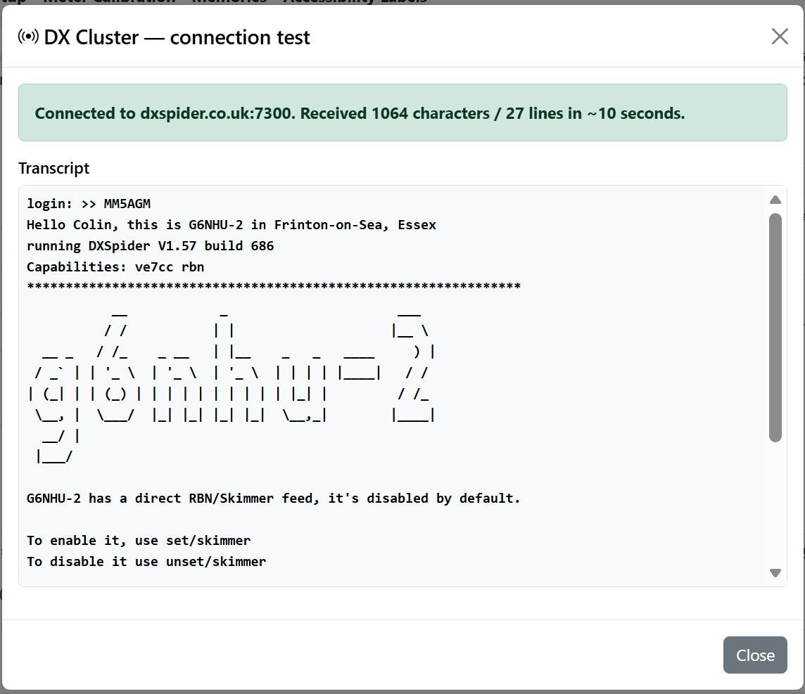

Outcomes:

- 🟢 **Green button + "Cluster connection successful"** — the cluster accepted the connection and sent data. Safe to Save Settings.
- 🟡 **Yellow button stays, red error in the popup** — connection failed. The popup's status line explains why: *host unreachable* (DNS or firewall), *connection refused* (host alive but nothing on that port), or *connected but no data within 10 seconds* (port answered but isn't speaking the cluster protocol — probably wrong port).

The button resets to yellow on every click, so retesting after editing the host gives a fresh visual cue rather than carrying over a stale result.

**Status badge on the spectrum panel** — top-right corner of the spectrum canvas shows the live cluster connection state:

- 🟢 green **DX: connected** — connected and receiving
- 🟡 amber **DX: connecting** — opening the TCP socket
- 🔴 red **DX: disconnected** — connection dropped or initial connect failed
- ⚫ grey **DX: off** — feature disabled or settings incomplete

If the badge stays red, hit `http://localhost:8080/api/dxcluster/status` in a browser — the `detail` field shows the underlying error message (e.g. "No such host is known").

**Diagnostic log** — every line received from the cluster is written to:

```
%APPDATA%\MM5AGM\Icom Web Control\dx-cluster.log
```

The file is rewritten on each new connection so it never grows large. Open it in any text editor to see the raw protocol exchange — useful for troubleshooting or just to watch what the cluster is sending. There is also an HTTP endpoint `http://localhost:8080/api/dxcluster/recent` that returns the last 100 lines as plain text in a browser.

If the connection drops, the app reconnects automatically after 15 seconds. Disabling the toggle in Settings stops reconnection attempts.

> **Note on registering to send spots:** Most clusters accept connections from any callsign for *receiving* spots, but require a one-off email registration before they accept spots you upload (the cluster will tell you the address). IWC only receives spots — it does not send any — so you can ignore that prompt.

---

### 6.6 Backup &amp; Restore

At the bottom of the Settings page (below the Save Settings button) are two buttons for exporting and importing your complete IWC user data as a **single zip file**. This rolls up everything you've customised across the app into one file:

| File in the zip | What it contains |
|---|---|
| `appsettings.user.json` | Radio model, COM port, baud rate, band plan, SDR settings, DX cluster login and watch list, CW memory messages, external app paths, per-band Width/Shift/Mode/Antenna memory, RF Gain, Squelch, antenna selections |
| `memories.json` | Your radio memory channels (with all advanced fields) |
| `memory-banks.json` | Saved memory banks (named sets) |
| `calibration.user.json` | Meter calibration overrides (if you've adjusted any meter scales) |
| `labels.user.json` | Accessible-label customisations (if you've translated or renamed any controls) |

Plus a small `README.txt` recording when the backup was taken and which IWC version produced it.

**Live radio state** (current frequency, mode, etc.) is deliberately **not** backed up — that's transient state that resets to whatever the radio reports the next time you connect.

**Export full backup**

Click **Export full backup** to download a single file named `iwc-backup-YYYYMMDD-HHMMSS.zip`. Keep it somewhere safe — OneDrive, a USB stick, or your shack laptop. Re-export occasionally as your setup evolves.

**Import full backup…**

Click **Import full backup…**, pick a previously exported zip, and confirm the replacement. Each replaced file is preserved as a `.bak` in `%APPDATA%\MM5AGM\Icom Web Control\` so you can recover if the import causes problems. If anything goes wrong mid-import, every file written so far is rolled back automatically.

**You must restart IWC after importing.** Most services (radio connection, DX cluster, SDR streaming, rigctld server) only read their files at startup, so changes only take full effect after a restart. The app displays a reminder when the import completes.

**Typical use cases:**

- **New PC** — install IWC, copy your exported zip across, import. You're up and running in under a minute with all bands, memories and DX watch list intact.
- **Before a Windows rebuild or major update** — export, then re-import after the rebuild.
- **Sharing setup with a friend** — export and email them the file. They get a working starting point (though they'll want to change the callsign and possibly the COM port).
- **Experimenting safely** — export before trying something risky; import the file to revert if it goes wrong.

The files inside the zip are plain JSON; you can extract and inspect or hand-edit them if needed. They live at `%APPDATA%\MM5AGM\Icom Web Control\` and are also accessible directly without going through the export.

---

## 7. Application Setup

Access Application Setup from the navigation bar. This page configures the external application buttons and the WSJT-X UDP connection.

### 7.1 External App Buttons

Up to five buttons can appear in the top bar to launch external applications. For each button you can set:

- **Show / Hide** — whether the button appears on the main page
- **Button Name** — the label shown on the button (e.g., "WSJT-X")
- **Command Line** — the full path to the executable, including any arguments

Default command lines:

| App | Default |
|-----|---------|
| WSJT-X | `C:\WSJT\wsjtx\bin\wsjtx.exe --rig-name=WebApp` |
| JTAlert | `C:\HamApps\JTAlert\JTAlert.exe` |
| Log4OM | `"C:\Program Files (x86)\Log4OM 2\Log4OM.exe"` |
| GridTracker | `"C:\Program Files\GridTracker2\GridTracker2.exe"` |
| Fldigi | `"C:\Program Files\Fldigi-4.2.11\fldigi.exe"` (version may differ) |

Adjust these to match where you have installed each program. GridTracker and Fldigi are **off by default** — tick the **Show** box for each once you've installed it and confirmed the command line is correct. The Fldigi process detection uses the `fldigi.exe` task-manager name.

#### Path quoting — important

IWC parses each command-line entry into two parts: the **path to the executable** and any **arguments** to pass to it.

- If your **path contains spaces** (anything under `C:\Program Files`, `C:\Program Files (x86)`, etc.), the path **must be wrapped in double quotes** so IWC knows where the path ends and arguments begin.
- If your path has no spaces, quotes are optional.
- Anything after the closing quote (or, for unquoted paths, after the first space) is passed to the program as command-line arguments.

Examples:

| Entry | What gets launched |
|-------|--------------------|
| `C:\HamApps\JTAlert\JTAlert.exe` | `JTAlert.exe` with no arguments — no spaces in path, no quotes needed |
| `"C:\Program Files (x86)\HamApps\JTAlertV2\JTAlertV2.exe" /wsjtx` | `JTAlertV2.exe` with the argument `/wsjtx` — path has spaces so the quotes are required; everything after the closing quote is passed as arguments |
| `C:\Program Files (x86)\HamApps\JTAlertV2\JTAlertV2.exe /wsjtx` | Will **fail to launch** — without quotes, IWC takes everything up to the first space (`C:\Program`) as the path |
| `"C:\Program Files (x86)\Log4OM 2\Log4OM.exe"` | `Log4OM.exe` with no arguments — quotes required because the path contains spaces |

The four defaults above already follow this rule. If you've upgraded from an earlier release that allowed unquoted paths with spaces, IWC will automatically add the quotes the first time it reads your settings, so existing setups continue to work. If you add command-line arguments later, double-check that the quotes still surround **only the path**, not the whole string.

---

### 7.2 WSJT-X UDP Settings

| Setting | Default | Description |
|---------|---------|-------------|
| UDP Address | 239.255.0.1 | Multicast address WSJT-X sends status packets to |
| UDP Port | 2237 | UDP port number |

These must match WSJT-X's **Settings → Reporting → UDP Server** settings. See Section 9.1 for full WSJT-X setup instructions.

---

## 8. Radio Memories

The app maintains its own list of memory channels, independent of the radio's built-in memories. You can store as many channels as you like, organised with labels, and recall any of them at a click from the floating Mem panel (see Section 5.15).

### 8.1 Memories Editor

Access the full memories editor from **Memories** in the navigation bar.

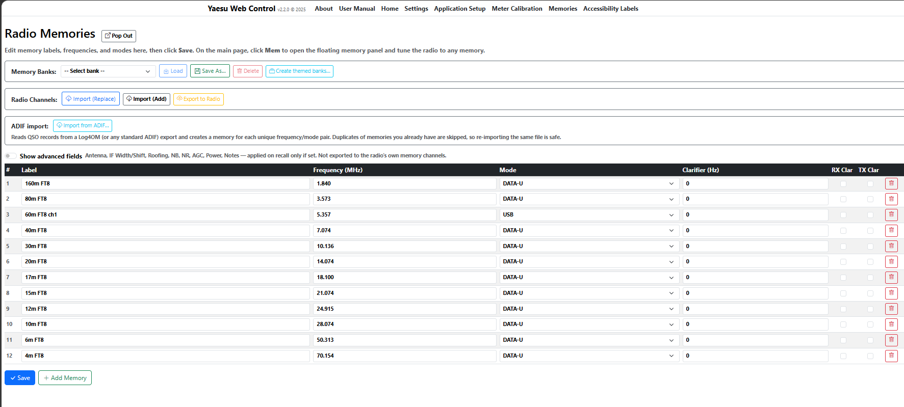

The editor shows all your saved memories in a table. For each memory you can edit:

| Field | Description |
|-------|-------------|
| Label | Name shown on the memory tile (up to 12 characters) |
| Frequency (MHz) | Frequency in MHz, e.g. 14.074 |
| Mode | Operating mode (LSB, USB, CW-U, DATA-U, FM, etc.) |
| Clarifier (Hz) | Clarifier offset in Hz |
| RX Clar | Whether the RX clarifier is enabled |
| TX Clar | Whether the TX clarifier is enabled |

**Advanced fields** — tick the **Show advanced fields** toggle at the top of the editor to reveal extra columns:

| Field | Description |
|-------|-------------|
| IF Width | The desired filter width |
| NB | Noise blanker on/off |
| NB Lvl | Noise blanker level, 1–20 |
| NR | Noise reduction (Off / NR1 / NR2) |
| AGC | AGC mode (Off / Fast / Mid / Slow / Auto) |
| Power | Transmit power in watts |
| Notes | Free-text notes, up to 100 characters |

**Each advanced field is applied on recall only if you have set a value.** Leave any field blank and the radio's current value for that setting is left alone. This means you can save a memory that only changes frequency and mode (the simple use case), or one that fully configures the radio (e.g. "20m FT8" with IF Width 2.4 kHz, NR2, 50 W, AGC Auto).

> **Important:** Advanced fields are **app-side only**. They are stored in `memories.json` on your PC. The radio's own memory channels (used by the Import/Export buttons) hold only a channel name, frequency and mode, so **Export to Radio** writes just the label, frequency and mode of each memory; the advanced fields stay in the app.

Click **Save** to save all changes. Click **Add Memory** to append a blank row. Click the **trash** icon on any row to delete that memory.

The **Pop Out** button opens the Memories page in a new browser tab — useful if you want to edit memories on a second monitor while the main control panel is open in the first.

**Save to Mem button** — When you click "Save to Mem" on a VFO panel, the app captures the **full live state** of that VFO at the moment you clicked it: frequency, mode, IF width, NB/NR/AGC, and power. The memory is added with the applicable advanced fields populated. Edit the label later from the Memories page.

---

### 8.2 Importing from the Radio

The radio's built-in memory channels can be read into the app using the **Import** buttons at the top of the Memories page.

| Button | What it does |
|--------|-------------|
| **Import (Replace)** | Reads channels 001–099 from the radio and replaces ALL app memories with what is found. Your existing app memories are lost. |
| **Import (Add)** | Reads channels 001–099 from the radio and adds them to your existing app memories without deleting anything. |

Import reads up to 99 channels and takes up to 30 seconds. A progress indicator is shown while it runs. Channels that are empty on the radio are skipped automatically.

> **Note:** Importing does not affect the radio — it only reads from it.

---

### 8.3 Importing from ADIF

If you already keep a list of favourite frequencies in Log4OM (or any other logger that exports ADIF), you can bring them into IWC as memories without retyping. On the Memories page there is an **ADIF import** card with a single **Import from ADIF…** button.

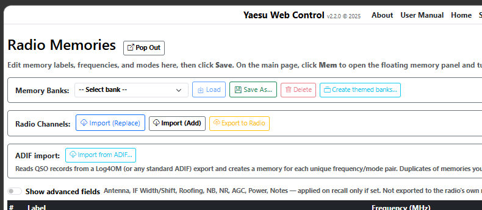

**What gets imported.** IWC reads every QSO record in the file and creates one memory per **unique combination** of frequency and mode. So if you've logged a thousand QSOs on 14.074 MHz FT8, you get just one memory called "14.074 DATA-U" — not a thousand duplicates.

**How modes are translated.** ADIF stores modes as a flat list (FT8, FT4, CW, SSB, RTTY, USB, LSB, AM, FM, etc.) but doesn't always specify upper/lower sideband for CW, RTTY or digital modes. IWC picks the convention most operators use:

| ADIF mode | IWC mode |
|---|---|
| USB / LSB / AM / FM | same |
| CW | CW-U |
| RTTY | RTTY-L |
| FT8 / FT4 / PSK / PSK31 / JT65 / JT9 / JS8 / MFSK / DATA / DIGITALVOICE | DATA-U |
| anything else | USB |

If a record has no frequency it's skipped silently — most loggers always include FREQ, but some legacy ADIF dumps don't.

**Duplicates are skipped.** Each new memory gets a label like `14.074 DATA-U` (frequency in MHz to three decimal places, then the mode). Before saving, IWC checks the existing memory list — if a memory with the same label already exists, the import skips it. This means **re-importing the same ADIF file is safe**: nothing is duplicated.

**Advanced fields are not imported.** ADIF doesn't carry IF Width, AGC, NB level, power, antenna selection, etc. Imported memories leave those fields empty, so recalling one of them tunes the radio and sets the mode but otherwise leaves the radio's current settings untouched. You can edit imported memories afterwards to add advanced fields if you want.

**Typical use case:** export your last six months of QSOs from Log4OM as ADIF, import here, get a memory bank of every frequency you've actually used recently — great as a starting point for a new contest list or as a personal "watering holes I care about" set.

---

### 8.4 Exporting to the Radio

| Button | What it does |
|--------|-------------|
| **Export to Radio** | Writes your app memories to the radio starting at channel 001, overwriting ALL existing radio channels. |
| **Export to Radio (Add)** | Scans the radio for empty channels and writes your app memories into those slots only. Existing radio channels are not touched. |

> **Warning:** Export to Radio (Replace) overwrites all 99 radio memory channels. Make sure you have imported or backed up anything you want to keep first.

---

### 8.5 Memory Banks

Memory banks let you save the current memory list under a name and reload it later. This is useful if you use different sets of memories for different operating scenarios — for example a "Daily" bank for regular operating and a "Contest" bank with contest-specific frequencies.

The **Memory Banks** bar appears at the top of the Memories page.

**Saving a bank:**

1. Set up your memories as you want them (add, edit, import from radio, etc.) and click **Save** on the editor form.
2. Click **Save As…** in the Memory Banks bar.
3. Type a name for the bank (e.g. "Contest") and click OK.
4. If a bank with that name already exists, you are asked to confirm overwrite.

The bank is saved immediately. Your current working memories are unchanged.

**Loading a bank:**

1. Select a bank from the dropdown.
2. Click **Load**.
3. Confirm the prompt — the current memory list is replaced with the bank contents and the page reloads.

**Deleting a bank:**

1. Select the bank from the dropdown.
2. Click **Delete** and confirm.

Deleting a bank does not affect your current working memories.

Banks are stored in `%APPDATA%\MM5AGM\Icom Web Control\memory-banks.json` and are not affected by importing from or exporting to the radio.

---

### 8.6 IWC Starter Bank

IWC ships with a built-in **starter bank** of common watering-hole memories — pre-populated, region-aware, and ready to load with one click. New users get a useful set of memories without having to type in every FT8 frequency by hand; experienced users can pick and choose which entries to keep.


**What's in it (typical entry counts vary slightly per region):**

- FT8 calling frequencies on every band from 160m to 6m (plus 4m in Region 1)
- FT4 calling frequencies for all bands where FT4 is active
- 60m channels — five fixed USA channels for Region 2, or the WRC-15 secondary allocation for Region 1
- SSB DX windows and general SSB calling — region-specific (Region 1 uses 14.195 for DX, Region 2 uses 14.230, etc.)
- CW DX windows on every band
- RTTY centres
- The NCDXF/IBP beacon sub-band on 10m
- 10m FM (29.600) and 6m SSB

Each entry has sensible defaults for AGC, NB, NR, and power — for example, FT8 entries set AGC to **Slow**, NB **off**, NR **off**, Power **25 W**. SSB entries use AGC **Mid** and 100 W; CW uses AGC **Fast**. The IF Width field is deliberately left blank so your own filter preference takes effect.

**Loading the starter bank.** The starter bank appears as a permanent entry at the top of the **Banks** dropdown — labelled **📥 IWC Starter Bank (built-in)** — both on the main page (in the floating Mem panel) and on the full Memories editor page. Loading it works exactly like any other Memory Bank (§8.4): selecting it loads the bank's contents into your working memory list, replacing whatever is there. The new entries then appear in the Mem panel as clickable tiles — click any tile to QSY VFO A to that frequency with all its saved settings, or use the Memories editor to change labels, edit fields, delete entries you don't want, etc.

On the **Memories editor page** a confirmation dialog appears before the load (same as for other banks). On the **floating Mem panel** the load happens immediately on dropdown change (also the same as for other banks).

**The built-in starter bank cannot be deleted** — its **Delete** button on the Memories editor is greyed out when the starter bank is selected. If you accidentally delete some of its entries from your working memories, just select the starter bank again from the dropdown and reload — your missing entries come back. (Any other customisations you've made since the previous load are replaced too, so save your work as a named bank with **Save As…** first if you want to preserve it.)

**Region awareness** — the starter bank entry shows the same name regardless of region, but the data loaded depends on the Band Plan in **Settings → §6.1**. Setting it to Region 1 loads `starter-bank-region1.json` (40 entries including 4 m), Region 2 loads the Americas bank with the five USA 60m channels, and so on. To switch regions, change the Band Plan in Settings, click **Save Settings**, then return to the Memories page or Mem panel and reload the starter bank — you'll get the new region's data.

**Editing freely** — once a starter entry is in your memory list, it's just an ordinary memory. Edit the label, change the power, add notes, delete it — anything you can do with a Save-to-Mem memory you can do with a starter entry. The starter bank file itself is read-only and shipped with the app, so your edits never affect what other users see; you can always click **Add Missing** to restore the original entry if you change your mind.

**Where the files live** — the starter banks are in `wwwroot/data/starter-bank-*.json` inside the install folder. They're plain JSON; if you want to look at the source data or contribute corrections, the format is one object per entry with frequency in Hz, mode, and the same advanced-field set the in-app memories use.

**Splitting the starter bank into themed banks.** The full starter bank is a mixed bag — FT8, SSB, CW, RTTY, FM and beacons all in one list. If you'd rather have **separate banks per mode** so you can load just FT8 frequencies on a contest weekend, or just CW for a quiet evening, click **Create themed banks…** on the Memory Banks bar. IWC reads the current region's starter bank and writes the contents out as up to six named banks:

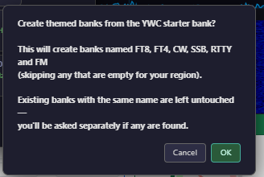

| Bank | Contains |
|---|---|
| **FT8** | Every entry whose label includes "FT8" — typically 1.840 / 3.573 / 5.357 / 7.074 / 10.136 / 14.074 / 18.100 / 21.074 / 24.915 / 28.074 / 50.313 MHz, plus 70.154 MHz in Region 1 |
| **FT4** | Every "FT4" entry on the bands where FT4 is active |
| **CW** | Every entry whose mode is CW-U or CW-L (the band-edge CW DX windows, plus the 10m beacons sub-band) |
| **SSB** | Every USB/LSB entry that isn't already in FT8/FT4 (i.e. the voice SSB calling and DX windows) |
| **RTTY** | Every RTTY-L / RTTY-U entry |
| **FM** | Every FM entry (typically 10m FM at 29.600 MHz) |

Themes that come out empty for your region are quietly skipped. If any of the themed names clash with banks you've already created (e.g. you've hand-built your own "FT8" bank), IWC asks before overwriting them — say "no" and your custom bank is left alone.

Once created, these banks appear in the **Banks** dropdown just like any user-saved bank. Loading "FT8" replaces your working memories with the FT8 entries; loading "SSB" replaces them with the SSB entries; etc. You can edit, rename, or delete them like any other bank, and re-running **Create themed banks…** is safe — it won't touch anything that already exists unless you tell it to.

---

### 8.7 A one-click "FT8 setup" (or any mode) workflow

The IC-7300 has its own **Preset** function — on the radio, **MENU → SET → Preset** (second page of the Set menu) opens a list of five preset memories. Two come pre-programmed from the factory (**Normal** and **FT8**); memories 3, 4 and 5 are blank for you to fill. Loading a preset re-applies a saved bundle of connector and mode-related settings on the radio itself — for example, the **FT8** preset sets the radio up for data operation in one step. Those presets live in the radio and are managed from the radio's front panel; IWC doesn't drive them over CI-V.

IWC's own approach is the app's **memory channels**, which give you the same "one click and I'm configured" result from the browser without touching the radio's Preset slots. The two are complementary — use the radio's Preset for its connector/audio bundles, and IWC memories for per-frequency "take me back to exactly here" recall.

If you want a browser-side "one click for FT8" (or SSB, CW, RTTY…) workflow:

1. Tune to your favourite frequency on the radio and set everything the way you like it — mode, IF width, NR, NB, AGC, power.
2. Click **Save to Mem** on the VFO panel.
3. Optionally edit the label and notes from the Memories page (e.g. "20m FT8").

Next time, click that memory tile in the floating Mem panel and you're back exactly where you left off — the saved advanced fields are re-applied to the radio, and nothing is locked out. Memories store per-frequency-and-mode-and-everything-else, so you can have as many one-click profiles as you like.

---

## 9. External Applications

### 9.1 WSJT-X

The app integrates with WSJT-X in two ways:

1. **CAT control via rigctld** — the app runs a rigctld-compatible server on TCP port 4532. WSJT-X connects to this to control the radio (frequency, mode, PTT).
2. **UDP status sync** — WSJT-X sends status packets (frequency, mode, TX state) to the app via UDP. The app uses these to keep VFO A in sync.

**Configuring WSJT-X for use with this app:**

The default command line (`--rig-name=WebApp`) causes WSJT-X to use a separate configuration profile called "WebApp". You must configure this profile once:

1. Launch WSJT-X from the app's button (so it starts in the WebApp profile).
2. In WSJT-X, go to **File → Settings**.

**Radio tab:**
- Rig: **Hamlib NET rigctl**
- Network Server: `localhost:4532`
- PTT Method: **CAT**
- Split Operation: **Fake It**
- Click **Test CAT** — it should show green.
- Click OK.

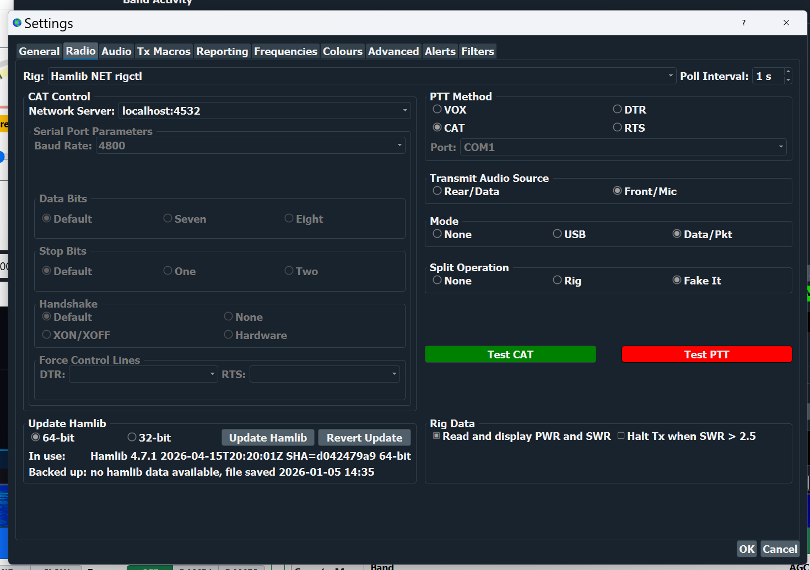

**Reporting tab:**
- UDP Server: `239.255.0.1`
- UDP Server port: `2237`
- Outgoing Interfaces: `loopback_0` (or leave blank for all interfaces)
- Multicast TTL: `1`
- Tick: **Accept UDP requests**, **Notify on accepted UDP request**
- Click OK.


These settings are saved in the WebApp profile and used every time WSJT-X is launched from the app button.

> **Important:** If you already use WSJT-X with a direct serial connection to the radio, the `--rig-name=WebApp` keeps those settings separate. Your normal WSJT-X profile is not affected.

**If you do not want a separate profile**, remove `--rig-name=WebApp` from the WSJT-X command line in Application Setup. WSJT-X will then use its default configuration — make sure that configuration points to rigctld on port 4532.

---

### 9.2 JTAlert

JTAlert monitors WSJT-X activity and displays alerts for callsigns of interest. It can also send QSO data to Log4OM via UDP multicast.

The JTAlert button in the top bar launches JTAlert and shows green when it is running.

**Configuring JTAlert to log to Log4OM:**

In JTAlert, go to **Settings → Logging → Log4OM V2** and set:

- **Enable Log4OM V2 Logging:** ticked
- **Send WSJT-X DX Call to Log4OM:** ticked
- **IP Address:** `127.0.0.1`
- **ADif_MESSAGE Port:** `2236`
- **Control Port:** `2241`
- **Log Type:** *Use SQLite File Log* (or whichever matches your Log4OM database)


---

### 9.3 Log4OM

Log4OM can receive QSO data from WSJT-X and JTAlert via UDP multicast, log QSOs with the correct frequency automatically, and (with one current limitation) display the radio's live frequency in its own status bar.

**Do not use Omni-rig.** Icom Web Control owns the serial port. If Omni-rig is also configured for the same radio it will conflict with the app and one will fail.

**Known limitation — live frequency display in Log4OM:** Log4OM NextGen's live frequency readout in its main window does not currently update from IWC's rigctld bridge — Log4OM's **CAT Status: OFFLINE** indicator stays red even after the Hamlib settings below are configured. **This is cosmetic only**: when WSJT-X logs a QSO, the correct frequency is captured from the ADIF record and stored in Log4OM's log book without any user action. So the workflow "run WSJT-X, work stations, see them appear correctly in Log4OM's log" works end-to-end; you just don't see a live tuning readout inside Log4OM itself. Tracking on [Issue #18](https://github.com/mm5agm/Icom_Web_Control/issues/18); see that issue if you want to follow progress on enabling the live readout.


To make this concrete, here is the full logging chain end-to-end. At the end of a QSO, WSJT-X pops up its **Log QSO** confirmation dialog with all the QSO details (callsign, mode, band, grid, reports, start/end times) — clicking OK is the only manual step the operator takes:

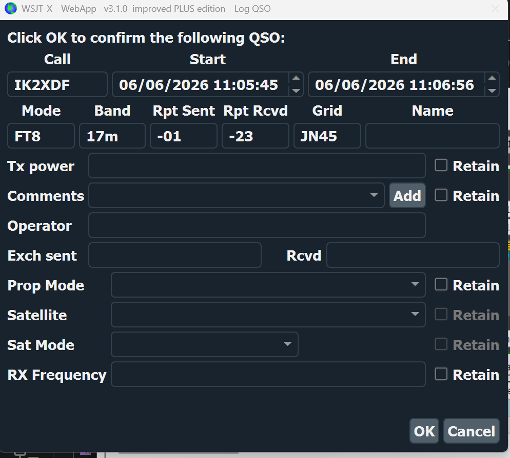

Once confirmed, the QSO immediately appears **in progress** in Log4OM — note the red OFFLINE CAT indicator top-left, yet the QSO panel is fully populated from the ADIF stream:

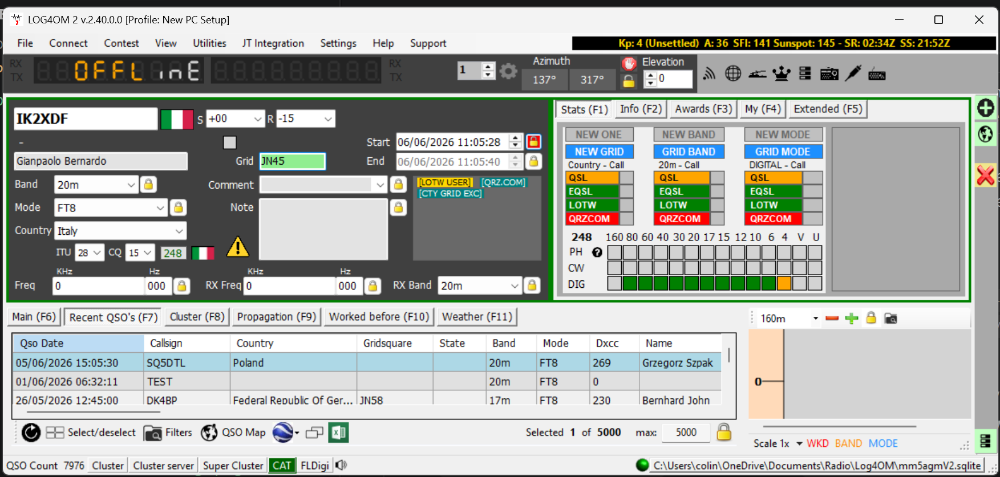

And here's the **same QSO after it's logged**, appearing at the top of the Recent QSOs list with the correct frequency, band and mode populated — no manual entry, despite CAT OFFLINE:

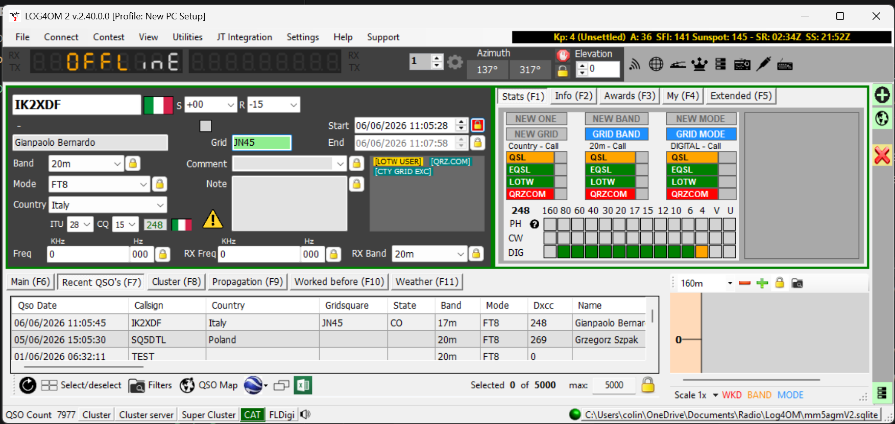

Open the logged QSO for editing and **every field is captured** — callsign, name, band, mode, exact frequency (18101.222 kHz here), grid square, country, ITU/CQ zones, DXCC entity, QSO start/end times and signal reports. Nothing has to be typed by hand:


#### Step 1 — UDP inbound connections

Go to **Software Integration → Connections** and select the **UDP** tab. Add two UDP INBOUND connections. When both are configured the list should look like this:

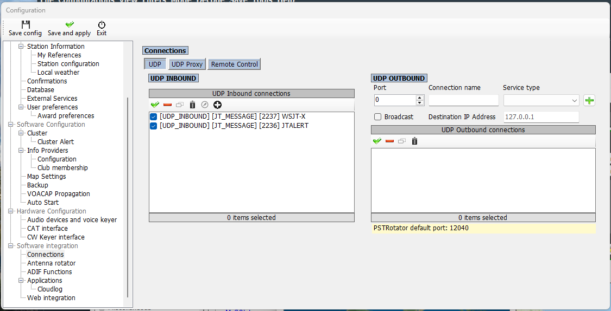

**For WSJT-X** (receives QSO data directly from WSJT-X):
- Connection name: `WSJT-X`
- Port: `2237`
- Service type: **JT_MESSAGE**
- Multicast: **ticked**
- Multicast source IP: `239.255.0.1`
- Parameters: SAVE_NEW_QSO, USE_EXTERNAL_DATA, UPLOAD_QSO, UPDATE_CQ_ITUZONE


**For JTAlert** (receives QSO data from JTAlert):
- Connection name: `JTALERT`
- Port: `2236`
- Service type: **JT_MESSAGE**
- Multicast: **ticked**
- Multicast source IP: `239.255.0.1`
- Parameters: SAVE_NEW_QSO, USE_EXTERNAL_DATA, UPLOAD_QSO, UPDATE_CQ_ITUZONE


#### Step 2 — Remote control

Still in the Connections screen, select the **Remote Control** tab and set:

- **Remote control port:** `2241`
- **Enable remote control:** ticked
- **Send to specific IP address/port:** `127.0.0.1`

This allows JTAlert to exchange control messages with Log4OM bidirectionally.


#### Step 3 — CAT interface (Hamlib)

Configure Log4OM's CAT interface to point at IWC's rigctld bridge. This is the configuration that *should* show the live radio frequency in Log4OM's status bar — see the "Known limitation" callout above for the current state.

Go to **Hardware Configuration → CAT interface → Settings**:

- CAT Engine: **Hamlib**

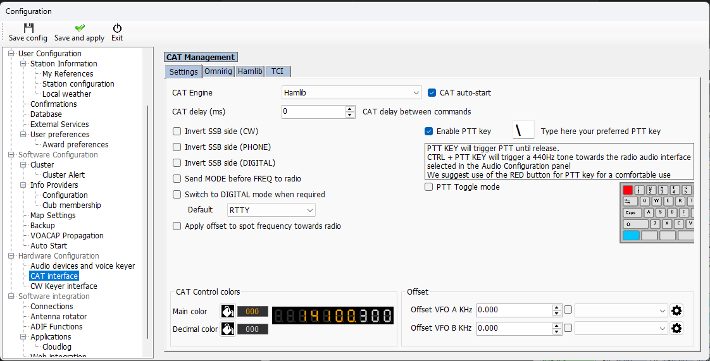

Then switch to the **Hamlib** tab inside CAT Management and set:

- **RIG Model:** *Hamlib NET rigctl Stable*
- **Network connected radio:** ticked
- **VFO MODE (supports dual VFO):** ticked
- **Connect to active HAMLIB instance:** ticked
- **ADDRESS:** `127.0.0.1`
- **Port:** `4532`

(See `Log4OM_Hamlib.png` above for what this panel looks like.)

#### Step 4 — ADIF Output (so QSOs reach Log4OM)

The WSJT-X → Log4OM logging path uses the ADIF auto-export file. Go to **User Configuration → ADIF Functions → ADIF Output** and set:

- **Enable ADIF output:** ticked
- **ADIF file:** the path WSJT-X / GridTracker write to (default `Documents\LOG4OM2\auto_export.adi`)

Log4OM watches this file and imports new QSOs as they're appended.


> **Tip — the 1–2 minute write delay is normal.** Log4OM intentionally delays writing the ADIF output so you can edit or remove a misclicked QSO before it leaves Log4OM. This is documented in the yellow notice in the screenshot. Don't panic if a QSO you just logged isn't in the ADIF file *immediately* — give it up to two minutes.

#### Startup order

Always start applications in this order:

1. **Icom Web Control** (must be running before anything connects to rigctld)
2. **WSJT-X**
3. **JTAlert**
4. **Log4OM**
5. **GridTracker** (if used)

---

### 9.4 GridTracker

GridTracker is a separate desktop app that draws a live world map of WSJT-X grid contacts and worked-stations data. It is **not** a web app — it runs as its own window — but IWC will launch it for you and show whether it's currently running.

**Setup:**

1. Install GridTracker 2 from [gridtracker.org](https://gridtracker.org/) (the v2 Electron rewrite has a single Windows installer — the older v1 with MariaDB is no longer required).
2. In IWC, open **Application Setup**.
3. In the **Application 4** card, set the **Command Line** to your installed path (default: `C:\Program Files\GridTracker2\GridTracker2.exe`).
4. Tick **Show** and click **Save**.
5. A **GridTracker** button appears in the top bar. Green = running, red = not running. Click it to launch.

**How it works with WSJT-X:** GridTracker reads WSJT-X's UDP feed independently — IWC doesn't forward anything to it. Make sure WSJT-X is set to **multicast** UDP (default `239.255.0.1:2237`) so IWC, JTAlert, and GridTracker can all subscribe to the same feed at once. If WSJT-X is set to unicast (`127.0.0.1:2237`), only one of the three apps will receive packets — this is a WSJT-X limitation, not a IWC one.

**No CAT integration is needed.** GridTracker is a passive listener; it doesn't talk to the radio at all. IWC still controls the radio, WSJT-X still drives QSOs, and GridTracker just paints the picture.

**GridTracker General settings** — the **Receive UDP Messages** block on the top-left of the General tab should be set to multicast `239.255.0.1` on port `2237`, matching WSJT-X.

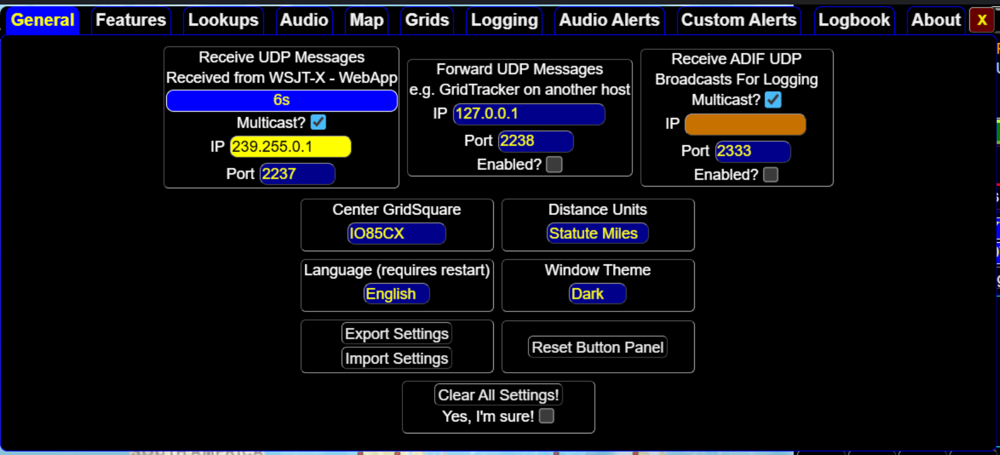

**GridTracker Logging settings** — the **Logging** tab shows where GridTracker forwards finished QSOs. The default *App Log(s)* feed (`wsjtx_log.adi`) is enough for the WSJT-X → Log4OM ADIF path documented in §9.3 — no additional logger needs to be configured here unless you also want GridTracker to push QSOs to QRZ, ClubLog, HRDLOG, etc.


---

## 10. Meter Calibration

The calibration page lets you adjust the scale of each meter gauge to match your radio's actual output. This is useful if the meter readings seem inaccurate.

Access calibration from **Meter Calibration** in the navigation bar.


Each meter gets its own column — a live gauge at the top, then the table of calibration points below it. The **Raw:** and **Calibrated:** readings above each table show what the radio is sending right now and what your table turns it into, so you can watch the effect of a change as you make it. The path to the file your work is saved in is shown at the top of the page.

**How calibration works:**

Each meter has a table of calibration points. Each point maps a **raw value** (the number the radio sends) to a **display value** (what is shown on the gauge).

For example, the S-meter might have points like:
- Raw 0 → S0
- Raw 120 → S9
- Raw 200 → S9+20dB

The gauge interpolates between points to produce smooth readings.

> **Important — where each number comes from.** The gauges and value badges on the calibration page (the needle, the **Power Out X.XW** badge, the S-unit label, and so on) are the app's *output*: it produces them by running the raw value through the **current** calibration curve. They are **not** the numbers you record. To make a calibration point you pair two things:
>
> - the **raw value** — read from the **`Raw:`** indicator on the page (the number the radio sends, before any calibration); and
> - the **true value** — read from the **radio's own meter or display** (or an external reference, such as a wattmeter into a dummy load).
>
> Copying the page's own gauge reading back into the table calibrates the app against itself and achieves nothing. Always take the true value from the radio, never from IWC's gauge.

**Editing calibration:**

1. To add a point: click **Add Point**, then enter the raw and display values.
2. To delete a point: click the **×** button next to it.
3. To test: click the **TX** button on the calibration page to transmit a test signal and watch the meters respond in real time.
4. Click **Save Calibration** when finished.
5. Click **Reload From File** to discard unsaved changes.

Calibration is saved to `%APPDATA%\MM5AGM\Icom Web Control\calibration.user.json`.

**Per-model defaults:** IWC ships a default calibration table for each supported radio (`calibration.default.IC-7300.json`, `calibration.default.IC-7300MK2.json`) in the installation folder. On first launch your `calibration.user.json` is created by copying the default for whichever radio you have configured. These defaults are starting points typed by hand, not measurements; if you calibrate your own radio (especially the S-Meter) and would like to help, please share your `calibration.user.json` on [Discussion #3](https://github.com/mm5agm/Icom_Web_Control/discussions/3), or use the **✉ Email calibration to developer** button on the Meter Calibration page. Contributions are folded into the per-model defaults shipped with future releases: every operator's measurements are kept separately and the shipped table is the **median** across all of them, so one unusual radio cannot drag the default off, and the more people who send theirs in the better the starting point gets for everybody.

> **Changing radio model later:** if you switch to a different radio in Settings, your existing calibration is **not** automatically reset to the new model's defaults — your custom values stay in place. If you want a fresh start tuned for the new radio, open the **Meter Calibration** page and click the **Reset to Defaults** button. It rebuilds your calibration from the shipped defaults for whichever radio you currently have configured.

### 10.1 Calibrating the S-Meter (receive)

The shipped default is a starting point. Your individual radio may differ by 1–3 S-units. Here is how to calibrate it against your own rig without needing test equipment.

**Before you start — three things to check:**

1. **The RF/SQL control must be acting as RF Gain — not Squelch.** The IC-7300's [RF/SQL] control can be configured to act as RF Gain, Squelch, or an auto blend of the two. The S-meter responds to **RF Gain** (which actually attenuates the received signal); it does NOT respond to squelch (which only changes the audio-gating threshold). **If you try to calibrate while the control is acting as squelch, IWC's reading will not track the rig's display and the calibration will be wrong.**

    Set it via **MENU → SET → Function → RF/SQL Control → "RF"** so the control is RF Gain in all modes.

2. **Use the RF GAIN control.** The IC-7300's [AF·RF/SQL] is a single concentric knob — the outer ring is AF (audio level) and the inner ring is RF/SQL. Turn the **inner RF/SQL ring** to vary RF Gain while calibrating; leave the outer AF ring alone.

3. **Provide a steady signal.** Easiest: connect a **dummy load** to the antenna socket — the receiver picks up internal background noise which is stable and predictable. Alternatively, tune to a strong stable broadcast station or beacon.

**The procedure:**

1. Open the **Meter Calibration** page on IWC. Watch the **Raw** indicator above the S-Meter row — it updates live.
2. Turn the RF GAIN (inner RF/SQL ring) **fully clockwise** — maximum RF gain. The rig's S-meter will read its highest value with this signal source. Note the IWC Raw value and the S-unit the rig is showing. Click **Edit** on the matching row in the calibration table (or **Add Point** if no row matches) and enter the raw value alongside the S-unit the rig displays.
3. **Slowly turn the control anti-clockwise.** Both the rig's S-meter AND IWC's Raw value will drop together — that's RF Gain actually attenuating the signal in the RF/IF stages, not just changing what's shown.
4. When the rig's S-meter reaches each labelled S-unit boundary (S9 → S7 → S5 → S3 → S1 → S0), pause and update the corresponding row in the calibration table with the IWC Raw value at that point.
5. Repeat down to S0 (or as far as the control will go).
6. Click **Save Calibration**.
7. **Look at the gauge.** The needle should now move to the correct S-unit position as you adjust the signal. Walk the control through one more time to verify IWC tracks the rig at each S-unit.
8. After you're finished, return the control to fully clockwise (max RF gain) for normal listening.

**Sharing your data.** If your calibration result is meaningfully different from the shipped default, please copy your `calibration.user.json` to [Discussion #3](https://github.com/mm5agm/Icom_Web_Control/discussions/3). Multiple submissions per model are averaged into improved shipped defaults in future releases.

### 10.2 Calibrating the Power meter (transmit)

The power meter on IWC reads the radio's transmitted RF power. To calibrate it, you transmit at known power levels and record the raw values IWC sees.

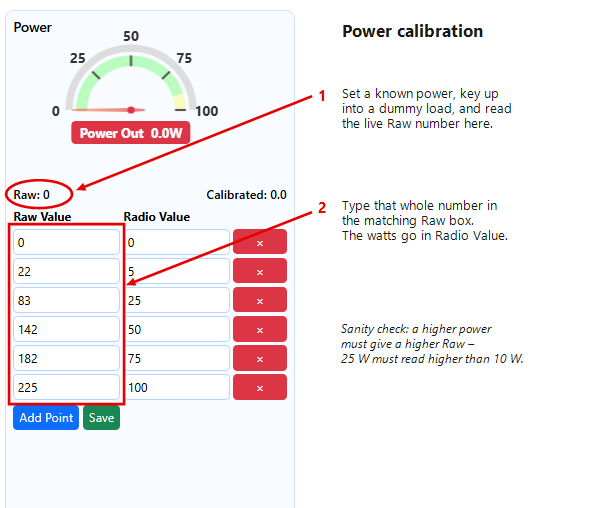

**Before you start:**

- Have a **dummy load** connected — not an antenna, since you'll be transmitting briefly at various power levels.
- Decide the band and mode you want to calibrate on — CW gives the cleanest carrier for short test transmits; SSB into a dummy load with mic gain low also works.

**The procedure:**

1. Open the **Meter Calibration** page on IWC. The Power row's **Raw** indicator (just above the Raw Value column) updates only during transmit, and is always a **whole number**.
2. Set the radio's RF Power to a low value (e.g. 5 W) via the radio's RF POWER control or IWC's slider.
3. Press the PTT or use IWC's TX button briefly — long enough for the meter to stabilise (about a second).
4. Note the whole-number **Raw** value IWC shows. Release PTT. In the calibration table, type that number into the **Raw Value** box and the known power into the **Radio Value** box (for example `Raw Value = 83`, `Radio Value = 25`).
5. Increase RF Power to the next test point (e.g. 10 W → 25 W → 50 W → 100 W for the IC-7300).
6. Repeat brief transmits at each level and record the raw values.
7. Click **Save Calibration**.

> **Get the two columns the right way round.** The **Raw Value** is the whole number IWC reports; the **Radio Value** is the watts you set on the rig. Don't put watts in the Raw box.
>
> **Every higher power must give a higher Raw.** More output always drives the meter reading up, so your raw numbers must *increase* with the power. If 25 W ever shows a *lower* raw than 10 W, two readings have got crossed — redo that pair. This is the single most common power-calibration mistake, and it makes the gauge read backwards.

For a quick sanity check after saving: transmit at a known power and watch IWC's power gauge — the needle should sit on the correct watts label.

### 10.3 Other meters

The same general approach applies to the other meters (SWR, ALC, Compression, Id, Vd), but the techniques differ:

- **SWR**: vary the antenna mismatch in known steps (a known-load or a controllable mismatch box).
- **ALC**: speak into the mic and adjust MIC GAIN to walk the ALC reading through known points.
- **Compression**: enable the Speech Processor and walk the COMP level.
- **Id / Vd**: PA drain current and supply voltage vary with RF power output and band — calibrate alongside Power.

These are lower-priority for most users than the S-Meter and Power calibrations. (The IC-7300 has no PA temperature meter over CI-V, so there is nothing to calibrate there.)

---

## 11. Diagnostics

Access the Diagnostics page from the navigation bar. It is primarily used when something is not working as expected.

**Band scope delivery** — the panel at the top of the page, always visible. It shows how many spectrum sweeps per second are actually reaching IWC from the radio, measured over the last three seconds, along with the number of sweeps assembled and discarded since the app started.

About **4 sweeps per second is normal over USB**, and there is nothing to fix if that is what you see. The radio does not send a sweep as one block — it splits it into 11 CI-V segments and paces them roughly 21 ms apart, which occupies about 89% of the time between sweeps. The CI-V baud-rate setting makes no difference to this; 19200 and 115200 measure the same.

That figure is the answer to a question operators ask often: **why the radio's own waterfall shows CW when IWC's does not.** The radio draws its scope internally with no cable in the way. IWC gets about four frames a second, and a dot at 20 WPM lasts around 60 ms, so it can fall between sweeps entirely. It is a sampling limit, not smoothing.

A rate well below 4/sec, or a discard count climbing steadily, is worth reporting — that is bus contention rather than the normal pacing.

**COM Ports button** — Opens a list of all serial ports currently detected on your PC. Use this if you are unsure which port the radio is connected to.

**CAT Status JSON button** — Opens a live JSON view of every radio parameter the app knows about. Useful when reporting a bug.

**Live Meter Readings table** — Shows the most recent raw value (0–255) received from the radio for each meter, alongside the CAT command used to request it and the time it was last updated. Rows flash yellow when a new value arrives. High SWR raw values are highlighted in orange.

**SignalR Event Log** — A scrolling log of every radio state update received over the websocket connection, with millisecond timestamps. Use the filter dropdown to narrow the log to a single property (e.g., SWR, Power, S-Meter). The **Pause** button freezes the log so you can read it; **Clear** empties it; **Save…** downloads the current log as a text file.

**About-page Diagnostics block** — the **About** page in the navigation bar has a separate Diagnostics block with a one-click **Copy diagnostics** button. The block lists IWC version, radio model, COM port, browser, .NET runtime, operating system, plus the **CPU model + logical core count** and **total physical memory** of the host PC. Paste the block when reporting a bug so it's clear whether you're running on hardware that can comfortably drive radio polling + the CI-V scope + spectrum render, or whether resource pressure might be a factor.

---

## 12. Using the App on a Tablet or Phone

The app is designed to work well on tablets and phones.

1. Make sure the **Network Interface** in Settings is set to `0.0.0.0 (all interfaces)`.
2. Note the network URL shown on the Settings page (e.g., `http://192.168.1.42:8080`).
3. Open that URL in the browser on your tablet or phone.
4. For the best experience on a tablet, use the browser's **Add to Home Screen** option to create a shortcut.

**Touch-friendly frequency tuning:**

On touch devices, tap a digit in the frequency display to select it (it highlights). Two buttons appear — **▲** (increase) and **▼** (decrease) — which you can tap to adjust that digit.

---

## 13. Keyboard Shortcuts

| Key / Action | Result |
|---|---|
| **F** | Enter full-screen mode |
| **Esc** | Exit full-screen mode |
| Mouse wheel (on spectrum) | Tune VFO A up or down in 1 kHz steps |
| Click on spectrum | Tune VFO A to the clicked frequency |
| **Tab** (in band buttons) | Move focus into the band button group |
| **← / →** (in band buttons) | Move to the previous/next band and switch immediately |
| Numeric entry button (**⑁**) next to MHz | Open the on-screen frequency keyboard for that VFO |
| **0–9** (frequency keyboard open) | Type the digit at the cursor position |
| **← →** (frequency keyboard open) | Move the cursor left or right |
| **Backspace** (frequency keyboard open) | Clear the current digit and move cursor back |
| **Delete** (frequency keyboard open) | Clear all digits |
| **↵ Enter** (frequency keyboard open) | Send the entered frequency to the radio |
| **Esc** (frequency keyboard open) | Close the keyboard without changing frequency |
| **Esc** (Memory panel open) | Close the Memory panel |

**Frequency display — changing the value digit by digit.** Every VFO frequency display is a "digit-pickable" control. You select a digit (it highlights yellow), then step it up or down. Three input methods reach the same set of actions, so pick whichever suits you:

| Input | Action | What happens |
|---|---|---|
| **Click** a digit | Select | That digit highlights yellow. The next step / arrow / button action acts on it. |
| **Mouse wheel** over a digit | Select + step | Wheels up = +1, wheels down = −1 on the digit under the cursor. |
| **Tab** into the freq display | Focus the display | A blue outline appears around the whole display. Now the keyboard keys below act on it. |
| **ArrowUp** / **ArrowDown** | Step selected digit by ±1 | If no digit is currently highlighted, the first press just highlights the kHz digit (4th from the right) — a second press then steps it. This avoids accidentally changing a digit you can't see is selected. |
| **PageUp** / **PageDown** | Step selected digit by ±10 | Carries propagate up — "9 + 1" rolls over into the next digit left. |
| **ArrowLeft** / **ArrowRight** | Move the selection cursor | Highlights the digit to the left / right. Does not change the frequency. |
| **Home** | Jump to the most-significant digit | Selection moves to the **leftmost** digit (tens of MHz). |
| **End** | Jump to the least-significant digit | Selection moves to the **rightmost** digit (Hz). |
| **▲ / ▼** buttons | Step the selected digit by ±1 | Only visible if Settings → Accessibility → **Show frequency up/down arrow buttons** is on. A click does the same as one ArrowUp / ArrowDown. If no digit is selected, the first click auto-selects the kHz digit and steps it in one go (buttons are a deliberate action — unlike the keyboard, they don't need a "show me the cursor" first press). **Press and hold to repeat** the same step every 500 ms until released — mouse, touch, and keyboard (Enter/Space) all work. |
| Click anywhere outside the display + arrow buttons | Deselect | The selection is cleared; the next ArrowUp will start over with the "first press picks the kHz digit" behaviour. |

A few extra notes:

- **Click-tuned changes are debounced** — when you stop wheeling / pressing for ~600 ms, the new frequency is sent to the radio. Holding ArrowUp for a sustained step (autorepeat) works fine; it sends one CAT command per ~600 ms of stillness rather than one per keystroke.
- **Selection persists** across polling cycles — you can press ArrowUp repeatedly and the selection stays on the same digit. The radio's confirmation of one step doesn't blow your selection away.
- **The selected digit highlights yellow** when an actual digit is selected. The whole display also gains a blue focus ring when it has keyboard focus (e.g. you tabbed into it).

**Browser zoom — make everything bigger or smaller.** IWC is a web page, so it honours your browser's standard zoom keyboard shortcuts. This is the easiest way to make controls more readable on a high-resolution monitor or to fit more on a small tablet screen:

| Key | Result |
|---|---|
| **Ctrl + +** (Ctrl and plus / equals) | Zoom in — make the whole page larger |
| **Ctrl + −** (Ctrl and minus) | Zoom out — make the whole page smaller |
| **Ctrl + 0** (Ctrl and zero) | Reset to 100% — back to the default size |
| **Ctrl + mouse wheel** | Smooth zoom in or out (over the page anywhere except the spectrum, which uses the wheel for tuning) |

The browser remembers your zoom level per site, so once you've set it, every IWC session opens at that size until you change it. Worth setting once if the default text is too small (or too large) for you — and especially worth knowing about for partially-sighted operators who don't otherwise know browsers can do this.

---

## 14. Troubleshooting

### 14.1 Reporting a bug

The fastest way to get a bug fixed is a good report. IWC has three features that work together to make this easy.

**1. The Diagnostics block on the About page.** Click **About** in the top navigation bar. The page shows app information, useful resource links, and a **Diagnostics** block — a single small text block listing:

- IWC version and release date
- Radio model and selected band plan
- Serial port and baud rate
- Current radio connection state
- Band scope state — whether it is on, how many sweeps have arrived, how many were dropped, and how long ago the last one was
- DX cluster host and your cluster login callsign (if configured)
- Browser and version
- .NET runtime version and Windows version
- The firmware versions of my bench radio (so you can compare against yours — see below)

That gives me everything needed to reproduce your setup — including a callsign so I know who I'm talking to.

**If you are on a pre-release, the version tells me so.** A pre-release shows its full label — `1.0.6-pre4` rather than just `1.0.6` — in the Diagnostics block, in the title bar and on the system tray icon. Earlier pre-releases did not: pre1, pre2 and pre3 all called themselves "1.0.6", so a report could not say which of the three it came from. Quote the version exactly as it appears.

**Radio firmware versions worth knowing.** Above the Diagnostics block on the About page there's a section titled **Developer's tested radio firmware** that lists my bench radio firmware values. Some IWC behaviours can depend on the radio's firmware version, because Icom has both added CI-V commands and changed the behaviour of existing ones between firmware releases. If you're hitting a CI-V-related bug, comparing your firmware against the listed values quickly tells you whether a firmware difference might be involved. To read your own firmware on an IC-7300 MkII: **MENU → SET → Others → Version Information** on the radio's front panel. Include any firmware mismatch in your bug report.

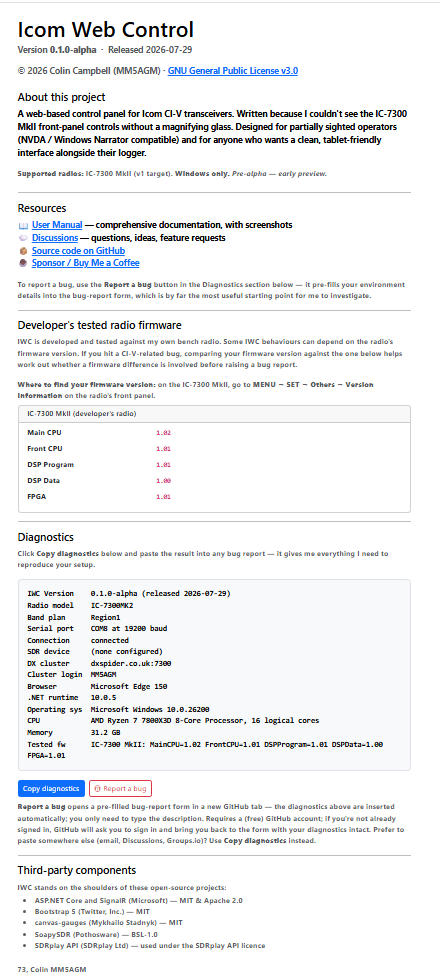

**2. Report a bug on GitHub button** *(recommended)*. Right below the Diagnostics block. Clicking it opens a pre-filled bug-report form on GitHub in a new browser tab. The new tab takes a second or two to load while it negotiates with GitHub — be patient, don't keep clicking. Once it lands you'll see the form with the Diagnostics section already populated; you only need to type a description of what went wrong and, ideally, the steps to reproduce. Submit when ready.


If you're not already signed in to GitHub, you'll be asked to sign in first — GitHub then brings you back to the form with the diagnostics still intact. You'll need a (free) GitHub account; new operators can sign up at https://github.com/signup in about a minute.

**3. Copy diagnostics button**. The alternative path for anyone who'd rather paste the diagnostics somewhere else — an email to me (mm5agm@outlook.com), a GitHub Discussion, etc. Clicking it puts the same diagnostics block onto your clipboard; you can then paste with Ctrl+V into wherever you're writing.

**Going to GitHub manually?** When you click **New issue** on the GitHub Issues page, you'll be offered a template picker — pick **Bug report** and the new-issue editor pre-fills with a structured skeleton: *Describe the bug · Steps to reproduce · Expected behaviour · Actual behaviour · Diagnostics · Screenshots / logs · Anything else*. Fill in each section as best you can. Paste the diagnostics block into the **Diagnostics** section. (The **Report a bug on GitHub** button does all of this automatically — recommended.)

If you've got an F12 → Console error message, paste that into the **Screenshots / logs** section too — JavaScript errors are often the smoking gun for UI bugs that don't reproduce in the backend logs.

**Attaching a log file.** For anything involving the radio connection, CAT commands, or rigctld (WSJT-X, Log4OM, etc.), the backend log is usually more useful than a screenshot. IWC writes one log file per day to `%APPDATA%\MM5AGM\Icom Web Control\logs\iwc-YYYYMMDD.log` — paste that path into Windows Explorer's address bar, find the file covering when the problem happened, and attach it to your GitHub report in the **Screenshots / logs** section. GitHub's attachment picker doesn't always accept a `.log` extension — if the upload fails, rename it to `.txt` or zip it first.

A **Feature request** template is also available for ideas / improvements rather than bugs.

> Please report on **GitHub**. GitHub Issues stay open until fixed and closed when resolved, with the conversation preserved — far easier to track than an email thread. See the [Issues page](https://github.com/mm5agm/Icom_Web_Control/issues).

### 14.2 Common problems

**Start-up panel stays on "Initializing radio, please wait…"**

The radio is not answering on CI-V. IWC keeps retrying, so it clears itself the moment the link comes up.

- Check that the radio is powered on.
- Check the COM port in Settings. The **Check which COM ports this PC has** link in the "Radio not connected" banner lists every port your PC has and says whether the one you configured is among them; **Diagnostics → Ports** shows the same thing.
- Check the baud rate in Settings. On the **original IC-7300** it must match the radio's **MENU → SET → Connectors → CI-V → CI-V USB Baud Rate** — that is the USB port's own setting, and the plain **CI-V Baud Rate** below it belongs to the round [REMOTE] socket and has no effect on a USB connection. The **MkII has no CI-V USB Baud Rate menu at all**, so there is nothing to match: set Settings to **19200** and ignore the radio's **CI-V Baud Rate**, which is the [REMOTE] socket's.
- Check the CI-V address in Settings (`B6` for the IC-7300 MkII, `94` for the original IC-7300).
- Click **Test Connection** in Settings.
- If IWC knows *why* it cannot connect — a COM port that is not present, for instance — the panel says so and offers a link to Settings instead of spinning.

**"Radio not connected" — what the banner is telling you**

When IWC cannot reach the radio it shows a yellow banner across the top of the main page with the reason. It is worth reading the exact wording, because the three messages mean quite different things:

| The banner says | What it means | What to do |
|---|---|---|
| *"Serial port COMx **not found**. Ports available now: …"* | Windows has no such port. The list that follows is what your PC actually has. | Pick one of the listed ports in Settings. If the list is empty or has nothing radio-shaped in it, install Icom's USB driver — the original IC-7300 needs it before Windows creates a port at all. |
| *"Serial port COMx is present but **could not be opened**"* | The port exists, but something else has it. | Close whatever else is talking to the radio — WSJT-X in direct CAT mode, Ham Radio Deluxe, N1MM, Omni-rig, or a second copy of IWC. See §15.2 on port sharers. |
| *"Serial port COMx **opened, but the radio isn't responding**"* | The port is fine. The radio is not answering on it. | See the next entry. |

**"Serial port COMx opened, but the radio isn't responding — is it powered on?"**

The port opened cleanly, so the driver, the cable and the port number are all correct. Something is stopping the radio from answering.

- **If you are on v1.0.4-pre1 or earlier, check CI-V USB Echo Back first.** With that setting on, those versions cannot connect *at all* — the radio is answering perfectly and IWC is failing to listen. Switch it off at **MENU → SET → Connectors → CI-V** (the MkII has **CI-V USB (A) Echo Back** and **(B)** — switch both off; the original IC-7300 has one). **v1.0.4-pre2 and later work either way**, so on current versions you can skip this.
- Check the CI-V address in Settings matches the radio: **`B6`** for the IC-7300 MkII, **`94`** for the original IC-7300 (**MENU → SET → Connectors → CI-V → CI-V Address**).
- Check the baud rate in Settings. On the **original IC-7300** it must match **CI-V USB Baud Rate** on the radio — not the plain **CI-V Baud Rate**, which is the [REMOTE] socket's setting; if that is on **Auto**, set both ends to **19200** while you are diagnosing. On the **MkII** there is no USB baud menu, so just set Settings to **19200**.
- **On the IC-7300 MkII, make sure you are on the right port.** The radio presents *two* USB serial ports and only one of them carries CI-V — the one Windows names **"IC-7300MK2 Serial Port A (CI-V)"**. Port B will open happily and never answer.
- A quick sanity check: if another program — N1MM, WSJT-X, Ham Radio Deluxe — can talk to the radio on that same port, then the port and radio are definitely fine and the fault is in how IWC is addressing it. Say so in your bug report (§14.1); it narrows things down enormously.

**Start-up panel stays on "Starting spectrum scope, please wait…"**

The radio is talking, but no spectrum sweep has arrived. The panel gives up after about 12 seconds and hands you the rest of the app, so this is never permanent.

- Check the **Scope** switch above the spectrum display is on.
- Check the scope is switched on at the radio itself.
- Everything except the spectrum works normally in the meantime — use **Continue anyway** if you do not want to wait out the 12 seconds.

**Spectrum panel is empty, or says "Waiting for the radio's band scope…"**

The panel is on screen and the radio is connected, but no sweep is arriving. The status badge at the right-hand end of the panel header says the same thing in one word (**Scope off**, **Connecting…**, **Live**, **Scope blocked**).

- Check the **Scope** switch above the panel, and the scope on the radio's own screen.
- Open **About** and read the **Band scope** line in the Diagnostics block. "on, but NO sweep has ever arrived" means the radio is not sending scope data at all; a large discard count means sweeps are arriving but being broken up by bus traffic — try a higher CI-V baud rate. The **Band scope delivery** panel on the Diagnostics page (§11) shows the same counters live, plus the measured sweeps-per-second.
- Include that Diagnostics block in any bug report about a missing spectrum (§14.1).

**Spectrum panel says "The radio refused to send scope data" (badge: Scope blocked)**

The radio understood the command to start sending scope data and declined it. That is not a bus fault — everything else is working — so the panel prints the reason underneath. On the original IC-7300 the reason is almost always the baud rate: the original model only sends scope data when its **CI-V USB Port** is **Unlink from [REMOTE]** and its **CI-V USB Baud Rate** is **115200**. The MkII has no such restriction.

- On the radio: **MENU → SET → Connectors → CI-V**, set **CI-V USB Port** to **Unlink from [REMOTE]** and **CI-V USB Baud Rate** to **115200**.
- In IWC: **Settings → Radio & CAT → Baud Rate**, set **115200** and save.
- Restart IWC so it reopens the port at the new rate.

**The page opens, but there are no meters and no value ever changes** (v1.0.3 and earlier)

The layout, the buttons and the band selectors are all there, but the gauges are missing, the frequency never moves, and the icons show as empty boxes. The browser's status bar may sit on "Transferring data from cdn.jsdelivr.net…" while the page loads.

Up to and including v1.0.3, the page fetched three files from public servers on the internet. A PC that had been online at some point kept its own copy of them and worked fine; a PC that had never been online got nothing, and without the library that carries live updates the rest of the page's script stopped before it started. See the note in Section 1.

- **Upgrade to v1.0.4 or later** (its pre-releases carry the fix too). All three files now ship inside IWC and nothing is fetched from the internet. There is no setting to change and no workaround on older versions.

**Frequency display shows 0 or does not update**

- The radio may not be responding to CAT commands. Test the connection from the Settings page.
- Check that no other software (e.g., another instance of the app, Ham Radio Deluxe, WSJT-X in direct CAT mode, Omni-rig) is using the same COM port. If you use Log4OM with Omni-rig, see Section 9.3 — Omni-rig is not needed and will conflict with this app.

**WSJT-X does not show as connected**

- Make sure you have configured WSJT-X's **WebApp** profile (see Section 8.1). This must be done once after a fresh install.
- Check that the UDP address in Application Setup (default 239.255.0.1) matches WSJT-X's **Settings → Reporting → UDP Server** address.
- Check that the UDP port (default 2237) also matches.
- If WSJT-X was already running when you started the app, restart WSJT-X from the app button.

**WSJT-X cannot control the radio (CAT fails)**

- Make sure WSJT-X's Radio settings are:
  - Rig: Hamlib NET rigctl
  - Network Server: localhost, port 4532
- The rigctld server starts automatically when this app starts. Check the app is running.

**Spectrum display is blank or never appears**

The scope comes from the radio over CI-V, so there is no SDR, driver or device setting to check — if the rest of the app is talking to the radio, the scope should follow.

- **Original IC-7300 (not the MkII): check the baud rate first.** The original model refuses to send scope data unless the radio's **CI-V USB Port** is **Unlink from [REMOTE]** and its **CI-V USB Baud Rate** is **115200**, with 115200 set in IWC's Settings to match. At IWC's default of 19200 the rest of the app works perfectly and the spectrum never appears. IWC now says so in the panel itself, and warns in Settings the moment you pick the combination.
- Check the panel's **scope on/off** toggle hasn't been left off. Switching it off is remembered for the rest of the session — IWC won't quietly switch the scope back on under you if the radio drops and reconnects — so it stays off until you switch it back on or restart the app.
- Confirm the radio itself is connected — if the meters are dead and the frequency isn't tracking the VFO knob, fix the CI-V connection first (see the two entries at the top of this section).
- The scope shares the CI-V bus with everything else. At the default 19200 baud a sweep takes a noticeable slice of the link, and IWC deliberately slows its meter polling while the scope streams. If the trace is ragged rather than absent, a higher rate leaves more headroom: on the **original IC-7300** set **115200** on the radio (**MENU → SET → Connectors → CI-V → CI-V USB Baud Rate**) and in Settings; on the **MkII** just raise **Settings → Baud Rate**, as the radio has no USB baud menu to match.

**Why the trace updates so slowly, and why you cannot read CW on it.** IWC receives about **four sweeps per second** from the radio over CI-V. That is what the radio delivers over its USB port, not a limit IWC imposes and not something the baud rate changes — measured on a MkII, 19200 and 115200 give an identical ~4 sweeps per second. (The radio splits each sweep into eleven CI-V segments on the USB path and paces them out one after another; IWC draws the sweep as soon as the last one lands.) At that rate the display simply cannot show keying: a dot at 20 WPM lasts about 60 milliseconds, and the trace only redraws every 240. The radio's own screen is quicker because it draws the scope internally, with no serial link in the way, and nothing sent down CI-V will ever match it. Turning the averaging down (§5.4) makes the trace livelier but does not add sweeps.

**Meter needles smear, detach, or shoot past the end of the scale — in Firefox** (v1.0.5 and earlier)

While transmitting, a needle appears to come away from its gauge, is drawn well beyond the end of its arc, or leaves a small red fragment above or to the left of the gauge for a fraction of a second before tidying itself up. It happens repeatedly for as long as you are transmitting and is worst when the readings are moving fastest. Reloading the page does not help.

This affects **Firefox only**. Edge, Chrome and other Chromium-based browsers never showed it. It is purely a drawing fault in the browser — the readings themselves are correct, and nothing is wrong with the radio or the CI-V link.

Up to and including v1.0.5, each needle was animated: told to sweep to its new position over 400 milliseconds. But readings arrive from the radio roughly every 150 milliseconds, so a new sweep began before the previous one had finished — up to three running at once. Chromium discards the frames that have been superseded; Firefox keeps them on the canvas, and the leftovers merge into what looks like one needle running off the end of the dial. On receive, with a steady signal, the needles barely move and the fault does not appear at all.

- **Upgrade to v1.0.6 or later.** The animation has been removed, so needles move straight to each new reading — which at six to seven updates a second looks the same, without the artefacts. There is no setting to change.
- **v1.0.6 is not out yet**, but the fix is available now as the pre-release **v1.0.6-pre1**, at https://github.com/mm5agm/Icom_Web_Control/releases/tag/v1.0.6-pre1 — download `Icom_Web_Control_Setup.exe` from that page and install it over your current version. IWC's update banner ignores pre-releases, so it will not offer this build to you; you have to follow the link.
- **Staying on an older version?** Use Edge or Chrome for IWC and the gauges draw cleanly. There is no workaround within Firefox itself.

**Meters appear to show incorrect values**

- The meters use a default calibration that may not exactly match every individual radio. See Section 10 to adjust the calibration.

**App will not start — "Icom Web Control is already running"**

Only one instance can run at a time, so a copy that is still running — even one you cannot see, because it never opened a window or is sitting in the system tray — blocks the next start. The dialog names the process ID and gives you three choices:

- **Yes** — open the running copy in your browser. Use this when you simply lost the tab.
- **No** — close the running copy and start a fresh one. Use this when the running copy is stuck.
- **Cancel** — do nothing.

If **No** cannot shift it, the app says so and asks you to end `Icom_Web_Control.exe` in Task Manager (Ctrl+Shift+Esc).

**App shuts down unexpectedly after closing the browser**

- This is normal behaviour. When the last browser tab is closed, the app waits 30 seconds for a reconnection before exiting. If you want to keep the app running (for example while WSJT-X is using it via rigctld), leave a browser tab open on the main page. If you need to force-quit immediately without waiting, open Windows Task Manager (**Ctrl+Shift+Esc**), find **Icom_Web_Control.exe**, and click **End Task**.

**Cannot access the app from a tablet**

- Check that **Network Interface** in Settings is set to `0.0.0.0 (all interfaces)`, not `localhost`.
- Check that Windows Firewall allows inbound connections on port 8080. You may see a firewall prompt the first time you use the app.
- Make sure the tablet is on the same Wi-Fi network as the shack PC.

---

## 15. Frequently Asked Questions

### 15.1 WSJT-X transmits but the radio shows no TX audio (or zero power output) in DATA-U / DATA-L mode

This is the most common digital-mode setup pitfall and it's not an IWC problem — it's a one-time radio menu setting that has to be done on the radio itself. Until the IC-7300 is told to take its DATA-mode audio from the USB codec that WSJT-X feeds, DATA-mode TX produces silence (the radio keys but no RF comes out).

**Fix on the radio menu:**

Set `MENU → SET → Connectors → MOD Input → DATA MOD` to **USB**, and set `USB MOD Level` to roughly **30–50%**. With DATA MOD left on MIC or ACC (a common factory default), the radio keys but ignores the USB audio, so you get no power out.

The radio remembers this across power cycles, so it's a once-only change. It has to be done on the radio; it is not configurable from IWC.

**Windows gotcha — WSJT-X pointed at the wrong "Speakers" endpoint.** Even with the radio set correctly, TX can still produce zero power if WSJT-X is sending audio to the wrong playback device. The IC-7300's USB codec can appear **twice** in Windows' Playback list (`Win+R → mmsys.cpl → Playback`) as two identically-named entries — e.g. two **"Speakers (2- USB Audio Device)"** rows, one flagged *Default Device* and one just *Ready*. Only one of them is actually wired to the radio's modulator. If WSJT-X's **Output** (Settings → Audio → Output) is set to the wrong one, its Tune tone drives that endpoint to full scale (you'll see the green bar move in `mmsys.cpl`) yet the radio makes no power — the audio is going nowhere useful.

The tell-tale sign: the radio makes power when its own voice synth speaks (internal audio) but never from WSJT-X's tone. To fix, switch WSJT-X → Settings → Audio → **Output** to the *other* identically-named entry. If you can't tell the two apart in the WSJT-X dropdown, right-click the wrong one (the one that goes full-scale but gives no RF) in `mmsys.cpl → Playback` and **Disable** it, leaving only the working endpoint to choose. While you're there, open the working endpoint's **Properties → Levels** tab and confirm it isn't muted and the slider is well up.

---

### 15.2 Can I use VSPE, OmniRig, com0com or a similar virtual COM port sharer?

Short answer: **not reliably, and we'd suggest avoiding it**. IWC's CI-V layer talks directly to the IC-7300 over a regular Windows COM port. Virtual-port sharers sit between IWC and the real port, and even when they're configured correctly they introduce timing and forwarding behaviours that IWC isn't tested against.

Symptoms when there's a port sharer in the chain:

- **"Test Connection" fails** with a "COM port opened but the radio did not respond to a CI-V probe" error.
- Or worse — the port opens, IWC reports connected, but the frequency/mode displays never follow the radio's actual state. CI-V chatter is being swallowed somewhere between IWC and the radio.

Why this happens in practice:

- **VSPE** (Virtual Serial Port Emulator) doesn't always forward client-side port settings (baud rate, parity) through to the underlying physical port. If another app set up the chain at a different baud rate previously, IWC's 19200 setting is applied at the virtual layer only and the physical port stays at whatever rate it was last given. The radio hears garbled bytes and silently drops them.
- **OmniRig** is designed as a CAT/CI-V *abstraction* layer for multiple apps to share a radio. Apps that want OmniRig support are expected to use OmniRig's COM-server interface, not pretend to talk to a generic virtual COM port underneath. IWC speaks raw CI-V, not OmniRig.
- **com0com** creates virtual port pairs but doesn't talk to physical ports on its own — you need a separate bridge program (like hub4com) to connect the virtual pair to a real COM port. The chain is easy to misconfigure.

**Recommended setup:** plug the IC-7300's USB Type-C cable in, see what COM port Windows assigns (Device Manager → Ports), set that COM port directly in IWC Settings. If you also want WSJT-X, JTAlert, Log4OM, etc. to control the same radio, point them at IWC's rigctld interface on **localhost:4532** rather than letting them open the COM port themselves. IWC then acts as the single owner of the radio's COM port and serves CAT to every other app over the network.

If you must use a virtual port sharer (e.g. you've already built a working setup around one), the easiest test is to point IWC at the real physical COM port directly while everything else stays on the sharer's virtual ports — and only re-add the sharer to IWC's path if a specific need forces it.

---

### 15.3 Why was Alexa voice control dropped in favour of the built-in microphone method?

Earlier development branches explored using Amazon Alexa to control IWC — you'd say "Alexa, set frequency to fourteen point zero seven four" to your Echo device and the command would route through Amazon's cloud, hit a custom skill, and arrive at IWC over a Cloudflare tunnel. That work reached a fully-working end-to-end prototype, but **the setup overhead made it impractical for anyone who isn't already comfortable with Cloudflare tunnels and the Amazon Developer Console**.

The current voice control uses **Windows' built-in speech recognition (SAPI 5)** with a press-and-hold microphone button beside each VFO panel. No cloud round-trip, no external accounts, no public endpoint, and your audio never leaves your computer.

| What's needed | Alexa method | Built-in microphone method |
| --- | :---: | :---: |
| A public domain name | ✅ Required | ❌ Not required |
| Cloudflare account &amp; tunnel | ✅ Required | ❌ Not required |
| Amazon Developer account | ✅ Required | ❌ Not required |
| SMAPI command-line install | ✅ Required | ❌ Not required |
| Skill build in Alexa Developer Console | ✅ Required | ❌ Not required |
| An Echo device (or Alexa app on a phone) | ✅ Required | ❌ Not required |
| Internet connection (for every command) | ✅ Required | ❌ Not required |
| Audio sent to a cloud service | ✅ Yes (Amazon) | ❌ Stays on your PC |
| Hands-free wake-word ("Alexa, …") | ✅ Yes | ❌ No — press-and-hold mic button |
| Works from anywhere in the house | ✅ Yes | ❌ Only at the PC |
| Typical setup time | ~30–60 minutes | ~2 minutes |

The Alexa code **isn't deleted** — it lives on a parked branch and can be revived if Amazon ever simplifies the developer experience, or if a contributor wants to package the cloud side as a one-click installer. For now, the built-in microphone method gives most of the same usefulness at a small fraction of the setup complexity, and it works equally well for users on a restricted home network where opening a Cloudflare tunnel isn't viable.

---

### 15.4 What is the TX button for? When I press it the radio goes into TX mode but there's no audio from my microphone.

The TX button in IWC sends the CI-V PTT command, which puts the radio into transmit mode (PTT engaged) but **does not route any audio into the radio**. With nothing modulating the carrier, what actually goes on-air depends on the current mode:

- **CW** — an unmodulated carrier (a steady tone). Useful for tune-up, SWR measurement, or driving an external tuner / amplifier into its tune cycle.
- **SSB / AM / FM** — the TX path is open but no audio is being injected, so the on-air signal is effectively silent.
- **DATA / digital modes** — the same as SSB until something else (WSJT-X via USB audio) is feeding audio in.

In short, the TX button is "key the radio for testing", not "open the mic". The radio's microphone input is only routed to the TX path when the mic's own **PTT button** (or footswitch, or VOX) triggers TX. IWC doesn't intercept or route audio at all — that side is between your mic and the radio.

What people use it for in practice:

1. **Tune-up.** Switch to CW, click TX, watch your SWR or let your ATU find a match.
2. **Driving an external amplifier or antenna tuner** into its auto-tune cycle.
3. **Digital-mode keying tests.** When WSJT-X (or similar) is feeding audio in over USB, the TX button gives you a CI-V-driven way to verify the keying side of the path without starting a real QSO.

To transmit voice from your microphone, press the PTT button on the mic itself.

---

### 15.5 WSJT-X is very slow to key the radio (10–20 second delay on PTT / Tune)

If pressing **Test PTT** or **Tune** in WSJT-X takes ten to twenty seconds before the radio actually transmits — and sometimes seems to stay in transmit afterwards — the delay is almost certainly **not** in IWC.

When this was traced from an operator's logs — in the sister project, [Yaesu Web Control issue #73](https://github.com/mm5agm/Yaesu_Web_Control/issues/73), which shares IWC's rigctld server — the app was keying the radio within about 40 *milliseconds* of receiving each PTT command, so the wait was happening *before* the command ever reached it. WSJT-X talks to IWC's rigctld server over the local loopback address (`127.0.0.1`), and on some Windows machines that loopback path can be bottlenecked by legacy networking.

The fix that resolved it for that operator: **disable NetBIOS over TCP/IP**. It's a legacy protocol that can slow down local loopback traffic. To disable it:

1. Open **Network Connections** (press **Win + R**, type `ncpa.cpl`, press Enter).
2. Right-click your active network adapter → **Properties**.
3. Select **Internet Protocol Version 4 (TCP/IPv4)** → **Properties**.
4. Click **Advanced…**, then open the **WINS** tab.
5. Under *NetBIOS setting*, choose **Disable NetBIOS over TCP/IP**, then **OK** out.

This is a machine-specific networking quirk rather than an IWC bug, so it won't affect most setups — but if you're seeing long PTT delays with an otherwise-working WSJT-X ↔ IWC link, it's the first thing to try.

As a safety backstop, IWC will force the radio back to receive if a program keys it through rigctld and never sends the matching release, so a stuck transmit can't be left keyed indefinitely — but that's a safety net, not a cure for the delay. The loopback fix above is the real solution.

---

### 15.6 Can I hear the radio from another room? I have IWC working downstairs but there's no sound.

No — and nothing is wrong with your setup.

IWC carries **no radio audio at all**. It is a *control* application: it speaks CI-V to the radio over the USB cable and moves its controls, and that is the whole of what travels over your network. The receive audio never leaves the shack. So on a second computer you get a complete, fully working control panel and complete silence, which is the app behaving as built.

**Is audio coming?** It is being worked on, in the sister application first. IWC has a twin — [Yaesu Web Control](https://github.com/mm5agm/Yaesu_Web_Control), the same app for Yaesu radios — and a contributor there is building browser-to-radio audio streaming over the USB connection, receive and transmit. It is in development and not finished, so there is no date for it. If it proves out in YWC, bringing it across to IWC is the obvious next step.

**What gets you sound today.** Two approaches people already use:

| Approach | How it works | Trade-off |
|---|---|---|
| **Remote Desktop** | Connect to the shack PC from the other room. Windows carries that PC's sound back down the connection, so you hear the radio and see IWC on the shack machine's screen. | Simplest by far if the shack PC runs Windows — nothing extra to install. You are driving a remote screen rather than using IWC natively in your own browser. |
| **Audio over IP** (e.g. [Mumble](https://www.mumble.info/)) | A server on the shack PC takes the radio's USB audio input and streams it; a client in the other room plays it. Run IWC in your own browser alongside it. | More to set up, and you are configuring two things rather than one. In exchange you use IWC properly, in the browser, on the machine in front of you. |

For either route, the radio's audio device on the shack PC is the **USB Audio CODEC** input that appears when the IC-7300 is connected — the same device WSJT-X uses (see §15.1).

> **One caution.** IWC has **no password on it**. That is deliberate: it is designed for your own home network. Reaching it from your own house is exactly what it's for, but if you ever want it from *outside* the house, use a VPN back into your own network rather than forwarding port 8080 to the internet.

---

## 16. Accessibility and Screen Readers

### 16.1 Making Everything Bigger

The single quickest way to make IWC more readable: **press Ctrl and the plus key** to zoom the whole page in. Each press makes everything bigger. **Ctrl and minus** zooms back out; **Ctrl and 0** resets to 100%. Your browser remembers the zoom level per site, so once you've set it, every future IWC session opens at the same size. See §13 Keyboard Shortcuts for the full list.

---

### 16.2 Windows High Contrast Mode

When a Windows High Contrast theme is active, the gauge displays automatically adjust:

- Gauge needles are shown in bright **yellow** so they remain clearly visible against dark backgrounds.
- Gauge plate backgrounds become transparent, preserving the half-circle appearance.

To enable a High Contrast theme: **Windows Settings → Accessibility → Contrast themes**, choose a theme, and click **Apply**. No changes to the app are needed — it detects the theme automatically.

---

### 16.3 Screen Reader Support

All interactive controls in the app have accessible labels that screen readers announce when you hover over or focus on them:

| Element | What is announced |
|---------|------------------|
| Band buttons | Full band name — e.g., "20 metres, radio button" |
| Band button group | Announced as a radio group; arrow keys move between bands |
| Meter gauges | Meter name and current reading — e.g., "S meter, VFO A: S5", "Amplifier supply voltage meter: 50.2 V" |
| Frequency display | "VFO A frequency" with current value in MHz |
| Sliders, dropdowns, buttons | Their purpose — e.g., "Transmit power", "VFO A mode" |

**Announcements interrupt rather than queue.** The ARIA live region used for hover and value-change announcements is set to `assertive`, meaning each new announcement cancels whatever was previously being read out. Combined with longer debounces on rapid-fire events (mouse-wheel frequency changes wait 500 ms after the last tick before announcing; sweeping the mouse across a row of controls only announces controls you pause on for ≥400 ms), this stops the screen reader from reading every passed-over button on the way to the one you actually wanted.

---

### 16.4 NVDA

NVDA (NonVisual Desktop Access) is a free, open-source screen reader for Windows.

**Download:** [https://www.nvaccess.org/download/](https://www.nvaccess.org/download/)

NVDA works with Edge, Chrome, and Firefox. Install it, then open the app in Edge as normal.

**Essential NVDA keys:**

| Key | Action |
|-----|--------|
| `Insert + N` | Open the NVDA menu |
| `Insert + Q` | Quit NVDA |
| `Insert + M` | Toggle mouse tracking on/off |

**How meter announcements work:**

The app does **not** rely on NVDA's built-in mouse tracking for meter gauges. Instead, the meter canvases are intentionally hidden from NVDA's accessibility tree (`aria-hidden`). An ARIA live region — a standard web accessibility technique — handles all meter announcements directly.

When you move the mouse over a meter gauge, the app reads:

1. The meter's accessible label from your saved labels (see Section 16.6)
2. The current reading at that moment (e.g., "S5", "50.2 V", "1.5:1")

It then writes *both* into the live region, and NVDA announces them as a single phrase — for example: **"Amplifier supply voltage meter: 50.2 V"**.

Because the live region is always active, meter values are announced whether or not NVDA's mouse tracking is enabled. The label used is always your custom label, not a title generated by the gauge library.

**Behaviour on startup:**

When the app loads, NVDA does not automatically read through the page. Two design decisions achieve this:

- The main control panel uses `role="application"`, which tells NVDA to stay in forms/interaction mode rather than reading the page from top to bottom in browse mode.
- The navigation bar at the top of the page is hidden from the accessibility tree so it is not announced when the page loads or when you return to the tab.

**Band navigation:** When Tab moves focus into a band button group, NVDA announces *"Band — use arrow keys to change band, group"*. Press the **left/right arrow keys** to move between bands. Each band change is announced immediately (e.g., "20 metres, radio button, checked").

> **Note:** NVDA reads abbreviations aloud. "SWR" is read as three separate letters ("S W R"). "PA" may be expanded to "Power Amplifier". The default labels in this app are written to avoid ambiguous abbreviations.

---

### 16.5 Windows Narrator

Narrator is the screen reader built into Windows 11 — no download required.

**Toggle Narrator on/off:** `Win + Ctrl + Enter`

Once running, Narrator reads aloud the element that has keyboard focus. To navigate the app with Narrator:

- Use `Tab` to move between interactive controls (buttons, sliders, dropdowns).
- Narrator announces the control's label and current value as focus moves to it.
- In **Scan mode** (`Caps Lock + Space`): use the arrow keys to move through all elements on the page, including non-interactive text and meter labels.

---

### 16.6 Customising Screen Reader Labels

Every control in the app — band buttons, meters, VFO controls, the on-screen frequency keyboard, spectrum span buttons, and the navigation bar home link — has a text label that screen readers announce. You can change any of these labels through the built-in **Accessibility Labels** editor.

**Editing labels:**

1. Click **Accessibility Labels** in the navigation bar.
2. The page shows all labels grouped by section. Edit the text in any **Label** field.
3. Click **Save Labels**.
4. Switch back to the main page — the new labels take effect automatically without needing to reload.

To restore all labels to their factory defaults, click **Reset to Defaults** at the bottom of the page.

---

**What can be customised:**

| Section | Controls covered |
|---------|-----------------|
| Band Buttons | Band buttons — 160m through 4m |
| Meters | All meter gauges (S-meter, SWR, Power, etc.) |
| VFO Controls | Frequency displays, up/down buttons, mode selector |
| Radio Controls | AGC, Preamp, ATT, NR, NB, Notch, AF gain, IF width, IF shape, filter slot, RF gain, TX power, Mic gain |
| Frequency Keyboard | On-screen frequency keyboard — all buttons including digits 0–9 |
| Spectrum Display | Spectrum scope canvas |
| Navigation | Application name / home link |

---

**Complete French translation:**

On the Accessibility Labels page, replace each label value with the French equivalent below. The section names (Band Buttons, Meters, etc.) and internal keys are not editable — only the label values shown in the input boxes.

| Section | Key | French label |
|---------|-----|-------------|
| Band Buttons | 160m | 160 mètres |
| Band Buttons | 80m | 80 mètres |
| Band Buttons | 60m | 60 mètres |
| Band Buttons | 40m | 40 mètres |
| Band Buttons | 30m | 30 mètres |
| Band Buttons | 20m | 20 mètres |
| Band Buttons | 17m | 17 mètres |
| Band Buttons | 15m | 15 mètres |
| Band Buttons | 12m | 12 mètres |
| Band Buttons | 10m | 10 mètres |
| Band Buttons | 6m | 6 mètres |
| Band Buttons | 4m | 4 mètres |
| Meters | S meter — VFO A | Indicateur S, VFO A |
| Meters | S meter — VFO B | Indicateur S, VFO B |
| Meters | Power output meter | Indicateur de puissance |
| Meters | SWR meter | Indicateur ROS |
| Meters | ALC meter | Indicateur ALC |
| Meters | Compression meter | Indicateur de compression |
| Meters | Amplifier temperature meter | Indicateur de température ampli |
| Meters | Drain current meter | Indicateur de courant de drain |
| Meters | Amplifier supply voltage meter | Indicateur de tension d'alimentation |
| VFO Controls | VFO A — frequency display | Fréquence VFO A en mégahertz |
| VFO Controls | VFO B — frequency display | Fréquence VFO B en mégahertz |
| VFO Controls | VFO A — frequency up button | VFO A fréquence plus haute |
| VFO Controls | VFO A — frequency down button | VFO A fréquence plus basse |
| VFO Controls | VFO B — frequency up button | VFO B fréquence plus haute |
| VFO Controls | VFO B — frequency down button | VFO B fréquence plus basse |
| VFO Controls | VFO A — mode selector | Mode VFO A |
| VFO Controls | VFO B — mode selector | Mode VFO B |
| Frequency Keyboard | Open keyboard — VFO A | Ouvrir le clavier de fréquence pour VFO A |
| Frequency Keyboard | Open keyboard — VFO B | Ouvrir le clavier de fréquence pour VFO B |
| Frequency Keyboard | Close keyboard | Fermer le clavier de fréquence |
| Frequency Keyboard | Digit key: 0 | Zéro |
| Frequency Keyboard | Digit key: 1 | Un |
| Frequency Keyboard | Digit key: 2 | Deux |
| Frequency Keyboard | Digit key: 3 | Trois |
| Frequency Keyboard | Digit key: 4 | Quatre |
| Frequency Keyboard | Digit key: 5 | Cinq |
| Frequency Keyboard | Digit key: 6 | Six |
| Frequency Keyboard | Digit key: 7 | Sept |
| Frequency Keyboard | Digit key: 8 | Huit |
| Frequency Keyboard | Digit key: 9 | Neuf |
| Frequency Keyboard | Move cursor left | Déplacer le curseur à gauche |
| Frequency Keyboard | Move cursor right | Déplacer le curseur à droite |
| Frequency Keyboard | Backspace — clear digit and move left | Retour arrière — effacer le chiffre et reculer |
| Frequency Keyboard | Clear all digits | Effacer tous les chiffres |
| Frequency Keyboard | Confirm frequency entry | Saisir la fréquence |
| Spectrum Display | Spectrum canvas | Affichage du spectre RF |
| Spectrum Display | Span 250 kHz button | Largeur de bande 250 kHz |
| Spectrum Display | Span 500 kHz button | Largeur de bande 500 kHz |
| Spectrum Display | Span 1 MHz button | Largeur de bande 1 MHz |
| Spectrum Display | Span 2 MHz button | Largeur de bande 2 MHz |
| Navigation | Application name / home link | Accueil Icom Web Control |

---

**Complete Danish translation:**

| Section | Key | Danish label |
|---------|-----|-------------|
| Band Buttons | 160m | 160 meter |
| Band Buttons | 80m | 80 meter |
| Band Buttons | 60m | 60 meter |
| Band Buttons | 40m | 40 meter |
| Band Buttons | 30m | 30 meter |
| Band Buttons | 20m | 20 meter |
| Band Buttons | 17m | 17 meter |
| Band Buttons | 15m | 15 meter |
| Band Buttons | 12m | 12 meter |
| Band Buttons | 10m | 10 meter |
| Band Buttons | 6m | 6 meter |
| Band Buttons | 4m | 4 meter |
| Meters | S meter — VFO A | S-måler, VFO A |
| Meters | S meter — VFO B | S-måler, VFO B |
| Meters | Power output meter | Udgangseffektmåler |
| Meters | SWR meter | SWR-måler |
| Meters | ALC meter | ALC-måler |
| Meters | Compression meter | Kompressionsmåler |
| Meters | Amplifier temperature meter | Forstærkertemperaturmåler |
| Meters | Drain current meter | Drænstrømmåler |
| Meters | Amplifier supply voltage meter | Forsyningsspændingsmåler |
| VFO Controls | VFO A — frequency display | VFO A frekvens i megahertz |
| VFO Controls | VFO B — frequency display | VFO B frekvens i megahertz |
| VFO Controls | VFO A — frequency up button | VFO A frekvens op |
| VFO Controls | VFO A — frequency down button | VFO A frekvens ned |
| VFO Controls | VFO B — frequency up button | VFO B frekvens op |
| VFO Controls | VFO B — frequency down button | VFO B frekvens ned |
| VFO Controls | VFO A — mode selector | VFO A tilstand |
| VFO Controls | VFO B — mode selector | VFO B tilstand |
| Frequency Keyboard | Open keyboard — VFO A | Åbn frekvenstastaturt for VFO A |
| Frequency Keyboard | Open keyboard — VFO B | Åbn frekvenstastaturt for VFO B |
| Frequency Keyboard | Close keyboard | Luk frekvenstastaturt |
| Frequency Keyboard | Digit key: 0 | Nul |
| Frequency Keyboard | Digit key: 1 | En |
| Frequency Keyboard | Digit key: 2 | To |
| Frequency Keyboard | Digit key: 3 | Tre |
| Frequency Keyboard | Digit key: 4 | Fire |
| Frequency Keyboard | Digit key: 5 | Fem |
| Frequency Keyboard | Digit key: 6 | Seks |
| Frequency Keyboard | Digit key: 7 | Syv |
| Frequency Keyboard | Digit key: 8 | Otte |
| Frequency Keyboard | Digit key: 9 | Ni |
| Frequency Keyboard | Move cursor left | Flyt markør til venstre |
| Frequency Keyboard | Move cursor right | Flyt markør til højre |
| Frequency Keyboard | Backspace — clear digit and move left | Tilbage — slet ciffer og flyt til venstre |
| Frequency Keyboard | Clear all digits | Ryd alle cifre |
| Frequency Keyboard | Confirm frequency entry | Indtast frekvens |
| Spectrum Display | Spectrum canvas | RF-spektrum visning |
| Spectrum Display | Span 250 kHz button | Spændvidde 250 kHz |
| Spectrum Display | Span 500 kHz button | Spændvidde 500 kHz |
| Spectrum Display | Span 1 MHz button | Spændvidde 1 MHz |
| Spectrum Display | Span 2 MHz button | Spændvidde 2 MHz |
| Navigation | Application name / home link | Icom Web Control startside |

---

### 16.7 Frequency tuning by keyboard or buttons

If you can't use a mouse wheel — head-tracking input, on-screen keyboard users, reduced-dexterity operators — the VFO frequency display is fully keyboard-driven. You can also enable two on-screen ▲ / ▼ buttons that step the selected digit by one.

**Enable the on-screen ▲ / ▼ buttons (off by default):** Settings → Accessibility → tick **Show frequency up/down arrow buttons** → Save. Two small buttons appear next to each VFO's frequency display.

**The full keyboard / button reference is in §13 Keyboard Shortcuts** under "Frequency display — changing the value digit by digit". The short version:

- **Tab** into the frequency display to focus it (blue outline appears).
- **ArrowUp / ArrowDown** step the selected digit by ±1.
- **PageUp / PageDown** step by ±10.
- **ArrowLeft / ArrowRight** move the selection cursor sideways.
- **Home / End** jump the selection to the **leftmost** (most significant — tens of MHz) or **rightmost** (least significant — Hz) digit.
- The first arrow press when nothing is selected just highlights the kHz digit — a second press then steps it. This protects against an accidental ArrowUp changing the radio without you realising a digit was selected.
- Click the ▲ / ▼ buttons to step the selected digit by ±1 (one button click = one ArrowUp / ArrowDown). Press and hold to repeat that step every 500 ms until released.
- Clicking outside the display deselects.

---

## 17. Voice Control

> **Not the same as Voice Announcements (§5.16).** Voice *control* (this section) is **you speaking to the app** — a press-and-hold mic button that lets you issue spoken commands. Voice *announcements* (§5.16) is **the app speaking to you** — automatic spoken cues for band, mode, TX state, DX alerts, etc., useful as an accessibility feature. They are independent features with separate on/off switches. If you're looking for the toggle to silence IWC's automatic speech, you want §5.16.

IWC includes hands-free voice control of common operating actions. Hold the **mic button** on the main Index page — next to the VFO's band/mode controls — and speak a command. The IC-7300 has a **single receiver**, so there's one mic button; commands act on the operating VFO. Recognition happens entirely on your PC via Windows' built-in speech engine — your audio never leaves your computer. See [§15.3](#153-why-was-alexa-voice-control-dropped-in-favour-of-the-built-in-microphone-method) for the reasoning behind this approach and the Alexa method that was considered and dropped.

Voice control is **off by default** — it has to be turned on in Settings before the mic button appears (see [§17.2](#172-enabling-voice-control)).

### 17.1 What you can say

Every command below acts on the operating VFO. The phrases are the built-in English (UK) defaults; they're editable (see [§17.6](#176-adding-your-own-commands)), so if your installation has custom phrases, "Settings → Voice Control → Voice Phrases" is the definitive list, not this table.

Everything in the table is wired to the IC-7300 over CI-V and works today.

| Command family | Say | What happens |
| --- | --- | --- |
| Set frequency | "tune to fourteen point zero seven four megahertz", "set frequency to fourteen megahertz" | Tunes to that frequency. Whole MHz, one decimal, or three decimals; "megahertz" is optional |
| Change band | "go to twenty metres", "switch to forty metres" | Jumps to that band's default (usually FT8) frequency. Bands: 160, 80, 60, 40, 30, 20, 17, 15, 12, 10, 6 and 4 metres. The band name alone works too — a bare "forty metres" is the same as "go to forty metres" |
| Step up / down | "tune up" / "step up" / "nudge up"; "tune down" / "step down" / "nudge down" | Moves by the configured step size (see Set step size; default 10 kHz) |
| Band up / down | "band up" / "band down" | Moves one amateur band up or down and lands on that band's default frequency — the same place "go to \<band\> metres" would put you, and the confirmation says which band. It stops at the ends rather than wrapping round: at 10 m "band up" says "Already on the highest band" instead of dropping you on 160 m. Bands your band plan doesn't include are skipped, so 4 m isn't in the sequence outside Region 1 |
| Set step size | "set step ten kilohertz", "step size one kilohertz" | Sets the step size: 10 Hz, 100 Hz, 1 kHz, 10 kHz, or 100 kHz. The step word alone works too ("ten kilohertz"). Same value as the step dropdown by the mic button — either one updates the other |
| Set mode | "mode U S B", "set mode L S B" (also C W, A M, F M, data, data l, r t t y — spell mode letters out one at a time) | Switches mode |
| Swap VFOs | "swap V F O", "swap A and B" | Exchanges VFO A and B contents |
| Set preamp | "set preamp off", "preamp one" (also two) | Preamp off / amp 1 / amp 2 (IC-7300 has two preamp stages) |
| Set attenuator | "attenuator off", "attenuator on" / "attenuator twenty d b" | The IC-7300's attenuator is a single 20 dB pad — on or off |
| Set AGC | "set a g c fast" (also mid, slow) | AGC speed. The IC-7300 has fast/mid/slow only — there is no off or auto |
| Set AF gain | "set a f gain fifty" / "audio gain fifty" (0–100 in the steps listed in the phrase editor, or "mute" / "maximum") | Sets the AF (volume) level |
| Set RF gain | "r f gain seventy", "set r f gain one hundred" | Sets RF gain, 0–100 |
| Set squelch | "squelch thirty", "set squelch zero" | Sets the squelch threshold, 0–100 |
| Noise reduction | "noise reduction off", "noise reduction on", "n r forty" | Off, on, or on at that level (0–100) in one command — a level turns NR on as well as setting it |
| Noise blanker | "noise blanker off", "n b on", "noise blanker fifty" | Same pattern as NR: off, on, or on at a level |
| Notch filter | "notch off", "notch auto", "notch manual" | Selects auto notch, manual notch, or neither. Each choice sets both notches, so one can't be left running under the other |
| Audio peak filter | "a p f off", "audio peak filter narrow" (also wide, medium) | CW audio peak filter width |
| Set TX power | "transmit power fifty", "set power one hundred" | Sets transmit power as a percentage — 100 is full power (100 W SSB/CW/FM, 25 W AM) |
| Set mic gain | "mic gain fifty", "microphone gain sixty" | Sets microphone gain, 0–100 |
| Speech processor | "processor off", "speech processor on", "compressor forty" | Off, on, or on at that compression level |
| Transmit | "key transmitter" / "start transmitting"; "stop transmitting" / "go to receive" | Radio keys up / drops back to receive |
| Split | "split on" / "enable split"; "split off" / "simplex" | Split operation toggles |
| Antenna tuner | "tuner on" / "antenna tuner on"; "tuner off" / "bypass tuner" | Puts the internal tuner in line or bypasses it |
| Auto-tune | "tune antenna" / "start tuner" / "match antenna" | Starts an auto-tune cycle. Say it again while one is running and it stops — the spoken confirmation says which of the two it did ("Tuning antenna" or "Stopping antenna tuner"). Note there is no bare "tune": that word belongs to "tune up" / "tune down" |
| Custom commands (macros) | "copy a to b" / "copy b to a" | Sends the CI-V command attached to that phrase. Those two ship as defaults; you can add your own for anything in the IC-7300's CI-V command set — see [§17.6](#176-adding-your-own-commands) |
| IF filter width | "filter wider" / "filter narrower" | Moves the IF passband one step along the radio's own filter ladder and **speaks the new width in hertz** — "Filter narrower, 2400 hertz". The step size is the radio's, not a fixed number of hertz: 50 Hz below 500 Hz, 100 Hz above it, and 200 Hz in AM. It stops at the ends of the ladder rather than wrapping, and says so — at the narrowest setting, "filter narrower" answers **"Already at the narrowest, 50 hertz"** instead of repeating the ordinary read-back. In FM there is no adjustable width and IWC says so |
| Status read-back | "what frequency", "what mode", "what band" | IWC speaks the current value out loud — nothing is sent to the radio |
| Help | "help", "what can I say" | IWC speaks a short list of the available command categories |

> ℹ️ **Every voice command is now wired to the radio.** Earlier builds had two — band up/down and filter wider/narrower — that the speech engine recognised but that changed nothing on the radio; they spoke an "isn't available yet" message rather than a false confirmation. Both now work, and this section no longer has a second table.

A few notes on phrasing:

- **Spell out mode letters.** Say "U S B" (three letters), not "USB" as a word — the speech engine handles letter-by-letter spelling much more reliably for short acronyms.
- **Fractional frequencies are spoken digit-by-digit** after "point". "Fourteen point zero seven four" parses as 14.074, not "fourteen point seventy-four". "Oh" is accepted as an alternative to "zero".
- **"megahertz" is optional.** Both "set frequency to fourteen point zero seven four megahertz" and "tune to fourteen point zero seven four" work — say it or skip it.
- **MHz only — no kHz.** The grammar recognises frequencies in whole-or-decimal **megahertz**, from 1 MHz up to 71 MHz (covering HF + 6 m + 4 m). It does **not** recognise kilohertz input. If you say something the grammar can't parse — e.g. "tune to thirty kilohertz" — the engine will fuzzy-match to the nearest valid in-range phrase ("tune to thirty point eight") and act on that instead. **Listen to the spoken confirmation** that follows every command: it tells you exactly what got recognised, which is the safety net against misrecognition. For sub-MHz tuning (LF, MF, down to the IC-7300's 30 kHz lower limit), use the mouse or the keyboard-driven frequency display instead — see §16.7.
- **Levels come from a fixed list, not any number you like.** The controls that take a 0–100 level — AF gain, RF gain, squelch, NR, NB, TX power, mic gain, processor — recognise **zero, ten, twenty, twenty five, thirty, forty, fifty, sixty, seventy, seventy five, eighty, ninety** and **one hundred** (also "maximum" or "full"). A number that isn't in that list will be fuzzy-matched to the nearest one that is, so listen to the spoken confirmation. The full list per command is in the phrase editor, and you can add or remove values there.
- **Bands supported:** 160, 80, 60, 40, 30, 20, 17, 15, 12, 10, 6 and 4 metres. The default frequency picked for each band is roughly the FT8 / digital hangout — adjust with a follow-up "set frequency to …" or "tune up" / "tune down".
- **"Fine step up" / "fine step down" are gone.** They were shortcuts for the microphone UP/DN keys on the Yaesu radio IWC grew out of, and CI-V has no equivalent command. "Tune up" / "tune down" with the step size set to 10 Hz does the same job. If you are upgrading, your saved phrase pack is replaced by the new defaults the first time you run this version — the noise-reduction and noise-blanker macros it carried are now proper commands with their own phrases, and the two would have competed for the same words. The previous pack is snapshotted into **Show version history** the next time you save.
- **The antenna-tuner commands were added later, and your saved pack keeps up.** If you already have a phrase pack — including a translated or customised one — the three tuner commands are added to it on first run of this version, in English, with everything you had left untouched. They show up in the phrase editor like any other command, so you can reword or translate them there.
- **Scots variants** are accepted where they're in the default phrase list — e.g. "tune tae fourteen point zero seven four" works the same as "tune to …". Add your own in the phrase editor (§17.6) for any command you like.

**After every command, IWC speaks a short confirmation** through the PC's default audio output:

- *"Move to fourteen point zero seven four megahertz, successful"* — for SetFrequency.
- *"Move to 20 metres, successful"* — for SetBand.
- *"Mode U S B, successful"* — for SetMode.
- *"Swap V F O, successful"* — for SwapVFO.
- *"Tune up, successful"* / *"Tune down, successful"* — for nudge.
- If the command was rejected (e.g. frequency out of range), the suffix is *"unsuccessful"* instead.

This is a primary accessibility feature: a partially-sighted operator can drive the radio without watching the screen and hear exactly what happened to each command. The confirmation also doubles as the safety net for misrecognition — if you said "tune to fourteen" but heard *"Move to forty megahertz, successful"*, the spoken readback tells you the engine misheard and you can issue the command again. Disable in **Settings → Voice Control → Speak confirmation after each voice command** if you find it chatty.

### 17.2 Enabling voice control

1. Open **Settings** in the IWC top navbar.
2. Scroll to the **Voice Control** section.
3. Tick **Enable voice control**, then click **Save**.
4. **Restart IWC.** The speech engine is loaded once at startup; the toggle takes effect on the next launch.
5. Confirm the **Windows speech recognition pack for your active language** is installed. Open Windows → Settings → Time &amp; Language → Speech and check the installed-languages list. The active language defaults to English (United Kingdom) — if it isn't listed, install it from there (most UK Windows installs already have it). The **Active language** dropdown in the Voice Control section lets you switch to any other installed language pack (see [§17.7](#177-more-languages)).
6. **Pick the right microphone and speaker in Windows.** Voice control listens through the Windows **default recording device** and speaks its confirmations through the Windows **default playback device** — IWC uses whatever Windows has set as default, it does not have its own device picker. Open **Windows → Settings → System → Sound** and set:
   - **Input (microphone):** your actual microphone or headset — *not* the radio.
   - **Output (speaker):** your PC speakers or headset — *not* the radio.

   > ⚠️ **IC-7300 USB gotcha.** Connecting the IC-7300 by USB adds a **"USB Audio CODEC"** device to both the Input and Output lists, and Windows often makes it the default. If that happens, voice control ends up "listening" to the radio's received audio instead of your microphone (so nothing you say is recognised), and the spoken confirmations get routed into the radio's USB input instead of your speakers. In Windows Sound settings, leave the "USB Audio CODEC" set aside for WSJT-X/digital modes and make sure your **microphone** and **speakers/headset** are the defaults for general use.

After restart, you should see a **mic button on the Index page beside the VFO panel**, next to the band/mode controls. If you don't see it, jump to [§17.4 Troubleshooting](#174-troubleshooting).

### 17.3 Using the mic button

The mic button is a **press-and-hold** control — it doesn't latch. Hold it to listen, release to process.

1. **Press and hold** the mic button. The button colour changes to indicate the speech engine is listening.
2. **Speak the command clearly** at a normal volume.
3. **Release** the button. The engine processes what it heard.
4. If the phrase matched the grammar, the radio responds within a fraction of a second. The button returns to its idle colour.
5. Bold text under the button shows the **last phrase recognised** and which command it matched — useful for spotting misrecognitions ("set frequency to forty metres" instead of "go to forty metres", say).

If you change your mind mid-phrase, just release the button without speaking. Nothing is sent to the radio unless a full grammar match is found.

**Low-confidence matches are rejected.** If you say something the engine isn't sure about — a phrase outside the grammar, background noise during PTT, an ambient TV in the room — the recognition is dropped rather than fitted to the closest rule. This stops random audio from accidentally firing a "set mode" or "go to band" command that would change the radio's state without you intending it. The "Last heard" hint under the mic button shows what the engine almost picked up; the Diagnostics block on the Settings page logs it as "Low-confidence match".

The Settings page → Voice Control section has a **Diagnostics** block that shows the current state of the engine, the last phrase heard, the last intent matched, and any error message. Open it in another browser tab if you want a live view of what voice control is doing.

### 17.4 Troubleshooting

**No mic button on the Index page.**
- Did you tick "Enable voice control" in Settings *and* restart IWC? The toggle only takes effect on next launch.
- The IC-7300 is a single-receiver radio, so there's one mic button beside the VFO panel — that's expected, not a fault.
- Open the Settings page → Voice Control → Diagnostics. If the **State** is anything other than `Idle`, there's an engine error — read the **Last error** line.
- If Diagnostics shows the active language's Windows speech pack isn't installed, install it (Windows → Settings → Time &amp; Language → Speech → Add a language) — see [§17.2](#172-enabling-voice-control).

**Mic button is there but commands don't do anything.**
- Open the **Diagnostics page** (`http://localhost:8080/Diagnostics`), click the **Voice Control Log** button at the top, then click **Refresh**. This shows the recent voice events (start / stop / heard / rejected / dispatched) from today's log without you having to find or parse the raw log file. Click **Copy to clipboard** to grab them for a bug report.
- You should see `SAPI recogniser ready` shortly after IWC startup and a `Rejected (best alt: '…')` line for each unmatched press. The "best alt" is the engine's best guess at what you said — if it's wildly wrong, the mic itself may have a problem (try Windows Sound settings → Input → speak and see if the level meter responds).
- **Check the default microphone.** Voice control listens to the Windows **default recording device**. If the `Rejected` line is empty or nonsense every time, the wrong device is probably the default — most often the IC-7300's **"USB Audio CODEC"** grabbed the default slot when you plugged the radio in, so the engine is hearing the radio's receive audio, not you. Set your real microphone as the default input in **Windows → Settings → System → Sound → Input** (see [§17.2](#172-enabling-voice-control)).
- **No spoken confirmation?** Confirmations play through the Windows **default playback device**. If commands work but you hear nothing, the wrong output is default (again, often the radio's "USB Audio CODEC") — set your speakers/headset as the default output in the same Sound settings.
- If the log shows `Rejected (best alt: '<your phrase>')` and your phrase looks correct, the grammar wording isn't matching what you said. Try one of the alternative phrasings listed in [§17.1](#171-what-you-can-say), or open a [GitHub discussion](https://github.com/mm5agm/Icom_Web_Control/discussions/new?category=ideas) and propose a new phrasing.
- The raw log file lives at `%APPDATA%\MM5AGM\Icom Web Control\logs\iwc-YYYYMMDD.log` if you ever need the unfiltered version (e.g. CAT command traffic, SDR worker status, etc.), but the Diagnostics page is the right tool for voice-specific issues.

**"Tune up" doesn't seem to do much.**
- The step size is shown (and changeable) in the dropdown next to the mic button, default **10 kHz**. If it's set small (e.g. 10 Hz) the movement can be easy to miss. Change it with the dropdown or by voice: "set step ten kilohertz".
- If you need bigger jumps use "set frequency to …" or "go to … metres" instead.

**Speech engine works for a while then stops responding.**
- Restart IWC. The engine is held alive across recognitions, and on rare Windows audio-stack hiccups it can lose its mic handle. Restart is the cleanest fix; if you see this often, report it on GitHub with the log.

### 17.5 Privacy

- All speech recognition happens **locally on your PC** through the Windows SAPI 5 engine. No audio is uploaded to Anthropic, Microsoft, Amazon, or anyone else.
- Recognised phrases are written to IWC's log file (`iwc-YYYYMMDD.log`) so that misrecognitions can be diagnosed. If that's a concern, set the log retention / rotation in Settings, or simply disable voice control when not in use.
- Nothing leaves the PC except the CI-V commands going to the radio over the serial port.

### 17.6 Adding your own commands

The voice command grammar is **data, not code** — it lives at `%APPDATA%\MM5AGM\Icom Web Control\Grammars\<culture>\Commands.<culture>.json` and is edited live from **Settings → Voice Control → Voice Phrases**:

- **Voice Phrases editor.** Every command family from the [§17.1](#171-what-you-can-say) table is listed with its trigger phrases in an editable grid — add, remove, or reword phrases, one or more per row, comma-separated. **Save phrases** writes immediately and takes effect with no restart; **Validate** checks for empty/duplicate entries before you save; **Reset to defaults** restores the built-in English (UK) set.
- **Test this pack.** A dry-run tester — speak a command and see what's recognised without sending anything to the radio, useful for checking a reworded phrase actually matches before trusting it live.
- **Version history.** Every save (and every pack import) snapshots the previous version — up to the last 5 — so a bad edit or import can be undone from **Show version history**.
- **Export / import as a language pack.** **Export language pack** bundles the current phrases, a generated `.srgs` reference copy, and author/description metadata into `IWC-VoicePack-<culture>-vN.zip` — share it on the [GitHub Discussions](https://github.com/mm5agm/Icom_Web_Control/discussions) group. **Preview import** lets you inspect another pack's contents before installing it.
- **Open user grammars folder** jumps straight to the `Grammars\` folder in Explorer if you'd rather hand-edit the JSON or inspect the generated `.srgs` file (a human-readable reference copy, not what the engine actually loads).
- **Custom Commands.** The one place you can add a command IWC has no built-in intent for. A row is a name, the phrases that trigger it, and the **CI-V command** to send, written as hex bytes — command, sub-command, data — exactly as they appear in the CI-V reference in the IC-7300 manual. `16 40 01;` is noise reduction on; chain commands with `;`, e.g. `16 40 01;16 22 01;` for NR on *and* NB on in one phrase. (NR and NB have built-in commands of their own now — the example is here because it shows the syntax, and because chaining is the thing only a custom command can do.) Spaces are optional (`164001;` is the same command). IWC adds the framing and the radio's address itself, so a Custom Command chooses *which* command is sent and nothing more. The Category column is free text — type a new name to start a new group.
- **Advanced mode** (off by default) allows a Custom Command to use any CI-V command, not just the command bytes the built-in Core Commands already send. The radio's power command (`18`) is one of the ones it unlocks — worth knowing before you turn it on, because over the IC-7300's USB CI-V link a power-off drops the serial port with it, and the radio can't then be switched back on remotely. Only enable Advanced mode if you trust the source of any pack you import.

If there's a particular command or phrasing you'd like added to the *built-in* defaults (as opposed to your own local edit), please file it as a GitHub issue or discussion.

### 17.7 More languages

Only **English (UK)** ships as the built-in default, but the language pack system itself is already multi-language. An **English (US)** pack is also available — same commands and phrases as the UK default, with US spelling ("meters" instead of "metres"). Get it from `/voice-packs/IWC-VoicePack-en-US-v3.zip` on your running IWC instance and install it via **Preview import** below.

1. **The Windows speech pack for the target language must be installed** on the operator's PC (Windows → Settings → Time &amp; Language → Speech → Add a language). Microsoft ships full recognition packs for US English, French, German, Spanish, Italian, Japanese, Mandarin Chinese, Brazilian Portuguese and Australian English (the list shifts between Windows releases). Some languages only ship voice synthesis, not recognition — those can't be used for voice control regardless of what IWC does.
2. **A phrase pack for that culture.** The **Active language** dropdown in Settings → Voice Control lists every culture with an installed pack (a ✓ or ⚠ shows whether Windows also has a matching recogniser). Installing a new one means either importing a `IWC-VoicePack-<culture>-vN.zip` someone else has authored and shared (**Preview import** → **Install**), or hand-authoring `Commands.<culture>.json` and dropping it into `Grammars\<culture>\` via **Open user grammars folder** — the semantic keys (intent names, parameter vocab) stay identical to the English defaults, only the phrases change.
3. **Switching locale takes effect immediately** — no restart needed, unlike the initial enable toggle.

The **Voice Phrases editor** itself currently only edits the **en-GB** pack in place; editing an *installed non-English pack* through the same in-app grid isn't wired up yet — for now, translate by hand-editing that culture's JSON file directly, or ask a fluent speaker to export their pack after editing it locally. If you'd like a particular language prioritised for a built-in default, or want the editor to support editing other locales directly, please open a GitHub discussion or issue and mention it.

---

*Icom Web Control is written and maintained by mm5agm@outlook.com. For bug reports and feedback, please use the [GitHub issues page](https://github.com/mm5agm/Icom_Web_Control/issues) or the [GitHub Discussions](https://github.com/mm5agm/Icom_Web_Control/discussions).*
